# 第一天


## 001.大项目贯穿

- 学习能力
- 动手能力
- 耐心和毅力
- 表达能力


## 002.学习中碰到问题怎么办

- 找同桌
- 找同学
- 找项目经理
- 找讲师


## 003.学习Java的窍门

- 多想

> 公司需要什么?
>
> 熟练掌握这个东西的人.如何才能熟练呢?多练练
>
> 学Java就像学车,天天看别人开车,自己无论怎么看都不会,必须亲自去开,去练习

- 多练

> 你以后所拿的工资与你平时的代码量,一定是成正比的

- 小要求

> 1.课堂气氛活跃一些


## 004.第一阶段课程安排

- 基础知识 7天
- 面向对象 10天


## 005.什么是Java

- 1.Java是一门计算机语言
  - 与计算机沟通的语言
  - 任何程序都是通过某一种语言实现的
- 2.用Java实现的成功案例
  - 淘宝网
  - 京东
  - 饿了吗
  - 摩拜单车
  - 银行系统一般都是Java实现的
  - ATM机系统几乎都是Java实现的


## 006.Java的编译运行过程(面试题)

> 计算机唯一能识别的只有0和1
>
> 但是,01不适合人脑记忆

`QQ`使用C语言写的

- Windows版的`QQ`运行在Windows操作系统上
- Linux版的`QQ`运行在Linux的系统上
- `iOS`版的`QQ`运行在`iOS`操作系统上

> Java出现的比C语言要晚一些,也要更高级一些
>
> Java的编译运行过程

```
.java的源文件,经过编译,生成.class字节码文件
JVM加载.class并运行,生成可执行文件(0和1)
```

- `Java`运行需要`JVM`的支持.`JVM`是一个软件,安装在操作系统中

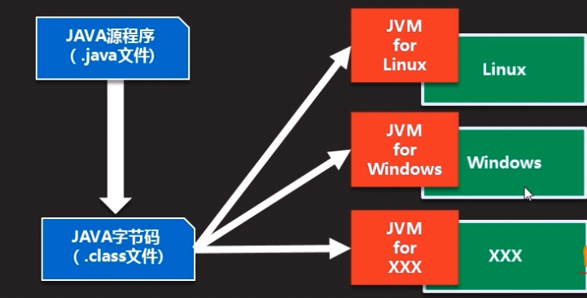

- 编译期和运行期

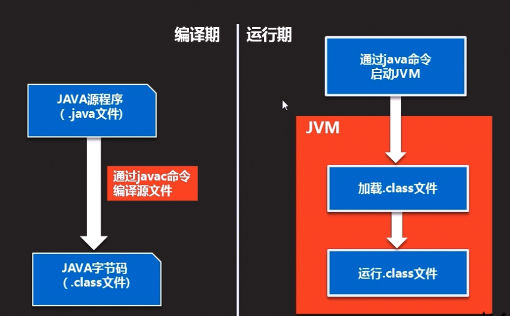


## 007.C语言的编译运行过程

```
.c的源文件,经过编译,直接变为可执行的文件(0和1),效率非常高
但是,每一个系统的指令(0和1)是不同的
这就导致不同系统编译的可执行文件无法在其他操作系统中运行
```


## 008.假设`QQ`使用Java语言写的

- `java`语言版本的`QQ`,经过编译,生成`.class`字节码文件
- `Windows`版的`JVM`加载并运行在Windows操作系统上
- `Linux`版的`JVM`加载并运行在`Linux`操作系统上
- `......`
- 将`java`的这种特征,称之为跨平台,也叫一次编程,到处使用


## 009.Java做的银行系统

- 可以在`Windows`系统上运行
- 可以在`Linux`系统上运行
- 可以在`iOS`系统上运行


## 010.名词解释(面试题)

- `JVM`:`java`虚拟机
  - 作用:`加载.class并运行`

- `JRE`:`java`运行环境
  - 包含`JVM`和`java系统类库(小零件)`
- `JDK`:`java`开发工具包
  - 包含`JRE`和开发`java`程序所必须的命令工具(编译,运行等)
- 说明
  - 运行`java`程序的最小环境为`JRE`
  - 开发`java`程序的最小环境为`JDK`


## 011.安装JDK

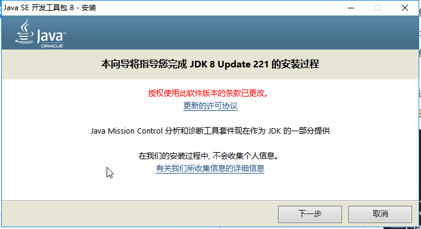

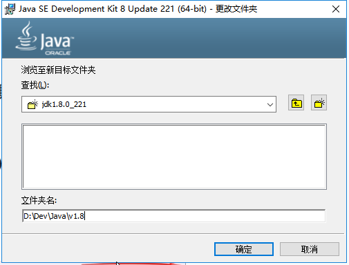

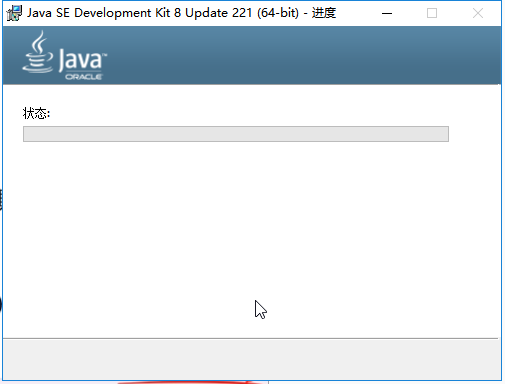

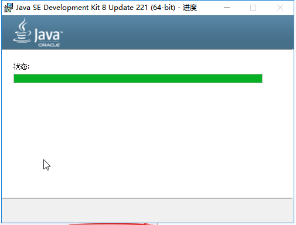

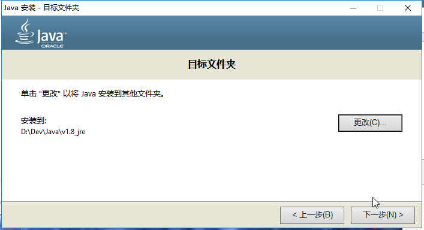

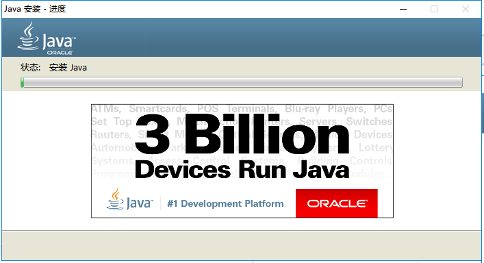

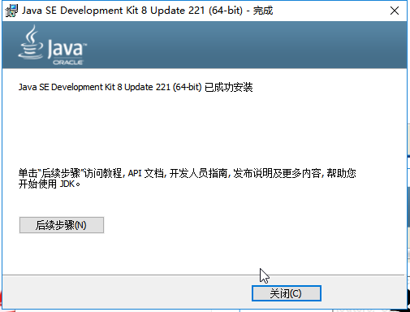


## 012.配置环境变量

- `JAVA_HOME`:指向`jdk`的安装目录

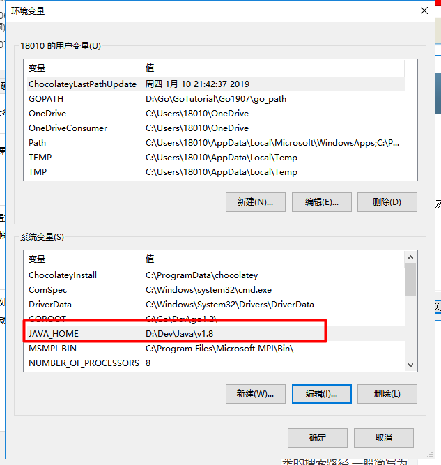

- `CLASS_PATH`:表示为类的搜索路径,一般简写为`.`

- `PATH`:指向`jdk`下面的`bin`目录


## 013.安装Eclipse

> Eclipse是IBM斥资千万元打造的开源IDE
>
> 开源:开放源代码,免费的

Eclipse的优点

- 开源免费
- 开源通过开发插件扩展Eclipse的功能,具有高度的灵活性

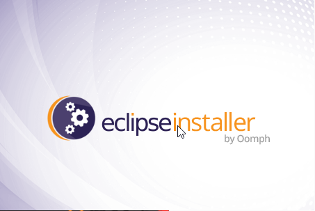

> Eclipse是用Java语言写的

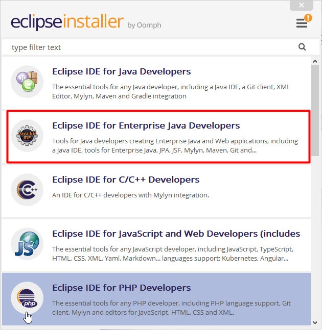

> 选择JDK版本和Eclipse的安装目录

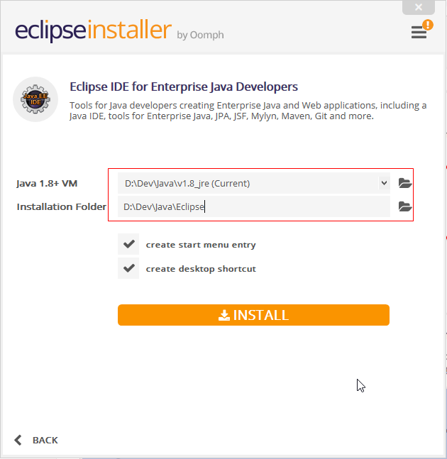

> 安装完成截图

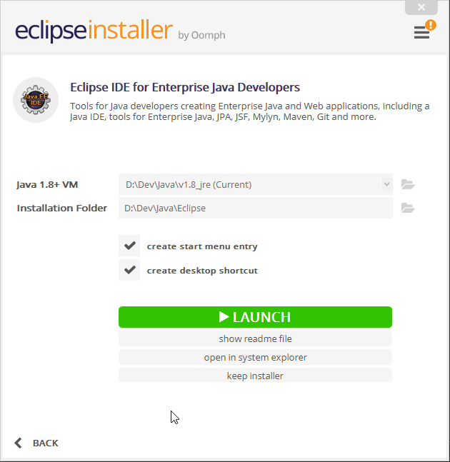

> 启动软件

> 选择工作空间

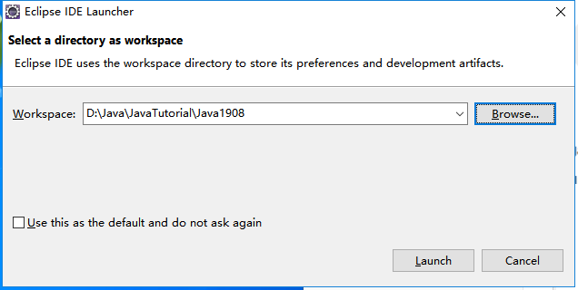

> 欢迎页

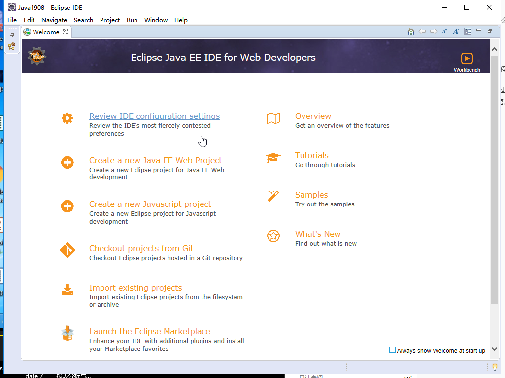

> 创建一个新项目

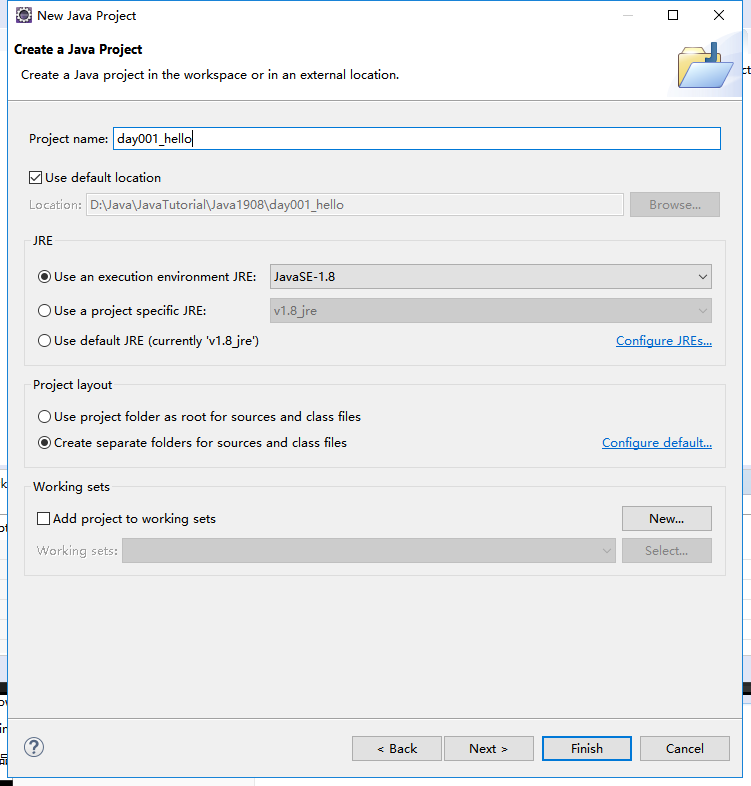

> 创建一个包

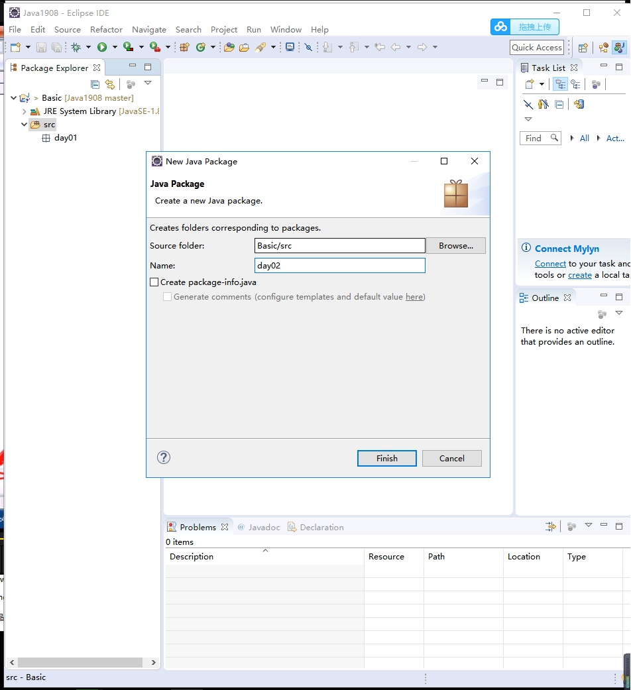

> 创建一个类


> 调整字体大小

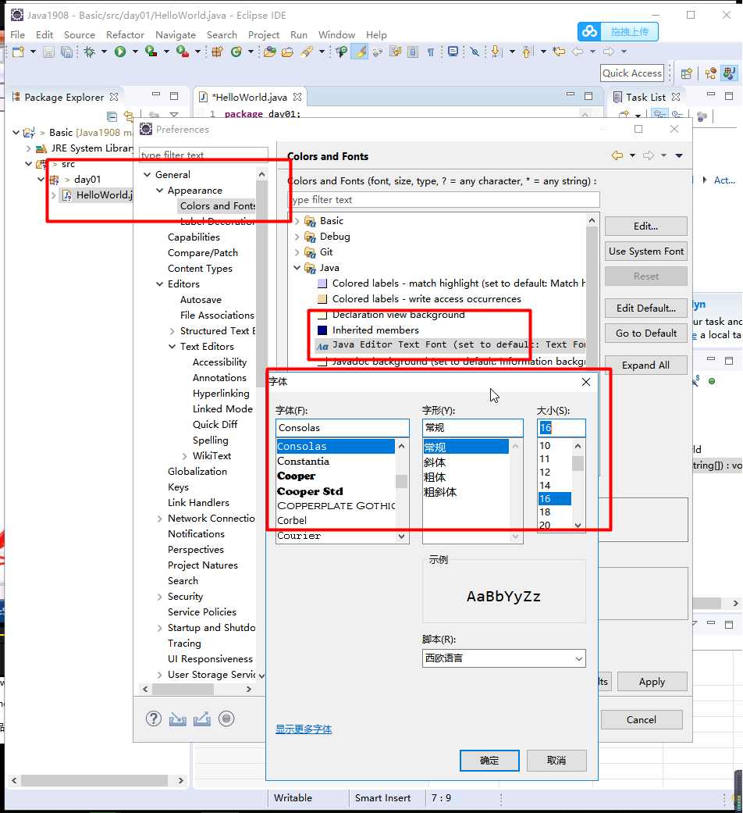


## 014.工作空间

- 创建的所有`java`程序的默认保存地址


## 015.开发步骤

- 新建`Java`项目/工程
- 新建`Java`包
- 新建`Java`类


## 016.注释:解释性文本

- 单行注释: `//`
- 多行注释: `/* */`
- 文档注释: `/** */`


## 017.第一个程序

```java
package day01;//声明了一个包叫day01

public class HelloWorld {// 声明类HelloWorld

	// 主方法,为程序的入口
	// 程序的执行从main开始,main结束则程序结束
	public static void main(String[] args) {
		// 打印一句话
		// ctrl+f11运行程序
		System.out.println("hello world");
	}

}
```

> 需要注意的点

- 1.`Java`严格区分大小写
- 2.所有的符号必须是英文模式的
- 3.每句话必须以`;`分号结尾
- 4.`print()`输出不换行,`println()`输出并换行


## 018.作业

- 1.`Java`的编译运行过程是怎样的?
- 2.什么是`JVM`,`JRE`,`JDK`?


## 019.参考答案

> 1.

```
第一步: .java源代码文件被编译为.class字节码文件
第二步: JVM加载.class并运行
```


> 2.

```
JVM:Java虚拟机
JRE:Java运行环境
JDK:Java开发工具包
```


## 020.练习

- 1.新建`Java`项目`MyProject`
- 2.在`MyProject`中新建`Java`包`mypackge`
- 3.在`mypackge`中新建`Java`类`MyClass`,输出`HelloWorld`并换行
- 3.在`mypackge`中新建类`Test`,输出
  - `Hello`,不换行
  - `World`,换行
  - `欢迎来到理想国`,换行
  - `今日事今日毕`,换行


## 021.练习参考答案

```java
package mypackage;

public class Test {

	public static void main(String[] args) {
		System.out.print("Hello");
		System.out.println("Word");
		System.out.println("欢迎来到理想国");
		System.out.println("今日事,今日毕");
	}

}
```

