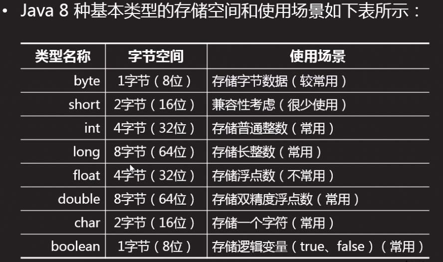

# 第二天


## 001.回顾

- 1.`Java`开发环境
  - 1.`Java`编译运行过程
    - 编译期:`.java`源文件,经过编译,生成`.class`字节码文件
    - 运行期:`JVM`加载`.class`文件并运行
    - 跨平台,一次编程,到处使用
  - 2.名词解释
    - `JVM`:`java`虚拟机,加载并运行`.class`
    - `JRE`:`java`运行环境,`JVM`+`java`系统类库
    - `JDK`:`java`开发工具包,`JRE`+开发`java`程序的必须命令工具
  - 3.配置环境变量
- 2.`Eclipse`
  - IBM,开源的,免费的,`java`开发的`IDE`集成开发环境
  - 开发步骤
    - 1.创建`java`项目
    - 2.创建`java`包
    - 3.创建`java`类
  - 注释:解释性文本,计算机不会执行
    - 单行注释 `//`
    - 多行注释 `/* */`
    - 文档注释 `/** */`


## 002.什么是变量

> 最早期的计算机是用来帮我们算数的(数字)
>
> 现在的计算机,还是用来算数的(数字,文字,图片,音频,视频等)`转换为01`

- 举例:淘宝网

> 输入 www.taobao.com  `一个数据`
>
> 淘宝首页  `一堆数据`
>
> 搜索手机壳  `交给淘宝处理的一个数据`
>
> 返回搜索结果页面  `一堆数据`
>
> 详情页面  `一堆数据`
>
> 购物车 `一堆数据`
>
> 结算 `一堆数据`

- 总结

> 计算机的本质就是 `Input(输入数据)+Output(输出数据)`

- 引出

> 变量就是用来存数据的.
>
> 变量是指在内存中开辟的存储空间,用于存放在运算过程中要用到的数据


## 003.变量的声明

- 当需要使用一个变量时,必须对该变量进行声明
- 变量的声明包含两点:变量类型和变量名
- 一条语句可以声明多个同类型的变量

```java
package com.lxgzhw;

public class Variable01 {

	public static void main(String[] args) {
		//声明一个整型的变量,名为a
		int a;
		//声明三个整型的变量,名为b,c,d
		int b,c,d;//注意,是用逗号隔开
	}

}
```


## 004.变量的初始化

```java
package com.lxgzhw;

public class Variable02 {

	public static void main(String[] args) {
		// 声明整型变量a并赋值为220
		int a = 220;
		int b;// 声明整型变量b
		b = 333;// 给变量b赋值为333
		int sum = 0;
		sum = a + b;
		System.out.println("a+b=" + sum);
	}

}
```

- 1.声明的同时初始化
- 2.先声明,后初始化


## 005.变量的使用

- 1.对变量的操作,就是对它所存的那个数的操作

```java
package com.lxgzhw;

public class Variable03 {

	public static void main(String[] args) {
		int a = 5;
		// 取出a的值,然后+10,再赋值给b
		int b = a + 10;
		// 打印b的值,这个时候 b=5+10
		System.out.println("a+10=" + b);
	}

}
```

- 2.变量的操作必须与数据类型匹配
  - 整数只能与整数相加
  - 浮点数只能与浮点数运算
- 3.变量在使用执行必须声明并初始化


## 006.变量的命名

- 1.只能包含字母,熟悉,`_`下划线和`$`符,不能以数字开头
- 2.严格区分大小写
- 3.不能使用关键字,如`public`,`class`,`static`等
- 4.不建议使用中文名,最好是英文名,见名知意,驼峰命名法
  - 除了首字母小写外,其他单词首字母都大写,适合变量名,方法名
  - 大驼峰命名法也叫帕斯卡命名法,所有单词首字母都大写,适合类名

```java
package com.lxgzhw;

public class Variable04 {

	public static void main(String[] args) {
		// 1.变量的声明
		int a;
		int b, c, d;

		// 2.变量的初始化
		int age = 22;
		System.out.println("年龄是:" + age);
		int score;
		score = 99;
		System.out.println("分数是:" + score);

		// 3.变量的使用
		age = age + 1;
		System.out.println("他今年又长了一岁,现在的年龄是:" + age);
		score = score - 10;
		System.out.println("老师很不开心,决定扣10分,他现在的分数是:" + score);
	}

}
```


## 007.基本数据类型

- 1.`int`整型:4个字节,只能装整数,-21亿到21个多亿
- 2.`long`长整型:8个字节,只能装整数,很大很大很大
- 3.`double`浮点型:8个字节,只能装小数,很大很大很大
- 4.`boolean`布尔型:1个字节,只能装true和false
- 5.`char`字符型,2个字节



## 008.计算机基本单位转换

```
1G=1024M(兆)
1M=1024KB(千字节)
1KB=1024B(字节)
1B=8Bit(位)
```


## 009.`int`类型

> int是最常用的整数类型,一个int类型的变量占用4个字节(32位)
>
> 所谓整数直接量(literal)就是直接写出的整数
>
> 例如:
>
> int age=22;
>
> 这里的22就是直接量

关于整数直接量,需要注意:

- 整数的直接量类型默认为int类型
- 除了通常的十进制书写形式,整数直接量也经常写16进制的形式(`0x`或`0X`开头)或八进制(0开头)
- 两个整数相除,会舍弃小数的部分(不是四舍五入),结果也是整数
- 两个整数进行运算时,其结果可能会超出整数的范围而溢出

```java
package com.lxgzhw.datatype;

public class Int01 {

	public static void main(String[] args) {
		// 1.整数直接量默认为int类型,不能超范围
		// 2.两个整数相除,小数部分直接舍弃,不会四舍五入
		// 3.整数运算时,若超出范围,则发生溢出(需要避免)
//		int salary=10000000000;//编译错误
		int salary = 100000000 * 1000;// 超过范围,不报错,溢出
		System.out.println("当前的工资是:" + salary);
	}

}
```

- 案例:数据溢出演示

```java
package com.lxgzhw.datatype;

public class Int02 {

	public static void main(String[] args) {
		// 数据溢出案例演示
		int num = 2147483647;
		num += 1;
		System.out.println(num);

		num += 2;
		System.out.println(num);

		num += 3;
		System.out.println(num);
		
	}

}
```


## 010.`long`类型

- 在表示整数时,如果int类型的范围不够,可以使用`long`类型
- `long`有8字节64位
- 如果要表示`long`的直接量,直接在后面加上`l`或`L`即可

```java
package com.lxgzhw.datatype;

public class Long01 {
	public static void main(String[] args) {
		System.out.println("定义一个Long类型的整数:");
		long salary = 30000000000L;
		System.out.println("当前工资为:" + salary);
	}
}
```

long类型可以和int类型进行计算,结果是long类型

```java
package com.lxgzhw.datatype;

public class Long02 {
	public static void main(String[] args) {
		// int和long类型进行运算,自动转换为long类型
		int salary = 1000000000;
		long num = 1000L;
		long result = salary * num;
		System.out.println(result);
	}
}
```

- 案例:统计时间

```java
package com.lxgzhw.datatype;

public class Long03 {
	public static void main(String[] args) {
		// 计算一年所用的毫秒数
		long year = 365 * 60 * 60 * 24;
		System.out.println("去年今天到今年今天的毫秒数为:" + year);

		// 计算1970年1月1日零点到现在的毫秒数
		long now = System.currentTimeMillis();
		System.out.println("1970年1月1日零点到现在的毫秒数为:" + now);
	}
}
```


## 011.`double`类型

> 浮点型,8个字节,只能装小数,范围很大很大

- 1.浮点数,就是小数,包括`float`和`double`
- 2.`double`类型的精度值是`float`类型的两倍,这正是其名称`双精度`的来由
- 3.大多数场合使用`double`来表示浮点数
- 4.默认的浮点直接量为`double`类型,如果需要表示`float`类型,需要在后面加`f`或`F`
- 5.浮点数的直接量有两种写法
  - 通常写法
  - 科学计数法 `1.33E3`相当于`1.33乘上10的3次方`


```
十进制:
1/2  0.5
1/4  0.25
以上称为精确表示
1/3  0.333333....
2/3  0.666666....
以上无法精确表示,称为无限循环小数

二进制:
二进制也有很多不能精确表示的数
```

- 6.二进制系统中无法精确的表示`1/10`,就好像十进制无法精确表示`1/3`,所以,`double`类型的运算有时候会出现误差,所以,精确运算场合不能使用`double`类型,例如财务,这种时候可以使用`BigDecimal`


- 案例:浮点型数据的定义方法

```java
package com.lxgzhw.datatype;

public class Double01 {

	public static void main(String[] args) {
		// 创建一个double类型
		double salary = 30000.00;
		// 创建一个float类型
		float salary01 = 30000.00F;// 后面加F
		// 科学计数法表示
		double sunSalary = 3.33E4;
		// 打印测试
		System.out.println("唐唐的工资为:" + salary);
		System.out.println("八戒的工资为:" + salary01);
		System.out.println("悟空的工资为:" + sunSalary);
	}

}
```


## 012.练习

> 1.
>
> 声明整型变量a并赋值为250
>
> 声明整型变量b并赋值为100亿
>
> 输出5/2
>
> 输出2/5
>
> 输出2.0/5
>
> 声明整型变量c并赋值为2147483647(int最大值),然后加1,输出c

> 2.
>
> 声明长整型变量d并赋值为100亿
>
> 声明长整型变量e并赋值为`10亿*2*10L`,输出e
>
> 声明长整型变量f并赋值为`10亿*3*10L`,输出f
>
> 声明长整型变量g并赋值为`10亿L*e*10`,输出g
>
> 声明长整型变量h并赋值为`System.currentTimeMillis()`,输出h

> 3.
>
> 声明浮点型变量pi并赋值为3.14
>
> 声明浮点型变量i和j,并分别赋值为6.0和4.9,输出`i-j`


## 013.练习参考答案

```java
package com.lxgzhw.datatype;

public class Practice01 {
	public static void main(String[] args) {
		// 声明整型变量a并赋值为250
		int a = 250;
		// 声明整型变量b并赋值为100亿
		// int b=10000000000;
		// 输出5/2
		System.out.println("5/2=" + (5 / 2));
		// 输出2/5
		System.out.println("2/5=" + (2 / 5));
		// 输出2.0/5
		System.out.println("2.0/5=" + (2.0 / 5));
		// 声明整型变量c并赋值为2147483647(int最大值),并加1,然后输出
		int c = 2147483647;
		c += 1;
		System.out.println("c=" + c);
		// 常量长整型变量d并赋值为100亿
		long d = 10000000000L;
		long e = 1000000000 * 2 * 10L;
		long f = 1000000000 * 3 * 10L;
		long g = 1000000000L * 3 * 10;
		System.out.println("e=" + e);
		System.out.println("f=" + f);
		System.out.println("g=" + g);
		long h = System.currentTimeMillis();
		System.out.println("h=" + h);

		// 浮点型
		double pi = 3.14;
		double i = 6.0, j = 4.9;
		System.out.println("i+j=" + (i + j));
	}
}
```


## 014.`boolean`类型

- 只允许取值为`true`或`false`


## 015.`char`类型

- 每一个`char`字符,都对应一个`int`类型的`Unicode`码
- 字符直接量需放在单引号中,只能有一个字符
- 常用码`a-97  A-65 0-48`
- 特殊的符号需要通过`\`来转义
- `Java`字符类型采用`Unicode`编码,字符类型实际上是一个16位的无符号整数
- 赋值方式有三种
  - 字符直接量 `a`
  - 整型直接量 `97`
  - `Unicode`形式 `\u097`


## 016.练习

> 1.
>
> 声明布尔型变量
>
> b1并赋值为true
>
> b2并赋值为false
>
> b3并赋值为3.14

> 2.
>
> 声明字符型变量
>
> c1并赋值为男
>
> c2并赋值为m
>
> c3并赋值为5
>
> c4并赋值为空格
>
> c5并赋值为空字符


## 017.练习参考答案

```java
package com.lxgzhw;

public class Demo01 {
    public static void main(String[] args) {
        System.out.println("哈哈哈");
        boolean b1 = true;
        boolean b2 = false;
//        boolean b3=3.14;


        //字符型
        char c1 = '男';
        char c2 = 'm';
        char c3 = '5';
        char c4 = ' ';
        //char c5='';
        //char c6='男性';
        char c7 = 98;
        System.out.println(c7);
        char c8 = '\'';
        System.out.println(c8);
    }
}
```


## 018.基本数据类型直接的转换

- 1.两种方式
  - 1.自动类型转换:小类型到大类型
  - 2.强制类型转换:大类型到小类型
    - 格式: `(要转换的类型)转换的数据`
    - 注意:强制转换有可能会丢失精度
- 2.两种规则
  - 1.整数直接量可以直接赋值给byte,short,char,但不能超出范围
  - 2.byte,short,char类型数据参与运算时,先一律转换为int再运算


数据类型从小到大依次为:

```
byte  short int long float double char
```

- 案例:数据类型转换

```java
package com.lxgzhw;

public class Demo02 {
    public static void main(String[] args) {
        //基本数据类型转换

        //1.自动转换 小->大
        byte num1 = 3;
        int num2 = num1;

        //2.强制类型转换 大->小
        double num3 = 33.33;
        int num4 = (int) num3;

        System.out.println("num2=" + num2);
        System.out.println("num4=" + num4);
    }
}
```

- 案例:`char`类型的运算

```java
package com.lxgzhw;

public class Demo03 {
    public static void main(String[] args) {

        //正常情况下能够运行
        System.out.println(2 + 2);

        //char,byte,short类型需要先转换为int类型再运行
        //字符从加法运算,实际上加的是Unicode编码
        System.out.println('2' + '2');

        char num1 = '3';
        int num2 = (int) num1;
        System.out.println(num2);
        //将字符转换为int类型,得到的也是Unicode编码值


        System.out.println((int) '2' + (int) '2');
    }
}
```


## 019.练习

> 1.
>
> 声明整型变量a并赋值为6
>
> 声明长整型变量b并赋值为a
>
> 声明整型变量c并赋值为b

> 2.
>
> 声明长整型变量d并赋值为100亿
>
> 声明整型变量e并赋值为d,输出e
>
> 声明浮点型变量f并赋值为66.9999
>
> 声明整型变量g并赋值为f,输出g

> 3.
>
> 声明byte类型变量`b1`和`b2`,分别赋值为6和8
>
> 声明byte类型变量`b3`并赋值为`b1+b2`

> 4.
>
> 输出2+2
>
> 输出2+'2'
>
> 输出'2'+'2'


## 020.练习参考答案

```java
package com.lxgzhw;

public class Practice1 {
    public static void main(String[] args) {
        //1
        int a = 6;
        long b = a;
        int c = (int) b;


        //2
        long d = 10000000000L;
        int e = (int) d;
        System.out.println(e);

        float f = 58.8855F;
        int g = (int) f;
        System.out.println(g);

        //3
        byte b1 = 6, b2 = 8;
        byte b3 = (byte) ((int) b1 + (int) b2);
        System.out.println(b3);

        //4
        System.out.println(2 + 2);
        System.out.println(2 + '2');
        System.out.println('2' + '2');

    }
}
```


## 021.`Scanner`的用法

> 给变量赋值

- 1.给一个固定的值
- 2.接收用户输入的值
- 3.系统随机生成的值


> 案例:接收用户输入的值

- 1.导入录入依赖库
- 2.创建录入对象
- 3.录入用户输入

```java
package com.lxgzhw;
//1.导入录入依赖库

import java.util.Scanner;

public class Scanner1 {
    public static void main(String[] args) {
        //2.创建录入对象
        Scanner sc = new Scanner(System.in);
        //录入数据
        System.out.println("请输入年龄:");
        //3.接收用户输入
        int age = sc.nextInt();
        System.out.println("您输入的年龄是:" + age);
    }
}
```


## 022.练习

```
1.创建类AgeRange,要求:
	接收用户输入的年龄age,并输出
	
2.创建LeapYear,要求:
	接收用户输入的年份,并输出
```


## 023.练习参考答案

> 第一题

```java
package com.lxgzhw;

import java.util.Scanner;

public class AgeRange {
    public static void main(String[] args) {
        Scanner sc = new Scanner(System.in);
        System.out.println("请输入年龄:");
        int age = sc.nextInt();
        System.out.println("您的年龄是:" + age);
    }
}
```

> 第二题

```java
package com.lxgzhw;

import java.util.Scanner;

public class LeapYear {
    public static void main(String[] args) {
        Scanner sc = new Scanner(System.in);
        System.out.println("请输入年份:");
        int year = sc.nextInt();
        System.out.println("您输入的年份是:" + year);
    }
}
```

