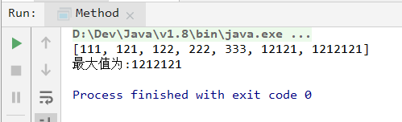
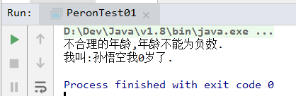
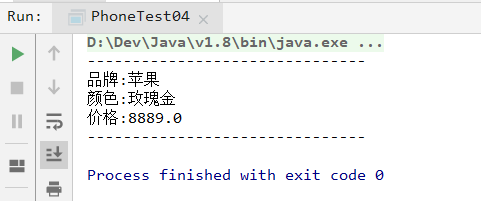
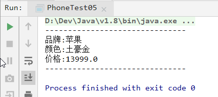
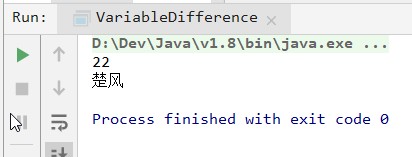
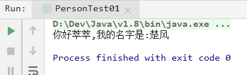
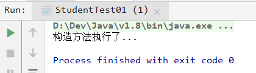

# 第六天 面向对象

> 作者:张大鹏


## 001.什么是类?

- 现实世界是由很多很多的对象组成的,基于对象抽象出了类
- 类是真实存在的个体
- 类是对象的模板,对象是类的实例


## 002.面向对象的案例

```java
package com.lxgzhw.demo01;

import java.util.Arrays;

/**
 * 面向过程:当需要实现一个功能的时候,
 * 每一个具体的步骤都要亲力亲为,详细处理每一个细节
 * 面向对象:当需要实现一个功能的时候,
 * 不关心具体的步骤,而是找一个已经具有该功能的
 * 人,来帮我做事儿
 */
public class Demo01PrintArray {
    public static void main(String[] args) {
        int[] arr = {11, 22, 33, 44};

        //要求打印格式为:[11,22,33,44]
        //使用面向过程
        System.out.print("[");
        for (int i = 0; i < arr.length; i++) {
            //判断是否为最后一个元素
            if (i == arr.length - 1) {
                System.out.println(arr[i] + "]");
            } else {
                System.out.print(arr[i] + ", ");
            }
        }

        //使用面向对象
        //找一个JDK给我们提供好的Arrays类
        //直接就能把数组变成想要的字符串
        System.out.println("-------------------------------");
        System.out.println(Arrays.toString(arr));
    }
}
```


## 003.面向对象的特点

- 封装
  - 方法就是一种方法
  - 关键字`private`也是一种封装
  - 概念:封装就是将一些细节信息隐藏起来,对于外界不可见
- 继承
- 多态


> 案例1:方法的封装

```java
package com.lxgzhw.demo03;

import java.util.Arrays;

public class Method {
    public static void main(String[] args) {
        int[] arr = {111, 222, 333, 12121, 121, 1212121, 122};

        //调用方法
        int max = getMax(arr);
        Arrays.sort(arr);
        System.out.println(Arrays.toString(arr));
        System.out.println("最大值为:" + max);
    }

    //取最大值
    public static int getMax(int[] arr) {
        //取其中的最大值
        int max = arr[0];
        //arr.fori 快捷键
        for (int i = 0; i < arr.length; i++) {
            if (max < arr[i]) {
                max = arr[i];
            }
        }
        return max;
    }
}
```

> 输出结果




> 案例2:`private`的封装

```java
package com.lxgzhw.demo03;

/*
定义年龄时,无法阻止不合理的信息被设置进来
用private关键字将需要保护的成员变量进行修饰

一旦使用private进行修饰,那么本类当中仍然可以随意访问,
但是,本类范围之外就不能直接访问了
 */
public class Person {
    private String name;//姓名
    private int age;//年龄

    public String getName() {
        return name;
    }

    public void setName(String name) {
        this.name = name;
    }

    public int getAge() {
        return age;
    }

    public void setAge(int age) {
        //对不合理的年龄进行过滤
        if (age < 0) {
            System.out.println("不合理的年龄,年龄不能为负数.");
            //将年龄设为默认值0
            this.age = 0;
        } else {
            this.age = age;
        }
    }

    public void show() {
        System.out.println("我叫:" + this.name + "我" + this.age + "岁了.");
    }
}
```

> 使用测试类进行测试

```java
package com.lxgzhw.demo03;

public class PeronTest01 {
    public static void main(String[] args) {
        Person sunWuKong = new Person();

        //一旦设为private 外部就不能直接访问了
        //只能通过方法进行设置
//        sunWuKong.name = "孙悟空";
//        sunWuKong.age = 555;
        sunWuKong.setName("孙悟空");
        //使用一个不合理的年龄进行测试
        sunWuKong.setAge(-333);
        sunWuKong.show();
    }
}
```

> 输出结果




> 注意:`boolean`类型的`get`方法要写成`is`

- 案例:学生类,性别是否为男

```java
package com.lxgzhw.demo03;

public class Student {
    private String name;//姓名
    private int age;//年龄
    private boolean male;//是不是男的

    //特殊情况,boolean类型的get方法要写is
    public boolean isMale() {
        return male;
    }

    public void setMale(boolean male) {
        this.male = male;
    }

    public String getName() {
        return name;
    }

    public void setName(String name) {
        this.name = name;
    }

    public int getAge() {
        return age;
    }

    public void setAge(int age) {
        this.age = age;
    }
}
```

> 在测试类中测试

```java
package com.lxgzhw.demo03;

public class StudentTest01 {
    public static void main(String[] args) {
        Student cuFeng = new Student();
        cuFeng.setName("楚风");
        cuFeng.setAge(24);
        cuFeng.setMale(true);


        //姓名
        System.out.println("姓名: " + cuFeng.getName());
        //年龄
        System.out.println("年龄: " + cuFeng.getAge());
        //是否为男
        System.out.println("是否为男: " + cuFeng.isMale());
    }
}
```


## 004.对象作为方法的参数

```java
package com.lxgzhw.demo02;

public class PhoneTest04 {
    public static void main(String[] args) {
        Phone iPhone = new Phone();
        iPhone.brand = "苹果";
        iPhone.price = 8889;
        iPhone.color = "玫瑰金";

        //将手机对象作为参数传给方法
        method(iPhone);
    }

    //使用自定义的类作为参数
    public static void method(Phone p) {
        System.out.println("-------------------------------");
        System.out.println("品牌:" + p.brand);
        System.out.println("颜色:" + p.color);
        System.out.println("价格:" + p.price);
        System.out.println("-------------------------------");
    }
}
```

> 打印结果



> 注意:当对象作为参数,传递到方法当中时,传递的实际上是地址值


## 005. 定义类

```java
package com.lxgzhw.demo02;

/*
定义一个类,用来模拟"手机"事物

属性:品牌,价格,颜色
行为:打电话,发短信

对应到类中:
成员变量:
    String brand;//品牌
    double price;//价格
    String color;//颜色
成员方法:
    public void call(String who){}//打电话
    public void sendMessage(){}//群发短信
 */
public class Phone {
    //成员变量
    String brand;
    double price;
    String color;

    //成员方法
    public void call(String who){
        System.out.println("给"+who+"打电话");
    }
    public void sendMessage(){
        System.out.println("Send message...");
    }
}
```


## 006.调用成员变量和成员方法

```java
package com.lxgzhw.demo02;

public class PhoneTest01 {
    public static void main(String[] args) {
        //Create a object by Phone
        Phone iphone8 = new Phone();

        //set value
        iphone8.brand = "iPhone";
        iphone8.color = "Gold";
        iphone8.price = 13888;

        System.out.println(iphone8.brand);
        System.out.println(iphone8.color);
        System.out.println(iphone8.price);
        //use function
        System.out.println("-------------------------------");
        iphone8.call("Jobs");
        iphone8.sendMessage();
    }
}
```


## 007.方法返回值是对象

```java
package com.lxgzhw.demo02;

public class PhoneTest05 {
    public static void main(String[] args) {
        //接收方法返回的PHone
        Phone iPhone = getPhone();
        //调用测试
        //当需要同包其他文件的方法是,需要指明文件名
        PhoneTest04.method(iPhone);
    }

    //返回Phone类型
    public static Phone getPhone() {
        Phone iPhone = new Phone();
        iPhone.brand = "苹果";
        iPhone.color = "土豪金";
        iPhone.price = 13999;
        return iPhone;
    }
}
```

> 输出结果



> 注意:返回什么类型,就需要用什么类型的变量接收.这里返回的是Phone类型,所以需要用Phone类型的变量来接收.


## 008.成员变量VS局部变量

- 1.定义位置不一样
  - 成员变量:方法的外部
  - 局部变量:方法的内部
- 2.作用范围不一样
  - 局部变量:只有方法中可以使用
  - 成员变量:整个类都可以使用

- 3.默认值不一样
  - 成员变量:没有默认值
  - 局部变量:有默认值,默认值是该类型的false值
- 4.内存的位置不一样
  - 成员变量:在堆内存中
  - 局部变量:在栈内存中
- 5.生命周期不一样
  - 成员变量:随着对象创建而诞生,随着对象被垃圾回收而消失
  - 局部变量:随着方法进栈而诞生,随着方法出栈而消失

```java
package com.lxgzhw.demo03;


public class VariableDifference {
    String name = "楚风";//成员变量

    public void methodA() {
        int num1 = 22;//局部变量
        //局部变量只有方法自己可以使用
        System.out.println(num1);
    }

    public void methodB() {
        //成员变量所有方法都可以使用
        System.out.println(this.name);
    }

    //主方法测试
    public static void main(String[] args) {
        VariableDifference v = new VariableDifference();
        v.methodA();
        v.methodB();
    }
}
```

> 输出结果




## 009.`this`关键字

- 当方法的局部变量和类的成员变量重名的时候,优先使用局部变量
- 如果需要访问本类当中的成员变量,就需要使用`this`关键字

- 谁调用的方法,`this`就指向谁


- 案例:`sayHi`

```java
package com.lxgzhw.demo04;

public class Person {
    public String getName() {
        return name;
    }

    public void setName(String name) {
        this.name = name;
    }

    private String name;

    void sayHi(String name) {
        System.out.println("你好" + name + ",我的名字是:" + this.name);
    }
}
```

> 测试类

```java
package com.lxgzhw.demo04;

public class PersonTest01 {
    public static void main(String[] args) {

        Person cuFeng = new Person();
        //设置我自己的名字
        cuFeng.setName("楚风");
        cuFeng.sayHi("萃萃");
    }

}
```

> 输出结果




## 010.构造方法

- 构造方法是专门用来创建对象的方法
- 我们通过关键字`new`来创建对象时,其实就是在调用构造方法
- 格式:

```
public 类名称(参数类型 参数名称){方法体}
```

- 注意:
  - 1.构造方法的名称必须和所在类名称完全一样,包括大小写
  - 2.构造方法不要写返回值类型,连`void`都不写
  - 3.构造方法不能写`return`返回值
  - 4.如果没有编写构造方法,编译器会自动生成一个默认的没有任何参数的构造方法
  - 5.一旦编写了至少一个构造方法,那么编译器不再生成默认构造方法
  - 6.构造方法也是可以进行重载(`方法名称相同,参数不同`)的
- 案例:`学生类`

```java
package com.lxgzhw.demo04;

public class Student {
    public Student() {
        System.out.println("构造方法执行了...");
    }
}
```

> 测试类

```java
package com.lxgzhw.demo04;

public class StudentTest01 {
    public static void main(String[] args) {
        //使用new关键字,实际上调用了构造方法
        Student cuFeng = new Student();
    }
}
```

> 输出结果




## 011.标准类

一个标准的类应该包含以下内容:

- 私有化的成员属性
- 无参构造方法
- 带参构造方法
- 属性的`get`和`set`成员方法
- 其他方法


- 案例:一个完整的类

```java
package com.lxgzhw.demo05;

public class Student {
    private String name;
    private int age;

    public Student() {
    }

    public Student(String name, int age) {
        this.name = name;
        this.age = age;
    }

    public String getName() {
        return name;
    }

    public void setName(String name) {
        this.name = name;
    }

    public int getAge() {
        return age;
    }

    public void setAge(int age) {
        this.age = age;
    }
}                                                                                                                                                                                                                                                                                                                                                                                                                                                                                                                                                                                                                                                                                                                                                                                                                                                                                                                                                                                                                                                                                                                                                                                                                                                                                                                                                                                                                                                                                                                                                                                                                                                                                                                                                                                                                                                                                                                                                                                                                                                                                                                        +
```

