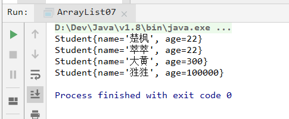

# 第七天 Scanner+Random+ArrayList

> 作者:张大鹏


## 001.Scanner

- `Scanner`类能够实现录入数据的功能
- 引用类型的一般使用步骤
  - 1.导包
    - `import 包路径.类名称`
    - 如果需要使用的目标类和当前类位于同一个包下,则可以省略不写
    - 只要`java.lang`下面的内容不需要导包
  - 2.创建
    - `类名称 对象名=new 类名称();`
  - 3.使用
    - `对象名.成员方法名();`


## 002.键盘录入

- 获取键盘输入的一个int数字 `int num=sc.netInt();`
- 获取键盘输入的一个字符串 `String str=sc.next();`

```java
package com.lxgzhw.demo01;
//1.导入包

import java.util.Scanner;

public class Scanner01 {
    public static void main(String[] args) {
        //2.创建对象
        //备注:System.in代表从键盘进行输入
        Scanner sc = new Scanner(System.in);

        //3.获取键盘输入的int数字
        System.out.println("请输入一个数字:");
        int num = sc.nextInt();
        System.out.println("输入的int数字是:" + num);

        //4.获取键盘输入的字符串
        System.out.println("请输入一个字符串:");
        String str = sc.next();
        System.out.println("您输入的字符串是:" + str);
    }
}
```


## 003.练习1

> 键盘输入两个int数字,并且,求出和值

> 分析:
>
> 1.既然需要键盘录入,那么就用Scanner
>
> 2.导包,创建,使用
>
> 3.需要录入两个数字 `sc.nextInt()`
>
> 4.对两个数字相加
>
> 5.将结果打印输出

```java
package com.lxgzhw.demo01;

import java.util.Scanner;

public class Scanner02 {
    public static void main(String[] args) {
        Scanner sc = new Scanner(System.in);
        System.out.println("请输入第1个数:");
        int num1 = sc.nextInt();
        System.out.println("请输入第2个数:");
        int num2 = sc.nextInt();
        //求和
        int sum = num1 + num2;
        //打印
        System.out.println(num1 + " + " + num2 + " = " + sum);
    }
}
```


## 004.练习2

> 键盘录入3个int数字,求出其中的最大值

> 分析:
>
> 1.既然是键盘输入,肯定需要用到Scanner
>
> 2.导包,创建,使用nextInt()方法
>
> 3.录入3个数字
>
> 4.对3个数字进行比较,得到最大值
>
> ​	4.1 先判断前两个谁最大
>
> ​	4.2 拿到前面的最大值与第三个数比较,得到最大值
>
> 5.打印最大值

```java
package com.lxgzhw.demo01;

import java.util.Scanner;

public class Scanner03 {
    public static void main(String[] args) {
        Scanner sc = new Scanner(System.in);
        System.out.println("请输入第一个数:");
        int num1 = sc.nextInt();
        System.out.println("请输入第二个数:");
        int num2 = sc.nextInt();
        System.out.println("请输入第三个数:");
        int num3 = sc.nextInt();

        //开始比较
        int max = num1;
        if (max < num2) {
            max = num2;
        }
        if (max < num3) {
            max = num3;
        }

        //打印
        System.out.println(num1 + ", " + num2 + ", "
                + num3 + " 中的最大值是:" + max);
    }
}
```


## 005.匿名对象

- 没有名字的对象就是你们对象

- 创建对象的标准格式: `类名称 对象名=new 类名称();`

- 案例:

```java
package com.lxgzhw.demo02;

public class Anonymous01 {
    public static void main(String[] args) {

        //正常情况
        Person cuFeng = new Person("楚枫", 33);
        System.out.println(cuFeng.getName());

        //匿名对象的情况
        System.out.println(new Person("萃萃", 22).getName());
    }
}
```

- 匿名对象只能使用唯一的一次,下次再用必须再创建一个新对象
- 如果确定有一个对象只需要使用唯一的一次,就可以使用匿名对象


## 006.匿名对象作为方法参数

- 匿名对象可以作为:
  - 参数
  - 返回值
  - 直接调用
- 案例

```java
package com.lxgzhw.demo02;

import java.util.Scanner;

public class Anonymous02 {
    public static void main(String[] args) {
        //匿名对象方法录入数据
        System.out.println("请输入一个数:");
        int num = new Scanner(System.in).nextInt();
        System.out.println("您输入的数是:" + num);


        //匿名对象方法作为参数
        System.out.println("-------------------------------");
        methodParam(new Scanner(System.in));

        //匿名对象作为返回值
        System.out.println("-------------------------------");
        System.out.println("请输入一个数:");
        int num1 = methodReturn().nextInt();
        System.out.println("您输入的数是:" + num1);
    }

    public static void methodParam(Scanner sc) {
        System.out.println("请输入一个数:");
        int num = sc.nextInt();
        System.out.println("输入的是:" + num);
    }

    //匿名对象作为返回值
    public static Scanner methodReturn() {
        return new Scanner(System.in);
    }
}
```


## 007.Random类

- 用来产生随机数字的
- Random是左闭右开区间,宝座不包右

- 三个步骤
  - 1.导包 `import java.util.Random`  
  - 2.创建 `Random r=new Random();`
  - 3.使用 `int num=r.nextInt(100);`
    - 如果参数留空,会生成整个int范围内的随机数
      - 正21亿-负21亿
    - 如果给参数,则是0到参数的范围
- 案例

```java
package com.lxgzhw.demo03;

import java.util.Random;

public class Random01 {
    public static void main(String[] args) {
        Random r = new Random();
        //生成随机数
        int num1 = r.nextInt();
        System.out.println("生成的随机数是:" + num1);

        //生成指定范围的随机数
        System.out.println("-------------------------------");
        int num2 = r.nextInt(101);
        System.out.println("生成的随机数是:" + num2);

        //另一种生成随机数的方法
        System.out.println("-------------------------------");
        int num3 = (int) (Math.random() * 100);
        System.out.println("生成的随机数是:" + num3);
    }
}
```

- 案例:生成随机数数组

```java
package com.lxgzhw.demo03;

import java.util.Random;

public class Random02 {
    public static void main(String[] args) {
        Random r = new Random();

        //生成随机数数组
        for (int i = 0; i < 100; i++) {
            int num = r.nextInt(10);
            System.out.print(num + "\t");
        }
    }
}
```


## 008.练习3

> 根据int变量n的值,来获取随机数,范围是[1,n],可以去到1也可以取到n

> 思路:
>
> 1.定义一个int变量n,随意赋值
>
> 2.要使用Random,三个步骤,导包,创建,使用
>
> 3.如果写10,那么就是[0,9),然而想要的是[1,9],可以发现,整体+1即可
>
> 4.打印随机数字

```java
package com.lxgzhw.demo03;

import java.util.Random;

public class Random03 {
    public static void main(String[] args) {
        int n = 10;
        Random r = new Random();

        //多来几次
        for (int i = 0; i < 100; i++) {
            //生成随机数,整体+1
            int randomNum = r.nextInt(n) + 1;
            System.out.print(randomNum + "\t");
        }
    }
}
```


## 009.猜数字小游戏

> 系统随机生成一个0-100之间的数字,让用户猜测,计算猜中的时间和次数

> 思路:
>
> 1.首先需要产生一个随机数字,并且一旦产生,就不再变化
>
> 2.需要键盘录入,所以用到了Scanner
>
> 3.获取键盘输入的数字,`sc.nextInt()`
>
> 4.比较随机数和用户输入的数字,提示太大或太小,猜中则结束游戏
>
> 5.不断循环让用户猜测,知道猜对为止`while(true)`
>
> 6.统计用户猜测的次数和时间

```java
package com.lxgzhw.demo03;

import java.util.Random;
import java.util.Scanner;

public class Random04 {
    public static void main(String[] args) {
        //统计时间
        double spendTime = 0;
        //统计次数
        int count = 0;
        //创建随机数
        Random r = new Random();
        //创建录入对象
        Scanner sc = new Scanner(System.in);

        //生成一个随机数
        int randomNum = r.nextInt(100);

        //开始时间
        double startTime = (double) System.currentTimeMillis();
        //让用户猜测
        while (true) {
            System.out.println("请输入一个0-100之间的数:");
            int userNum = sc.nextInt();
            //大了
            if (userNum > randomNum) {
                System.out.println("大了.");
            }
            //小了
            if (userNum < randomNum) {
                System.out.println("小了.");
            }
            //退出循环
            if (randomNum == userNum) {
                System.out.println("恭喜您猜对了.");
                break;
            }
            count++;
        }
        double endTime = (double) System.currentTimeMillis();
        //统计数据
        spendTime = endTime - startTime;
        spendTime /= 10000;
        System.out.println("共猜测:" + count + "次.");
        System.out.println("共消耗时间:" + spendTime + "秒");
    }
}
```


## 010.对象数组

> 定义一个数组,用来存储三个`Person`对象

```java
package com.lxgzhw.demo04;

public class ArrayList01 {
    public static void main(String[] args) {
        //首先创建一个长度为3的数组,里面用来存放Person类型的数组
        Person[] arr = new Person[3];

        //查看引用类型的默认值
        //System.out.println(arr[0]);

        //创建三个对象
        Person cuFeng = new Person("楚枫", 22);
        Person cuiCui = new Person("萃萃", 20);
        Person daHuang = new Person("大黄", 300);

        //进行赋值
        arr[0] = cuFeng;
        arr[1] = cuiCui;
        arr[2] = daHuang;

        //使用
        System.out.println(arr[0].getName());
    }
}
```

- 数组也可以存储对象
- 但是有缺点,一旦创建,无法改变


## 011.ArrayList

- ArrayList是一种最简单的集合
- 与数组的区别
  - 数组的长度不可以发生改变
  - ArrayList的长度是可以改变的
  - ArrayList有一个尖括号`<E>`,代表泛型
- `注意:泛型只能是引用类型,不能是非引用类型`
- 对于ArrayList来说,直接打印的不是地址值,而是内容,空内容是`[]`
- 向集合中添加数据需要用到`.add()`方法 
- 案例

```java
package com.lxgzhw.demo04;

import java.util.ArrayList;

public class ArrayList02 {
    public static void main(String[] args) {
        //字符串类型的数据
        //JDK 1.7 以上,右侧尖括号可以不写内容
        ArrayList<String> strList = new ArrayList<>();

        //查看内容
        //可以发现,是一个空数组
        System.out.println(strList);

        System.out.println("-------------------------------");
        //向集合中添加数据
        strList.add("楚枫");
        strList.add("萃萃");
        strList.add("大黄");
        System.out.println(strList);
    }
}
```


## 012.ArrayList常用方法

- 向集合中添加元素

```
public boolean add(E e);
```

- 从集合中获取元素

```
public E get(int index);
```

- 从集合中删除元素

```
public E remove(int index)
```

- 获取集合的长度

```
public int size()
```

- 案例

```java
package com.lxgzhw.demo04;

import java.util.ArrayList;

public class ArrayList03 {
    public static void main(String[] args) {
        ArrayList<String> arrList = new ArrayList<>();
        //添加元素
        arrList.add("楚枫");
        arrList.add("萃萃");
        arrList.add("大黄");
        System.out.println(arrList);

        //删除元素
        System.out.println("-------------------------------");
        arrList.remove(0);
        System.out.println(arrList);

        //获取元素
        System.out.println("-------------------------------");
        System.out.println(arrList.get(1));

        //查看集合长度
        System.out.println("-------------------------------");
        System.out.println(arrList.size());
    }
}
```


## 013.Arraylist的遍历

```java
package com.lxgzhw.demo04;

import java.util.ArrayList;

public class ArrayList04 {
    public static void main(String[] args) {
        ArrayList<String> arrList = new ArrayList<>();
        //添加元素
        arrList.add("楚枫");
        arrList.add("萃萃");
        arrList.add("大黄");

        //遍历集合
        for (int i = 0; i < arrList.size(); i++) {
            System.out.println(arrList.get(i));
        }
    }
}
```


## 014.ArrayList存储基本类型

- 自动装箱: `基本类型--->>>引用类型`
- 自动拆箱: `引用类型--->>>基本类型`

```java
package com.lxgzhw.demo04;

import java.util.ArrayList;

public class ArrayList05 {
    public static void main(String[] args) {
        //存储基本类型
        ArrayList<Integer> intList = new ArrayList<>();

        //添加数据
        intList.add(1);
        intList.add(2);
        intList.add(3);
        intList.add(33);

        //打印
        System.out.println(intList);
    }
}
```


## 015.练习4

> 生成20个随机整数,装到集合中,并遍历集合

```java
package com.lxgzhw.demo04;

import java.util.ArrayList;
import java.util.Random;

public class ArrayList06 {
    public static void main(String[] args) {
        //生成20个随机整数,装到集合中,并遍历集合
        Random r = new Random();
        ArrayList<Integer> intList = new ArrayList<>();

        for (int i = 0; i < 20; i++) {
            intList.add(r.nextInt(100));
        }

        //遍历集合
        for (int i = 0; i < intList.size(); i++) {
            System.out.print(intList.get(i) + "\t");
        }
    }
}
```


## 016.练习5

> 定义4个学生对象,添加到集合,并遍历

- 1.创建学生类

```java
package com.lxgzhw.demo04;

public class Student {
    private String name;
    private int age;

    @Override
    public String toString() {
        return "Student{" +
                "name='" + name + '\'' +
                ", age=" + age +
                '}';
    }

    public Student() {
    }

    public Student(String name, int age) {
        this.name = name;
        this.age = age;
    }

    public String getName() {
        return name;
    }

    public void setName(String name) {
        this.name = name;
    }

    public int getAge() {
        return age;
    }

    public void setAge(int age) {
        this.age = age;
    }
}
```

- 2.创建测试类

```java
package com.lxgzhw.demo04;

import java.util.ArrayList;

public class ArrayList07 {
    public static void main(String[] args) {
        //遍历4个学生的集合
        ArrayList<Student> students = new ArrayList<>();

        //添加学生
        students.add(new Student("楚枫", 22));
        students.add(new Student("萃萃", 22));
        students.add(new Student("大黄", 300));
        students.add(new Student("狌狌", 100000));

        //遍历学生集合
        for (int i = 0; i < students.size(); i++) {
            System.out.println(students.get(i));
        }
    }
}
```

- 3.输出结果




## 017.练习6

> 按照`{元素1@元素2@元素3}`的格式输出ArrayList集合

```java
package com.lxgzhw.demo04;

import java.util.ArrayList;

public class ArrayList08 {
    public static void main(String[] args) {
        //{元素1@元素2@元素3}
        ArrayList<String> strings = new ArrayList<>();
        strings.add("楚枫");
        strings.add("萃萃");
        strings.add("大黄");

        //按照格式打印
        arrayListPrint(strings);
    }

    //打印方法
    static void arrayListPrint(ArrayList arr) {
        System.out.print("{");
        for (int i = 0; i < arr.size(); i++) {
            //如果不是最后一个
            if (i != arr.size() - 1) {
                System.out.print(arr.get(i) + "@");
            } else {
                System.out.print(arr.get(i));
            }
        }
        System.out.print("}");
    }
}
```


## 018.练习7

> 用一个大集合存入20个随机数,筛选其中的偶数,放到小集合中
>
> 要求用自定义方法实现筛选

```java
package com.lxgzhw.demo04;

import java.util.ArrayList;
import java.util.Random;

public class ArrayList09 {
    public static void main(String[] args) {
        //用一个大集合存入20个随机数,筛选其中的偶数,放到小集合中
        //要求用自定义方法实现筛选
        ArrayList<Integer> integers = new ArrayList<>();
        Random r = new Random();
        //生成随机数集合
        for (int i = 0; i < 20; i++) {
            integers.add(r.nextInt(100));
        }
        //筛选
        integers = getArrayListEven(integers);

        //打印测试
        System.out.println(integers);
    }

    //筛选方法
    static ArrayList getArrayListEven(ArrayList<Integer> arrayList) {
        ArrayList<Integer> integers = new ArrayList<>();
        for (int i = 0; i < arrayList.size(); i++) {
            if ((arrayList.get(i) % 2) == 0) {
                integers.add(arrayList.get(i));
            }
        }
        return integers;
    }
}
```

