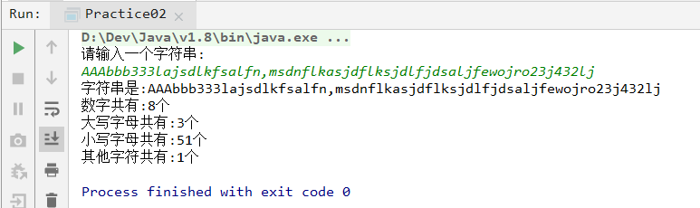
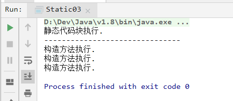

# `day008` 字符串,静态,常用工具

> 作者:张大鹏


## 001.字符串

- 程序当中所有双引号的字符串,都是String类的对象
- 字符串是常量,创建以后不能更改
- 正因为字符串不可变,所以可以共享使用
- 字符串的效果上相当于`char[]`字符数组,但是底层原理是`byte[]`字节数组


## 002.创建字符串

- 三种构造方法
  - `public String()`:创建一个空白字符串,不含任何内容
  - `public String(char[] array)`:根据字符数组的内容,来创建对应的字符串
  - `public String(byte[] array)`:根据字节数组,创建字符串
- 一种直接创建

> 代码实战

```java
package com.lxgzhw.demo01;

public class String01 {
    public static void main(String[] args) {
        //创建字符串的几种方法
        String s1 = new String();//空参构造
        System.out.println("第一个字符串:" + s1);
        System.out.println("-------------------------------");

        //根据字符数组创建字符串
        char[] charArray = {'a', 'b', 'c'};
        String s2 = new String(charArray);
        System.out.println("第二个字符串:" + s2);
        System.out.println("-------------------------------");

        //根据字节数组创建字符串
        byte[] byteArray = {67, 68, 69};
        String s3 = new String(byteArray);
        System.out.println("第三个字符串:" + s3);
        System.out.println("-------------------------------");

        //直接创建
        String s4 = "直接创建";
        System.out.println("第四个字符串:" + s4);
    }
}
```

> 注意:没有new,使用双引号直接创建,也是String类的对象


## 003.字符串常量池

- 程序当中直接写上的双引号字符串,就在字符串常量池中
- 对于应用类型来说 `==`进行的是地址值比较
- 只有直接创建的字符串才在常量池中
- 练习

```java
package com.lxgzhw.demo01;

public class String02 {
    public static void main(String[] args) {
        String s1 = "aaa";
        String s2 = "aaa";
        char[] chars = {'a', 'a', 'a'};
        String s3 = new String(chars);

        //判断是否一样
        // == 比较的是地址值 
        System.out.println(s1 == s2);//true
        System.out.println(s1 == s3);//false
        System.out.println(s2 == s3);//false
    }
}
```


## 004.字符串常用方法

- `public boolean equals(Object obj)`:参数可以是任何对象
  - 比较两个值是否相同
  - 练习

```java
package com.lxgzhw.demo01;

public class String03 {
    public static void main(String[] args) {
        //比较两个对象的值是否一样
        String s1 = "hello";
        String s2 = "hello";
        char[] chars = {'h', 'e', 'l', 'l', 'o'};
        String s3 = new String(chars);

        //比较
        System.out.println(s1.equals(s2));//true
        System.out.println(s1.equals(s3));//true
        System.out.println(s2.equals(s3));//true
    }
}
```

- 忽略大小写进行比较

```
public boolean equalsIgnoreCase(String str);
```

- 获取字符个数

```
public int length(String str);
```

- 拼接字符串

```
public String concat(String str);
```

- 获取指定索引位置的单个字符(从0开始)

```
public char charAt(int index);
```

- 查找参数字符串首次在本字符串中出现的位置,没有返回`-1`

```
public int indexOf(String str);
```


> 代码实战

```java
package com.lxgzhw.demo01;

public class String04 {
    public static void main(String[] args) {
        //查看字符串的长度
        int length = "adfasdfas".length();
        System.out.println("字符串长度是:" + length);
        System.out.println("-------------------------------");


        //拼接字符串
        String hello = "Hello";
        String world = "World";
        String concat = hello.concat(world);//全新字符串
        System.out.println(hello);//不会改变
        System.out.println(world);//不会改变
        System.out.println(concat);
        System.out.println("-------------------------------");

        //获取指定位置的单个字符
        char c = "Hello".charAt(1);
        System.out.println("1号位置是:" + c);
        System.out.println("-------------------------------");

        //查找参数字符串在源字符串中出现的位置
        //没有返回-1
        int helloIndex = "Hello world!".indexOf("Hello");
        System.out.println("Hello在字符串中的索引位置是:" + helloIndex);
        System.out.println("-------------------------------");
    }
}
```


## 005.字符串的截取

- `public String substring(int index)`:
  - 从参数位置一直到字符串末尾
  - 返回新的字符串
- `public String substring(int begin,int end)`:
  - 截取从`begin`开始,到`end`结束
  - 左包右不包
  - 返回新的字符串
- 代码演示

```java
package com.lxgzhw.demo01;

public class String05 {
    public static void main(String[] args) {
        String s = "Hello world";

        //截取方法1
        String s1 = s.substring(s.indexOf("w"));
        System.out.println(s1);
        System.out.println("-------------------------------");

        //截取方法2
        //左包右不包,所以,右边需要加一
        String s3 = s.substring(s.indexOf('w'), s.indexOf('d') + 1);
        System.out.println(s3);
        System.out.println("-------------------------------");
    }
}
```


## 006.字符串的转换

- `public char[] toCharArray()`:
  - 将当前字符串拆分为字符数组
  - 返回字符数组
- `public byte[] getBytes()`:
  - 获得当前字符串底层的字节数组
- `public String replace(CharSequence oldString,CharSequence newString)`:
  - 将所有出现的旧字符串替换为新字符串
  - 返回替换后的字符串
- 代码演示

```java
package com.lxgzhw.demo01;

public class String06 {
    public static void main(String[] args) {
        //转换为字符数组
        char[] chars = "Hello".toCharArray();
        //转换为字节数组
        byte[] bytes = "Hello".getBytes();
        //替换字符串
        String replace = "Hello World!".replace("World", "Java");

        //打印测试
        System.out.println(chars);
        System.out.println(bytes);
        System.out.println(replace);
    }
}
```


## 007.字符串的分割

- `public String[] split(String regex)`
  - 按照参数的规则,将字符串切割为若干部分
  - 返回字符串数组
- 代码实战

```java
package com.lxgzhw.demo01;

public class String07 {
    public static void main(String[] args) {
        String s = "aaa,bbb,ccc";
        //按照逗号进行切割
        String[] split = s.split(",");
        //打印
        System.out.println(split);
        //遍历
        for (int i = 0; i < split.length; i++) {
            System.out.println(split[i]);
        }
        System.out.println("-------------------------------");
        //空格分割
        String s1 = "a bb   ccc  ddddd";
        //切割方法实际上接收的是一个正则表达式
        //\\s+表示1个以上空白字符
        String[] s2 = s1.split("\\s+");
        for (int i = 0; i < s2.length; i++) {
            System.out.println(s2[i]);
        }
    }
}
```

> 注意:
>
> 1.split方法的参数其实是一个"正则表达式"


## 008.练习1

> 按照 `[word1#word2#word3]`的格式拼接字符串
>
> 要拼接的元素为: 1,2,3

> 参考答案

```java
package com.lxgzhw.demo01;

public class Practice01 {
    public static void main(String[] args) {
        //按照 `[word1#word2#word3]`的格式拼接字符串
        //要拼接的元素为: 1,2,3
        int num1 = 1, num2 = 2, num3 = 3;
        String concat = "[word".concat(String.valueOf(num1))
                .concat("#word")
                .concat(String.valueOf(num2))
                .concat("#word")
                .concat(String.valueOf(num3))
                .concat("]");
        System.out.println(concat);
    }
}
```


## 009.练习2

> 键盘输入一个字符串,统计其中各种字符出现的次数
>
> 种类有: 大写字母,小写字母,数字,其他

> 参考答案

```java
package com.lxgzhw.demo01;

import java.util.Scanner;

public class Practice02 {
    public static void main(String[] args) {
        //键盘输入一个字符串,统计其中各种字符出现的次数
        //种类有: 大写字母,小写字母,数字,其他
        Scanner sc = new Scanner(System.in);
        //1.录入一个字符串
        System.out.println("请输入一个字符串:");
        String next = sc.next();
        //2.调用统计方法
        countString(next);
    }

    //定义统计方法
    static void countString(String str) {
        //1.将字符串转换为字符数组
        char[] chars = str.toCharArray();
        //2.遍历字符数组,调用字符方法判断
        //2.1 isDigit()判断是否为数字
        //2.2 isUpperCase()判断是否为大写字母
        //2.3 isLowerCase()判断是否为小写字母
        //2.4 不是以上三者归为其他
        int digit = 0, upper = 0, lower = 0, other = 0;
        for (int i = 0; i < chars.length; i++) {
            if (Character.isDigit(chars[i])) {
                digit++;
            } else if (Character.isUpperCase(chars[i])) {
                upper++;
            } else if (Character.isLowerCase(chars[i])) {
                lower++;
            } else {
                other++;
            }
        }
        
        //3.打印
        System.out.println("字符串是:" + str);
        System.out.println("数字共有:" + digit + "个");
        System.out.println("大写字母共有:" + upper + "个");
        System.out.println("小写字母共有:" + lower + "个");
        System.out.println("其他字符共有:" + other + "个");
    }
}
```

> 输出结果




## 010.`static`关键字

- 一旦使用了`static`关键字,name这样的内容不再属于对象自己,而是属于类的,所以凡是本类的对象,都能共享同一份
- 修饰成员变量的情况

```java
package com.lxgzhw.com.lxgzhw.demo02;

public class Student {
    private int id;//学号
    private String name;
    private int age;
    static String room;//所在教室
    private static int idCounter=0;//学号计数器

    public Student() {
        idCounter++;
    }

    public int getId() {
        return id;
    }

    public void setId(int id) {
        this.id = id;
    }

    public Student(String name, int age) {
        this.name = name;
        this.age = age;
        //先自增后执行
        this.id=++idCounter;
    }


    public String getName() {
        return name;
    }

    public void setName(String name) {
        this.name = name;
    }

    public int getAge() {
        return age;
    }

    public void setAge(int age) {
        this.age = age;
    }
}
```

> 测试

```java
package com.lxgzhw.com.lxgzhw.demo02;

public class Static01 {
    public static void main(String[] args) {
        Student cuiCui = new Student("萃萃", 19);
        Student cuFeng = new Student("楚枫", 19);

        //加入教室
        cuFeng.room = "101教室";
        //打印萃萃的教室
        //可以发现,教室是同一个教室
        //多个对象共享同一个数据
        System.out.println(cuiCui.room);
        System.out.println("-------------------------------");
        //打印学号
        //学号实现了自增
        System.out.println(cuFeng.getId());
        System.out.println(cuiCui.getId());
    }
}
```


## 011.`static`修饰成员方法

- 修饰成员方法的情况
  - 一旦用`static`修饰,就变成了静态方法,静态方法属于类
  - 静态方法可以直接通过类名称调用
- 代码演示

> 定义

```java
package com.lxgzhw.com.lxgzhw.demo02;

public class MyClass {
    public static void show(){
        System.out.println("静态方法");
    }
}
```

> 调用

```java
package com.lxgzhw.com.lxgzhw.demo02;

public class Static02 {
    public static void main(String[] args) {
        //直接通过类名称调用
        //推荐写法
        MyClass.show();
    }
}
```

> 注意:对于本类中的静态方法,可以省略类名称
>
> 静态方法不能访问非静态变量
>
> 原因是内存中,先有静态内容,后有非静态内容


## 012.静态代码块

- 格式:

```
public class 类名称{
	static{
		//静态代码块的内容
	}
}
```

- 特点:当第一次用到本类时,静态代码块执行唯一的一次

- 静态内容总是优先于非静态,所以静态代码块比构造方法先执行
- 典型用途:一次性的对静态成员变量进行赋值
- 代码演示

```java
package com.lxgzhw.com.lxgzhw.demo02;

public class Static03 {
    static {
        System.out.println("静态代码块执行.");
        System.out.println("-------------------------------");
    }

    public Static03() {
        System.out.println("构造方法执行.");
    }

    public static void main(String[] args) {
        //测试
        Static03 s1 = new Static03();
        Static03 s2 = new Static03();
        Static03 s3 = new Static03();
    }
}
```

- 输出内容




## 013.`Arrays`工具类

- 是一个数组相关的工具类
- 提供了大量的静态方法,用来实现数组常用的操作
- 常用方法
  - `toString(数组)`:将数组转换为字符串
  - `sort(数组)`:对数组元素进行升序排序

- 代码演示

```java
package com.lxgzhw.demo03;

import java.util.Arrays;

public class Arrays01 {
    public static void main(String[] args) {
        //将数组变化为字符串
        int[] arr = {11, 232, 33, 32, 32, 32, 32};
        String s = Arrays.toString(arr);
        System.out.println(s);
        System.out.println("-------------------------------");

        //对数组进行升序排序
        Arrays.sort(arr);
        String s1 = Arrays.toString(arr);
        System.out.println(s1);
        System.out.println("-------------------------------");
        
    }
}
```


## 014.练习3

> 将一个随机字符串中的所有字符升序排列,并倒序打印

> 参考答案

```java
package com.lxgzhw.demo03;

import java.util.Arrays;
import java.util.Scanner;

public class Arrays02 {
    public static void main(String[] args) {
        //将一个随机字符串中的所有字符升序排列,并倒序打印
        //1.随便录入一个字符串
        Scanner sc = new Scanner(System.in);
        System.out.println("请输入任意字符串:");
        String s = sc.next();
        //2.调用字符串打印方法
        printString(s);
    }

    //字符串打印方法
    static void printString(String str) {
        //1.将字符串转换为字符数组
        char[] chars = str.toCharArray();
        //2.使用Arrays.sort()方法对数组进行升序
        Arrays.sort(chars);
        //3.遍历排序后的方法,倒序打印
        for (int i = chars.length - 1; i >= 0; i--) {
            System.out.print(chars[i] + "\t");
        }
    }
}
```


## 015.`Math`类

- 提供了大量的数学运算相关的方法
- 常用方法
  - `abs(double num)`:获取绝对值
  - `ceil(double num)`:向上取整
  - `floor(double num)`:向下取整
  - `round(double num)`:四舍五入
- 代码演示

```java
package com.lxgzhw.demo04;

public class Math01 {
    public static void main(String[] args) {
        //获取绝对值
        double num = -33.333;
        System.out.println(Math.abs(num));
        //向上取整
        System.out.println(Math.ceil(num));
        //向下取整
        System.out.println(Math.floor(num));
        //四舍五入
        System.out.println(Math.round(num));
    }
}
```


## 016.练习4

> 计算在`-10.8`到`5.9`之间,绝对值小于6且大于2的整数有多少个

> 参考答案

```java
package com.lxgzhw.demo04;

public class Math02 {
    public static void main(String[] args) {
        //计算在`-10.8`到`5.9`之间,绝对值小于6且大于2的整数有多少个
        int count = 0;
        //1.循环取值
        for (double i = -10; i < 6; i++) {
            //2.统计个数
            if (Math.abs(i) > 2 && (Math.abs(i) < 6)) {
                count++;
            }
        }
        //3.打印结果
        System.out.println("总共有" + count + "个数.");
    }
}
```

