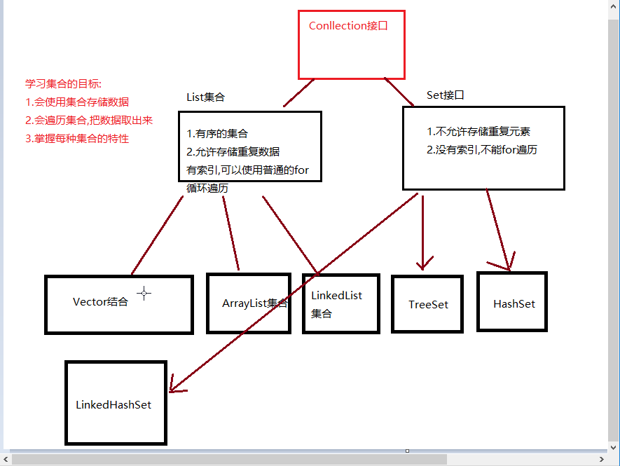

# `day013`集合,泛型

> 作者: 张大鹏


## 001.集合框架




- 有序集合
  - `ArrayList`
  - `Vector`
  - `LinkedList`
- 无序集合
  - `TreeSet`
  - `HashSet`
  - `LinkedHashSet`


## 002.Collection常用方法

- `add` 添加元素
- `clear` 清空集合
- `remove` 删除元素
- `contains` 包含
- `isEmpty` 是否为空
- `size` 集合长度
- `toArray` 转换为数组

```java
package com.lxgzhw.demo01;

import java.util.ArrayList;
import java.util.Collection;

public class Collection01 {
    public static void main(String[] args) {
        //创建集合对象
        //使用多态的方法创建
        Collection<String> strList = new ArrayList<>();

        //添加方法
        //public boolean add(E e)
        ((ArrayList<String>) strList).add("楚枫");
        ((ArrayList<String>) strList).add("萃萃");
        ((ArrayList<String>) strList).add("大黄");
        //打印
        System.out.println(strList);
        System.out.println("-------------------------------");

        //删除方法
        //public boolean remove(E ee)
        strList.remove("楚枫");//根据指定的对象删除


        System.out.println(strList);
        System.out.println("-------------------------------");


        //判断是否包含
        //public boolean contains(E e)
        if (strList.contains("萃萃")) {
            System.out.println("包含该角色.");
        }
        System.out.println("-------------------------------");

        //判断集合是否为空
        if (!strList.isEmpty()) {
            System.out.println("该集合不为空.");
        }
        System.out.println("-------------------------------");

        //查看集合中元素的个数
        System.out.println(strList.size());

        //将集合转换为数组
        Object[] objects = strList.toArray();
        for (int i = 0; i < objects.length; i++) {
            System.out.println(i);
        }

    }
}
```


## 003.`Iterator`迭代器

- 专门用来遍历集合
- 常用方法
  - `hasNext`
  - `next`
- 使用步骤
  - 1.使用集合中的`iterator`方法来获取迭代器
  - 2.使用`hasNext()`判断有没有下一个元素
  - 3.使用`next()`方法取出集合中的下一个元素

```java
package com.lxgzhw.demo01;

import java.util.ArrayList;
import java.util.Iterator;

public class Iterator01 {
    public static void main(String[] args) {
        //迭代器的使用
        ArrayList<String> roleList = new ArrayList<>();
        roleList.add("楚枫");
        roleList.add("萃萃");
        roleList.add("大黄");

        //迭代
        //boolean hasNext()判断有没有下一个
        //E next()取出下一个
        //Collection接口中有一个方法,iterator,返回的就是迭代器对象
        Iterator<String> iterator = roleList.iterator();
        //遍历
        while (iterator.hasNext()) {
            System.out.print(iterator.next() + "\t");
        }
    }
}
```


## 004.增强for循环

- 格式: `for(集合/数组类型 变量名:集合名/数组名)`

```java
package com.lxgzhw.demo02;

import java.util.ArrayList;

public class For01 {
    public static void main(String[] args) {
        //增强for循环 底层使用的也是迭代器
        int[] arr = {11, 22, 3, 333};
        for (int i :
                arr) {
            System.out.print(i + "\t");
        }

        //遍历集合
        ArrayList<String> strList = new ArrayList<>();
        strList.add("楚枫");
        strList.add("萃萃");
        strList.add("大黄");

        System.out.println("\n-------------------------------");
        for (String s :
                strList) {
            System.out.println(s);
        }
    }
}
```


## 005.泛型

- 一种未知的数据类型
- 当我们不确定使用什么数据类型的时候,可以使用泛型
- 泛型也可以看成是一个变量,用来接收数据类型
- 优势
  - 避免了类型转换的麻烦
  - 把运行期异常提升到了编译期
- 劣势
  - 泛型是什么数据,就只能存储什么类型数据


## 006.对比使用/不使用泛型

```java
package com.lxgzhw.demo03.Generic;

import java.util.ArrayList;
import java.util.Iterator;

public class Demo01Generic {
    public static void main(String[] args) {
        //调用方法
        show();
        System.out.println("-------------------------------");
        show2();
        System.out.println("-------------------------------");
    }

    /*
    创建集合对象,使用泛型:
    优势:
        1.避免了转换的麻烦,存什么类型取什么类型
        2.把运行期异常提升到编译期
    劣势:
        1.泛型是什么类型,只能存储什么类型
     */
    static void show() {
        ArrayList<String> strList = new ArrayList<>();
        //添加元素
        strList.add("楚枫");
        strList.add("萃萃");
        strList.add("大黄");

        //使用迭代器遍历集合
        Iterator<String> strIterator = strList.iterator();
        while (strIterator.hasNext()) {
            System.out.println(strIterator.next());
        }
    }

    /*
    创建集合对象,不使用泛型:
    优势:
        1.默认类型就是Object类型,可以存储任意类型的数据
    劣势:
        1.不安全,会引发异常
     */
    static void show2() {
        ArrayList arrayList = new ArrayList();
        //可以添加任意类型的数据
        arrayList.add("字符串");
        arrayList.add(111);
        arrayList.add(33.333);

        //遍历集合
        Iterator iterator = arrayList.iterator();
        while (iterator.hasNext()) {
            System.out.println(iterator.next());
        }
    }
}
```


## 007.定义泛型类

```java
package com.lxgzhw.demo03.Generic;
/*
 1.定义一个含有泛型的类
 2.泛型是一个未知的数据类型,当不确定使用什么类型时,可以使用泛型
 3.泛型可以接受任意的数据类型
 4.创建对象的时候确定泛型的数据类型 
 */
public class GenericClass<E> {
    private E name;

    public GenericClass() {
    }

    public GenericClass(E name) {
        this.name = name;
    }

    public E getName() {
        return name;
    }

    public void setName(E name) {
        this.name = name;
    }
}
```

> 使用定义的泛型类

```java
package com.lxgzhw.demo03.Generic;


public class Demo02Generic {
    public static void main(String[] args) {
        //不写泛型默认为Object类型
        GenericClass genericClass = new GenericClass();
        genericClass.setName("可以是任意类型");
        System.out.println(genericClass.getName());
        genericClass.setName(111);
        System.out.println(genericClass.getName());
        System.out.println("-------------------------------");

        //使用Integer类,就只能用int类型
        GenericClass<Integer> integerGenericClass = new GenericClass<>();
        integerGenericClass.setName(11111);
        System.out.println(integerGenericClass.getName());
        System.out.println("-------------------------------");

        //使用String类,就只能用String类型
        GenericClass<String> stringGenericClass = new GenericClass<>();
        stringGenericClass.setName("确定为字符串类型");
        System.out.println(stringGenericClass.getName());
        System.out.println("-------------------------------");
        
    }
}
```


## 008.定义泛型方法

```java
package com.lxgzhw.demo03.Generic;

/*
1.定义含有泛型的方法
2.格式
    修饰符 <泛型> 返回值类型 方法名(参数列表(泛型)){}
3.含有泛型的方法.调用时确定数据类型
4.传递什么类型的参数,泛型就是什么类型
 */

//泛型类是在 类名后面加<E>
//如public class GenericMethod<E>
public class GenericMethod {
    //定义一个含有泛型的方法
    public <M> void method(M m){
        System.out.println(m);
    }
    
    //定义一个含有泛型的静态方法
    public static <S> void method2(S s){
        System.out.println(s);
    }
            
}
```

> 使用静态方法

```java
package com.lxgzhw.demo03.Generic;

public class Demo03Generic {
    public static void main(String[] args) {
        //创建泛型方法所在的类的实例
        GenericMethod genericMethod = new GenericMethod();
        //调用泛型方法
        //可以传任意数据类型
        genericMethod.method(11);
        genericMethod.method("字符串");
        genericMethod.method(true);
        genericMethod.method(33.3333);
        System.out.println("-------------------------------");

        //静态方法无法通过对象调用
        //只能通过类名调用
        GenericMethod.method2("也可以是任意数据类型");
        GenericMethod.method2(333);
        GenericMethod.method2(false);
        System.out.println("-------------------------------");
    }
}
```


## 009.定义泛型接口

```java
package com.lxgzhw.demo03.Generic;

//定义泛型接口
//接收任意数据类型
public interface GenericInterface<E> {
    //方法使用该数据类型
    void method(E i);
}
```

> 使用字符串类型实现接口

```java
package com.lxgzhw.demo03.Generic;

public class GenericInterfaceImpl1 implements GenericInterface<String> {
    @Override
    public void method(String i) {
        System.out.println("接收字符串作为参数");
        System.out.println(i);
        System.out.println("-------------------------------");
    }
}
```

> 泛型类实现泛型接口

```java
package com.lxgzhw.demo03.Generic;

//泛型接口的另一种实现方法
//泛型类
//泛型类使用什么类型,接口就用什么类型
public class GenericInterfaceImpl2<E> implements GenericInterface<E> {
    @Override
    public void method(E i) {
        System.out.println("泛型类,接收任意数据类型");
        System.out.println(i);
        System.out.println("-------------------------------");
    }
}
```

> 测试泛型接口的实现类

```java
package com.lxgzhw.demo03.Generic;

public class Demo04GenericInterface {
    public static void main(String[] args) {
        //创建接口实现类1
        GenericInterfaceImpl1 genericInterfaceImpl1 = new GenericInterfaceImpl1();
        genericInterfaceImpl1.method("只能传递字符串");

        //创建接口实现类2 泛型
        GenericInterfaceImpl2<String> stringGenericInterfaceImpl2 = new GenericInterfaceImpl2<>();
        stringGenericInterfaceImpl2.method("传递字符串");
        GenericInterfaceImpl2<Integer> integerGenericInterfaceImpl2 = new GenericInterfaceImpl2<>();
        System.out.println("传递数字");
        integerGenericInterfaceImpl2.method(111);
    }
}
```


## 010.泛型通配符

```java
package com.lxgzhw.demo03.Generic;

import java.util.ArrayList;
import java.util.Iterator;

public class Demo05Generic {
    public static void main(String[] args) {
        //创建两种类型的集合,分别调用遍历方法
        ArrayList<String> strings = new ArrayList<>();
        strings.add("楚枫");
        strings.add("萃萃");
        strings.add("大黄");
        printArray(strings);

        ArrayList<Integer> integers = new ArrayList<>();
        integers.add(1);
        integers.add(2);
        integers.add(233);
        integers.add(233332);
        printArray(integers);
    }

    /*
    泛型通配符 ?
    1.只能作为方法的参数使用
    2.用来表示可以接收任意的数据类型
     */
    //定义一个方法,可以遍历打印任意类型集合
    static void printArray(ArrayList<?> list) {
        Iterator<?> iterator = list.iterator();
        while (iterator.hasNext()) {
            System.out.print(iterator.next() + "\t");
        }
        System.out.println("\n-------------------------------");
    }
}
```


## 011.泛型的上下限

```java
package com.lxgzhw.demo03.Generic;

import java.util.Collection;

public class Demo06Generic {
    public static void main(String[] args) {
        
    }
    //泛型的上限:表示只能是该类型或该类型的子类
    static void getElement1(Collection<? extends Number> collection){}
    //泛型的下限:表示只能是该类型或该类型的父类
    static void getElement2(Collection<? super String> collection){}
}
```

