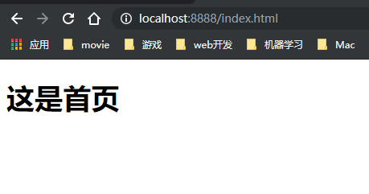

# `day022` 网络编程

> 作者: 张大鹏

## 001.聊天机器人

- 服务端

```java
package com.lxgzhw.demo01.CS;

import java.io.IOException;
import java.io.InputStream;
import java.io.OutputStream;
import java.net.ServerSocket;
import java.net.Socket;

/*
服务器
 */
public class TCPServer {
    public static void main(String[] args) throws IOException {
        //1.创建服务器并指定端口号ServerSocket
        ServerSocket ss = new ServerSocket(8888);
        //2.accept获取客户端对象 Socket
        Socket cs = ss.accept();
        //3.getInputStream获取网络字节输入流
        InputStream cis = cs.getInputStream();
        //4.使用字节输入流read方法读取客户端发送的数据
        byte[] bytes = new byte[1024];
        int len = cis.read(bytes);
        System.out.println(new String(bytes, 0, len));
        //5.getOutputStream获取网络字节输出流
        OutputStream cos = cs.getOutputStream();
        //6.使用字节输出流write方法写数据给客户端
        cos.write("机器人说:\n我终于会Java网络编程了.".getBytes());
        //7.释放资源
        ss.close();
        cs.close();
    }
}
```

- 客户端

```java
package com.lxgzhw.demo01.CS;

import java.io.IOException;
import java.io.InputStream;
import java.io.OutputStream;
import java.net.Socket;
import java.util.Scanner;

/*
客户端
 */
public class TCPClient {
    public static void main(String[] args) throws IOException {
        //1.创建客户端对象 Socket
        Socket localhost = new Socket("127.0.0.1", 8888);
        //2.获取字节输出流getOutputStream
        OutputStream outputStream = localhost.getOutputStream();
        //3.向客户端发送数据
        //3.1 让用户输入数据
        Scanner sc = new Scanner(System.in);
        System.out.println("请输入内容:");
        String next = sc.next();
        outputStream.write(next.getBytes());
        //4.获取字节输入流getInputStream
        InputStream inputStream = localhost.getInputStream();
        //5.读取服务器发送的数据
        byte[] bytes = new byte[1024];
        int len = inputStream.read(bytes);
        System.out.println(new String(bytes, 0, len));
        //6.释放资源
        localhost.close();
    }
}
```


## 002.文件上传器`版本1`

- 简单版
- 服务器

```java
package com.lxgzhw.demo02.Upload;

import java.io.*;
import java.net.ServerSocket;
import java.net.Socket;

/*
文件上传服务器
 */
public class Server {
    public static void main(String[] args) throws IOException {
        //1.创建服务器对象,并指定端口号ServerSocket
        ServerSocket serverSocket = new ServerSocket(8888);
        //2.获取客户端对象 accept
        Socket accept = serverSocket.accept();
        //3.字节输入流 getInputStream
        InputStream inputStream = accept.getInputStream();
        //4.字节输出流 getOutputStream
        OutputStream outputStream = accept.getOutputStream();
        //5.读写文件,文件夹不存在要创建
        File file = new File("hzw01.jpg");
        FileOutputStream fileOutputStream = new FileOutputStream(file);
        byte[] bytes = new byte[1024];
        int len = 0;
        while ((len = inputStream.read(bytes)) != -1) {
            fileOutputStream.write(bytes, 0, len);
        }
        //7.给客户端返回提示信息
        outputStream.write("上传成功".getBytes());
        //8.释放资源
        serverSocket.close();
        inputStream.close();
        outputStream.close();
    }
}
```

- 客户端

```java
package com.lxgzhw.demo02.Upload;

import java.io.FileInputStream;
import java.io.IOException;
import java.io.InputStream;
import java.io.OutputStream;
import java.net.Socket;

public class Client {
    public static void main(String[] args) throws IOException {
        //1.创建字节输入流对象 FileInputStream
        FileInputStream fileInputStream = new FileInputStream("hzw.jpg");
        //2.创建客户端对象 Socket
        Socket socket = new Socket("127.0.0.1", 8888);
        //3.获取客户端的输出流对象 getOutputStream
        OutputStream outputStream = socket.getOutputStream();
        //4.读取本地文件,用输出流写入
        int len = 0;
        byte[] bytes = new byte[1024];
        while ((len = fileInputStream.read(bytes)) != -1) {
            outputStream.write(bytes, 0, len);
        }
        //5.通知客户端上传完毕,关闭输出流
        socket.shutdownOutput();
        //6.使用网络字节输入流读取服务器返回的数据
        InputStream inputStream = socket.getInputStream();
        while ((len = inputStream.read(bytes)) != -1) {
            System.out.println(new String(bytes, 0, len));
        }
        //7.释放资源
        fileInputStream.close();
        socket.close();
        outputStream.close();
        inputStream.close();
    }
}
```


## 003.文件上传器 `版本2`

- 多线程版本

- 服务器

```java
package com.lxgzhw.demo03.Upload;

import java.io.File;
import java.io.FileOutputStream;
import java.io.IOException;
import java.io.InputStream;
import java.net.ServerSocket;
import java.net.Socket;
import java.util.Random;

/*
多线程文件上传:服务器
 */
public class Server {
    public static void main(String[] args) throws IOException {
        //1.创建服务器 ServerSocket
        ServerSocket serverSocket = new ServerSocket(8888);
        //2.一直监听客户端上传
        while (true) {
            //3.获取客户端对象 accept
            Socket accept = serverSocket.accept();
            //4.多线程处理文件上传,来一个开启一个新线程
            new Thread(new Runnable() {
                @Override
                public void run() {

                    //线程任务:完成文件的上传
                    try {
                        //5.保存在upload文件夹
                        File upload = new File("upload");
                        //5.1判断文件夹是否存在
                        if (!upload.exists()) {
                            //5.2不存在则创建
                            upload.mkdir();
                        }
                        //5.自定义文件的命名规则
                        //5.1 规则:域名+毫秒值+随机数
                        String fileName = "lxgzhw" + System.currentTimeMillis()
                                + new Random().nextInt(999999) + ".jpg";
                        //6.创建本地字节输出流,获取网络字节输入流
                        FileOutputStream fileOutputStream =
                                new FileOutputStream(upload + "\\" + fileName);
                        InputStream inputStream = accept.getInputStream();
                        //7.读写文件
                        byte[] bytes = new byte[1024];
                        int len = 0;
                        while ((len = inputStream.read(bytes)) != -1) {
                            fileOutputStream.write(bytes, 0, len);
                        }
                        //8.将结果通知客户端
                        accept.getOutputStream().write("上传成功".getBytes());

                        //9.释放资源
                        fileOutputStream.close();
                        inputStream.close();
                    } catch (IOException e) {
                        e.printStackTrace();
                    }

                }
            }).start();
        }
    }
}
```

- 客户端

```java
package com.lxgzhw.demo03.Upload;

import java.io.FileInputStream;
import java.io.IOException;
import java.io.InputStream;
import java.io.OutputStream;
import java.net.Socket;

public class Client {
    public static void main(String[] args) throws IOException {
        //1.创建字节输入流对象 FileInputStream
        FileInputStream fileInputStream = new FileInputStream("hzw.jpg");
        //2.创建客户端对象 Socket
        Socket socket = new Socket("127.0.0.1", 8888);
        //3.获取客户端的输出流对象 getOutputStream
        OutputStream outputStream = socket.getOutputStream();
        //4.读取本地文件,用输出流写入
        int len = 0;
        byte[] bytes = new byte[1024];
        while ((len = fileInputStream.read(bytes)) != -1) {
            outputStream.write(bytes, 0, len);
        }
        //5.通知客户端上传完毕,关闭输出流
        socket.shutdownOutput();
        //6.使用网络字节输入流读取服务器返回的数据
        InputStream inputStream = socket.getInputStream();
        while ((len = inputStream.read(bytes)) != -1) {
            System.out.println(new String(bytes, 0, len));
        }
        //7.释放资源
        fileInputStream.close();
        socket.close();
        outputStream.close();
        inputStream.close();
    }
}
```


## 004.简单浏览器服务器

- 服务器

```java
package com.lxgzhw.demo04.Web;

import java.io.*;
import java.net.ServerSocket;
import java.net.Socket;

/*
浏览器版本的服务器
 */
public class Server {
    public static void main(String[] args) throws IOException {
        //1.创建一个服务器对象 ServerSocket
        ServerSocket serverSocket = new ServerSocket(8888);
        //2.让服务器一直监听请求
        while (true) {
            //3.获取客户端对象
            Socket accept = serverSocket.accept();
            //4.开启多线程提升效率
            new Thread(new Runnable() {
                @Override
                public void run() {
                    //线程任务:处理浏览器请求
                    try {
                        //5.获取网络字节输入流,转换为字符缓冲输入流
                        InputStream inputStream = accept.getInputStream();
                        BufferedReader bufferedReader =
                                new BufferedReader(new InputStreamReader(inputStream));
                        //6.读取客户端信息的第一行
                        String firstLine = bufferedReader.readLine();
                        //7.从客户端信息中提取信息
                        String htmlPath = firstLine.split(" ")[1].substring(1);
                        //8.创建本地字节输入流
                        FileInputStream fileInputStream = new FileInputStream(htmlPath);
                        //9.获取网络字节输出流
                        OutputStream outputStream = accept.getOutputStream();
                        //10.写HTTP协议响应头
                        outputStream.write("HTTP/1.1 200 OK\r\n".getBytes());
                        outputStream.write("Content-Type:text/html\r\n".getBytes());
                        //11.写空行
                        outputStream.write("\r\n".getBytes());
                        //12.读写html文件
                        byte[] bytes = new byte[1024];
                        int len = 0;
                        while ((len = fileInputStream.read(bytes)) != -1) {
                            outputStream.write(bytes, 0, len);
                        }
                        //13.释放资源
                        fileInputStream.close();
                        outputStream.close();
                        inputStream.close();
                    } catch (IOException e) {
                        e.printStackTrace();
                    }
                }
            }).start();
        }
    }
}
```

- `index.html`

```html
<!DOCTYPE html>
<html lang="en">
<head>
    <meta charset="UTF-8">
    <title>首页</title>
</head>
<body>
<h1>这是首页</h1>
</body>
</html>
```

- 浏览器输入`localhost:8888\index.html`访问效果



