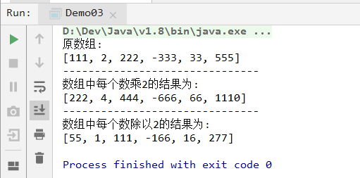
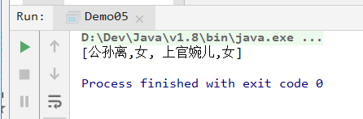

# `day023`函数式接口

> 作者: 张大鹏


## 001.函数式接口

- 接口类

```java
package com.lxgzhw.demo01.FunctionalInterface;

/*
函数式接口:
    1.有且只有一个抽象方法的接口
    2.添加@FunctionalInterface注解
    3.可以包含其他方法(默认,静态,私有)
 */
@FunctionalInterface
public interface FunctionInterface {
    void method();
}
```

- 测试类

```java
package com.lxgzhw.demo01.FunctionalInterface;

/*
使用方法:
    1.作为方法的参数
    2.作为方法的返回值
 */
public class Demo01 {
    //方法1:参数
    static void show(FunctionInterface functionalInterface) {
        functionalInterface.method();
    }

    //入口测试方法
    public static void main(String[] args) {
        //函数式接口可以用Lambda表达式优化
        show(() -> System.out.println("这是函数式接口的好处."));
    }
}
```


## 002.`Supplier`生产型

```java
package com.lxgzhw.demo02.Supplier;

import java.util.function.Supplier;

public class Demo01 {
    //定义接口方法
    static String getString(Supplier<String> supplier) {
        return supplier.get();
    }

    public static void main(String[] args) {
        //生产型函数式接口:Supplier<T>
        //作用:传什么类型,就得到什么类型

        //使用接口方法
        String cuFeng = getString(() -> "楚枫");
        System.out.println(cuFeng);
    }
}
```


## 003.练习1

- 函数式接口方法的基本使用步骤
  - 1.定义接口方法
  - 2.使用接口方法
  - 3.重写接口方法
    - 3.1 参数必须保持一致
    - 3.2 返回值类型必须保持一致

```java
package com.lxgzhw.demo02.Supplier;

import java.util.Arrays;
import java.util.function.Supplier;

/*
使用Supplier接口方法作为参数类型,
通过Lambda表达式求出int数组的最大值
 */
public class Demo02 {
    //定义接口方法
    static int getMax(Supplier<Integer> supplier) {
        return supplier.get();
    }

    public static void main(String[] args) {
        //1.定义一个int类型的数组
        int[] arr = {11, 2222, 2, 33333, 3, -3333, -111};
        //2.调用getMax接口方法
        int max = getMax(() -> {
            //3.定义数组的最大值
            int maxValue = arr[0];
            //4.遍历数组,求最大值
            //注意:java数组也支持迭代器
            for (int i : arr) {
                if (maxValue < i) {
                    maxValue = i;
                }
            }
            //5.返回最大值
            return maxValue;
        });
        //6.打印最大值
        System.out.println(Arrays.toString(arr));
        System.out.println("-------------------------------");
        System.out.println("该数组的最大值是:" + max);
    }
}
```


## 004.`Consumer`消费型

```java
package com.lxgzhw.demo03.Consumer;

import java.util.function.Consumer;

/*
消费型函数式接口Consumer<T>:
    1.特点:给什么类型的数据,就消费什么类型的数据
    2.抽象方法:accept(T t)
 */
public class Demo01 {
    //定义接口方法
    static void method(String name, Consumer<String> con) {
        //对姓名进行消费
        con.accept(name);
    }

    //入口:主方法
    public static void main(String[] args) {
        //案例:反转字符串
        method("楚枫", (String name) -> {
            String reName = new StringBuffer(name).reverse().toString();
            System.out.println("反转后的名字:" + reName);
        });
    }
}
```


## 005.函数式接口默认方法

```java
package com.lxgzhw.demo03.Consumer;

import java.util.function.Consumer;

/*
Consumer接口的默认方法:andThen
    作用:
        1.可以把两个Consumer接口组合在一起
 */
public class Demo02 {
    //定义接口方法
    static void method(String s, Consumer<String> con1,
                       Consumer<String> con2) {
        con1.andThen(con2).accept(s);
    }

    //主方法
    public static void main(String[] args) {
        //会先执行con1,再执行con2
        //案例:将验证码全小写,然后全大写
        method("As4k", (captcha) -> {
            System.out.println(captcha.toLowerCase());
        }, (captcha) -> {
            System.out.println(captcha.toUpperCase());
        });
    }
}
```


## 006.练习2

- 注意:
  - 1.`andThen`拼接的是两个步骤
  - 2.第一步的结果不会传到第二步
  - 3.所以,这里的`arr`在第二步中还是原来的`arr`

```java
package com.lxgzhw.demo03.Consumer;

import java.util.ArrayList;
import java.util.Arrays;
import java.util.function.Consumer;

/*
练习:
    要求用函数式接口拼接两个步骤
    1.定义一个整型数组
    2.将数组中的所有数都乘上2输出
    3.将数组中的所有数都除上2输出
 */
public class Demo03 {
    //接口方法
    static void operatorNum(int[] arr,
                            Consumer<Integer> con1,
                            Consumer<Integer> con2) {
        //遍历数组,消费每一个数
        for (int i : arr) {
            con1.andThen(con2).accept(i);
        }
    }

    //主方法
    public static void main(String[] args) {
        //1.定义一个数组
        int[] arr = {111, 2, 222, -333, 33, 555};
        //1.1 定义两个集合,用来存储计算后的结果
        ArrayList<Integer> arr1 = new ArrayList<>();
        ArrayList<Integer> arr2 = new ArrayList<>();
        //2.调用接口方法
        operatorNum(arr, (i) -> {
            i *= 2;
            arr1.add(i);
        }, (i) -> {
            i = i / 2;
            arr2.add(i);
        });
        //3.打印
        System.out.println("原数组:");
        System.out.println(Arrays.toString(arr));
        System.out.println("-------------------------------");
        System.out.println("数组中每个数乘2的结果为:");
        System.out.println(arr1);
        System.out.println("-------------------------------");
        System.out.println("数组中每个数除以2的结果为:");
        System.out.println(arr2);
    }
}
```

- 打印结果




## 007.`Predicate`断言

```java
package com.lxgzhw.demo04.Predicate;

import java.util.function.Predicate;

/*
Predicate:断言
该接口包含一个test方法,用来判断
 */
public class Demo01 {
    //接口方法
    static boolean checkString(String s, Predicate<String> predicate) {
        return predicate.test(s);
    }

    //主方法
    public static void main(String[] args) {
        //判断字符串的长度是否大于等于6:密码常用判断
        //1.定义一个字符串
        String password = "aaabbb";
        //2.调用方法检查
        //注意:接口参数不能与已有参数冲突
        boolean b = checkString(password, str -> str.length() >= 6);
        if (b) {
            System.out.println("该密码可用.");
        }
    }
}
```


## 008.练习3

```
有密码 Abc123
使用Predicate断言接口的and方法进行以下判断,如果满足则符合规则
	1.密码长度大于5
	2.密码包含大写
	3.密码包含小写
	4.密码包含数字
判断该密码是否可用.
```

- 参考答案

```java
package com.lxgzhw.demo04.Predicate;

import java.util.function.Predicate;

/*
Predicate断言接口能够判断:
    1.支持使用and进行与的判断
    2.可用同时判断两个以上的条件

 */
public class Demo02 {
    //接口方法
    static boolean checkPassword(String password,
                                 Predicate<String> length,
                                 Predicate<String> upper,
                                 Predicate<String> lower,
                                 Predicate<String> number
    ) {
        /*
        密码要求:
            1.长度大于5
            2.必须包含大写
            3.必须包含小写
            4.必须包含数字
         */
        return length.and(upper)
                .and(lower)
                .and(number)
                .test(password);

    }

    //主方法
    public static void main(String[] args) {
        //1.设置密码
        String password = "Abc111";
        //2.调用方法
        boolean isPassword = checkPassword(password,
                //判断长度
                (length) -> {
                    return password.length() > 5;
                },
                //判断大写
                (upper) -> {
                    boolean flag = false;
                    char[] chars = password.toCharArray();
                    for (char aChar : chars) {
                        boolean upperCase = Character.isUpperCase(aChar);
                        if (upperCase) {
                            flag = true;
                        }
                    }
                    return flag;
                },
                //判断小写
                (lower) -> {
                    boolean flag = false;
                    char[] chars = password.toCharArray();
                    for (char aChar : chars) {
                        boolean lowerCase = Character.isLowerCase(aChar);
                        if (lowerCase) {
                            flag = true;
                        }
                    }
                    return flag;
                },
                //判断数字
                (number) -> {
                    boolean flag = false;
                    char[] chars = password.toCharArray();
                    for (char aChar : chars) {
                        boolean isNum = Character.isDigit(aChar);
                        if (isNum) {
                            flag = true;
                        }
                    }
                    return flag;
                }
        );
        if (isPassword) {
            System.out.println("该密码可用.");
        }
    }
}
```


## 009.练习4

```
已知公司数据库中存在某人,
该人信息中包含"张大鹏:项目负责人..."

目前项目需求需要发生修改,需要找到该公司的项目负责人或者CEO,
判断该人是否满足需求,如果满足,提取出他的名字
```

- 参考答案

```java
package com.lxgzhw.demo04.Predicate;

/*
已知公司数据库中存在某人,
该人信息中包含"张大鹏:项目负责人..."

目前项目需求需要发生修改,需要找到该公司的项目负责人或者CEO,
判断该人是否满足需求,如果满足,提取出他的名字
 */

import java.util.function.Predicate;

/*
分析:
    1.或者的关系,用or
    2.判断用Predicate断言
    3.提取用split(":")
 */
public class Demo03 {
    //1.定义接口方法
    static boolean isHim(String info,
                         Predicate<String> isPrincipal,
                         Predicate<String> isCEO) {
        return isCEO.or(isPrincipal).test(info);
    }

    //2.定义测试方法
    public static void main(String[] args) {
        //3.定义信息
        String info = "张大鹏:项目负责人...";
        //4.调用断言方法
        boolean isHim = isHim(info,
                //5.判断是否是负责人
                principal -> {
                    //5.1 判断是否包含"项目负责人"
                    return principal.contains("项目负责人");
                },
                //6.判断是否是CEO
                ceo -> ceo.contains("CEO")
        );
        //7.提取信息,打印结果
        if (isHim) {
            String name = info.split(":")[0];
            System.out.println("我们要找的人就是他.名字叫:" + name);
        }
    }
}
```


## 010.练习5

```
现在有个项目,急需要有人开发.
经过团队商量,只要不找"皮包公司"就可以,
现在有个叫"理想国真恵玩"的人毛遂自荐,
请写一个java程序,用Predicate断言方法,判断他是否满足要求
```

- 参考答案

```java
package com.lxgzhw.demo04.Predicate;
/*
现在有个项目,急需要有人开发.
经过团队商量,只要不找"皮包公司"就可以,
现在有个叫"理想国真恵玩"的人毛遂自荐,
请写一个java程序,用Predicate断言方法,判断
他是否满足要求.
 */

import java.util.function.Predicate;

/*
分析:
    1.Predicate断言
    2.只要不,即就是非,使用negate否定
 */
public class Demo04 {
    static boolean whether(String name, Predicate<String> isSkin) {
        return isSkin.negate().test(name);
    }

    public static void main(String[] args) {
        String name = "理想国真恵玩";
        boolean whether = whether(name, skin -> skin.equals("皮包公司"));
        if (whether) {
            System.out.println("满足要求.");
        }
    }
}
```


## 011.练习6

```
现在有数组
String[] roles={
    "公孙离,女",
    "上官婉儿,女",
    "貂蝉,女",
    "阿珂,女",
    "大乔,女",
    "小乔,女",
    "诸葛亮,男",
    "司马懿,男"
}
筛选出所有复姓的女性角色
```

- 参考答案

```java
package com.lxgzhw.demo04.Predicate;

/*
现在有数组
String[] roles={
    "公孙离,女",
    "上官婉儿,女",
    "貂蝉,女",
    "阿珂,女",
    "大乔,女",
    "小乔,女",
    "诸葛亮,男",
    "司马懿,男"
}
筛选出所有复姓的女性角色
 */

import java.util.ArrayList;
import java.util.Arrays;
import java.util.function.Predicate;

/*
分析:
    1.复姓有"公孙"和"上官","诸葛","司马"
    2.遍历roles数组,以split(",")进行切割,得到姓名和性别
    3.只要姓名包含复姓中任何一个就继续判断性别是否为女
        1.可以把复姓抽出来形成新的ArrayList集合
        2.如果满足复姓且为女,放到新集合中
    4.遍历新集合,打印出所有的满足要求的角色
 */
public class Demo05 {
    /*
    1.有判断就用断言Predicate
    2.都满足是且的关系,用and
    3.数组需要遍历,遍历后的字符串作为参数
     */
    static boolean isCompoundFemale(
            String info,
            Predicate<String> name,
            Predicate<String> gender
    ) {

        return name.and(gender).test(info);
    }

    ;

    //入口主方法
    public static void main(String[] args) {
        //1.定义数组
        String[] roles = {
                "公孙离,女",
                "上官婉儿,女",
                "貂蝉,女",
                "阿珂,女",
                "大乔,女",
                "小乔,女",
                "诸葛亮,男",
                "司马懿,男"
        };
        //1.1 定义复姓集合(便于扩展)
        ArrayList<String> compounds = new ArrayList<>();
        compounds.add("公孙");
        compounds.add("上官");
        compounds.add("诸葛");
        compounds.add("司马");
        //2.定义新集合,存储符合的角色
        ArrayList<String> compoundFemale = new ArrayList<>();
        //3.遍历数组
        for (String role : roles) {
            //4.调用方法
            boolean isCompoundFemale = isCompoundFemale(role,
                    //4.1判断是否为复姓
                    compound -> {
                        boolean flag = false;
                        for (String s : compounds) {
                            //4.1.1 如果compound包含s,则是复姓
                            if (compound.contains(s)) {
                                flag = true;
                            }
                        }
                        return flag;
                    },
                    //4.2判断是否为女性
                    female -> {
                        //4.2.1先拆分字符串
                        String gender = female.split(",")[1];
                        //4.2.2判断是否为女
                        return gender.equals("女");
                    }
            );
            //5.将满足条件的角色加到新集合
            if (isCompoundFemale) {
                compoundFemale.add(role);
            }
        }
        //6.打印满足条件的角色
        System.out.println(compoundFemale);
    }
}
```

- 打印结果




## 012.`Function`类型转换接口

- 注意:`Lambda`的参数是接口函数的参数
- 主要看接口函数调用的时候是否传了参数

```java
package com.lxgzhw.demo05.Function;

import java.util.function.Function;

/*
数据类型转换接口:Function
    1.方法为apply(T t)
    2.泛型接收两个参数
        2.1 第一个参数是转换前的类型
        2.2 第二个参数是转换后的类型

案例:将字符串转换为整数
 */
public class Demo01 {
    /*
    接口函数:
        1.接收字符串
        2.返回整数
     */
    static int stringToInteger(String s,
                               Function<String, Integer> fun) {
        return fun.apply(s);
    }

    //入口方法
    public static void main(String[] args) {
        //1.定义字符串
        String s = "1222";
        //2.调用方法
        int i = stringToInteger(s, (str) -> Integer.parseInt(str));
        //3.打印
        System.out.println(i);
    }
}
```


## 013.练习

- 注意:这里的`andThen`能将前面的操作结果传给后面

```
需求:
    有一个字符串"111",将其转换为整数类型,
    然后乘100,再将结果转换为字符串类型
```

- 参考答案

```java
package com.lxgzhw.demo05.Function;

/*
依赖于Function默认方法andThen,拼接步骤
需求:
    有一个字符串"111",将其转换为整数类型,
    然后乘100,再将结果转换为字符串类型
 */

import java.util.function.Function;

/*
分析:
    1.转换用Function接口
    2.转换两次用andThen
    3.参数是字符串
    4.返回值是字符串
 */
public class Demo02 {
    /*
    接口方法:参数是字符串,返回值是字符串
     */
    static String getNewString(String s,
                               Function<String, Integer> fun1,
                               Function<Integer, String> fun2) {
        return fun1.andThen(fun2).apply(s);
    }

    //入口方法
    public static void main(String[] args) {
        //1.定义字符串
        String s = "111";
        //2.调用方法
        String newString = getNewString(s, str -> {
            int i = Integer.parseInt(str);
            i *= 100;
            return i;
        }, i -> String.valueOf(i));
        //3.打印测试
        System.out.println(newString);
    }
}
```

