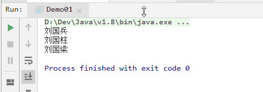
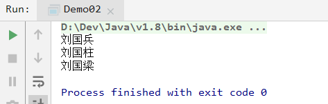
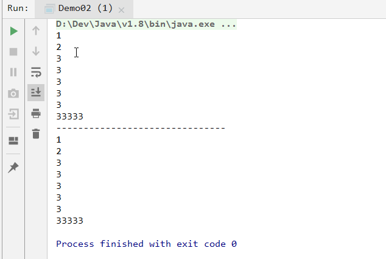
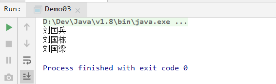
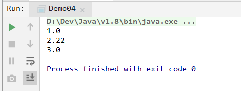
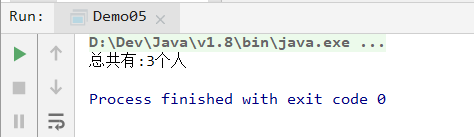
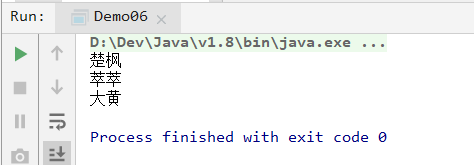
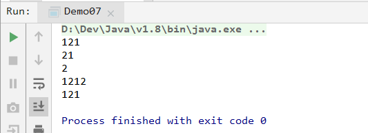
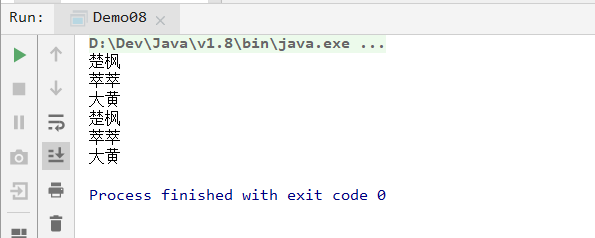
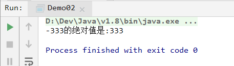

# `day024` `Stream`和方法引用

> 作者: 张大鹏


## 001.练习1

```
根据福建南平刘姓辈分表:
国、泰、玉、明，初、孔、白、梦，正、宗、德、仪，永、春，启、元，士、英、子、宁，林、考、岳、恩，生、秉、礼、义，仕、名、朝、庭，克、米、尔、祖，万、世、永、盛
传统方法过滤集合
    集合中有:
        楚枫,萃萃,大黄,狌狌,道凌,道天,刘国兵,刘国柱,刘国梁
        1.筛选出所有姓刘的人
        2.筛选出名字是三个字的人
        3.筛筛出国字辈的人
        4.放在一个新集合中
        5.打印集合
```

- 参考答案

```java
package com.lxgzhw.demo01.Stream;

import java.util.ArrayList;

/*
根据福建南平刘姓辈分表:
国、泰、玉、明，初、孔、白、梦，正、宗、德、仪，永、春，启、元，士、英、子、宁，林、考、岳、恩，生、秉、礼、义，仕、名、朝、庭，克、米、尔、祖，万、世、永、盛
传统方法过滤集合
    集合中有:
        楚枫,萃萃,大黄,狌狌,道凌,道天,刘国兵,刘国柱,刘国梁
        1.筛选出所有姓刘的人
        2.筛选出名字是三个字的人
        3.筛筛出国字辈的人
        4.放在一个新集合中
        5.打印集合
 */
public class Demo01 {
    public static void main(String[] args) {
        //传统方法
        //1.创建集合
        ArrayList<String> names = new ArrayList<>();
        //2.添加集合元素
        names.add("楚枫");
        names.add("萃萃");
        names.add("大黄");
        names.add("狌狌");
        names.add("道凌");
        names.add("道天");
        names.add("刘国兵");
        names.add("刘国柱");
        names.add("刘国梁");
        //3.创建新集合
        ArrayList<String> newNames = new ArrayList<>();
        //4.遍历集合,筛选出符合条件的放到新集合
        for (String name : names) {
            if (name.startsWith("刘") &&
                    name.length() == 3 &&
                    name.contains("国")) {
                newNames.add(name);
            }
        }
        //5.遍历新集合打印
        for (String newName : newNames) {
            System.out.println(newName);
        }
    }
}
```

- 打印结果




## 002.`Stream`流

```java
package com.lxgzhw.demo01.Stream;

import java.util.stream.Stream;

public class Demo02 {
    public static void main(String[] args) {
        //用Stream流来完成前面的练习
        /*
        Stream流类似于Python中的生成器:
            1.只能取一次
            2.比传统集合效率更高
            3.是管道流
         */
        //1.创建集合
        Stream<String> names = Stream.of("楚枫",
                "萃萃",
                "大黄",
                "狌狌",
                "道凌",
                "道天",
                "刘国兵",
                "刘国柱",
                "刘国梁"
        );
        //2.过滤集合
        names
                .filter(name -> name.startsWith("刘"))
                .filter(name -> name.length() == 3)
                .filter(name -> name.contains("国"))
                .forEach(name -> System.out.println(name));
    }
}
```

- 打印结果



- 分析
  - 1.使用`Stream.of(可变参数)`创建新集合
  - 2.使用`Stream.filter(Predicate断言接口方法)`来过滤
  - 3.使用`Stream.forEach(Consumer消费型接口方法)`来遍历
- 关于可变参数和可变方法,不会的可以翻前面的教程


## 003.创建`Stream`的六种方法

```java
package com.lxgzhw.demo02.Stream;

import java.util.ArrayList;
import java.util.HashMap;
import java.util.HashSet;
import java.util.Map;
import java.util.stream.Stream;

/*
获取Stream流的常用方法
 */
public class Demo01 {
    public static void main(String[] args) {
        //1.将ArrayList转换为流
        ArrayList<String> names = new ArrayList<>();
        names.add("楚枫");
        Stream<String> arrayListStream = names.stream();

        //2.将HashSet转换为流
        HashSet<String> names01 = new HashSet<>();
        names01.add("楚枫");
        Stream<String> hashSetStream = names01.stream();

        //3.将HashMap的键转换为流
        HashMap<String, Integer> students = new HashMap<>();
        students.put("楚枫",22);
        Stream<String> hashMapKeyStream = students.keySet().stream();

        //4.将HashMap的值转换为流
        Stream<Integer> hashMapValueStream = students.values().stream();

        //5.将HashMap的键值对转换为流
        Stream<Map.Entry<String, Integer>> hashMapKeyValueStream = students.entrySet().stream();

        //6.直接创建流
        Stream<String> roles = Stream.of("楚枫", "萃萃", "大黄");
    }
}
```

- 总结:
  - 1.`Stream`流可以通过一般集合的`stream()`方法获取
  - 2.`Stream`流可以直接通过`Stream.of()`方法直接创建


## 004.流遍历方法

```java
package com.lxgzhw.demo02.Stream;

import java.util.stream.Stream;

/*
Stream流的遍历方法:forEach
    1.参数是一个Consumer接口函数
    2.可以用Lambda表达式优化
    3.可以用引用方法优化
 */
public class Demo02 {
    public static void main(String[] args) {
        Stream<Integer> intList = Stream.of(1, 2, 3, 3, 3, 3, 3, 33333);
        Stream<Integer> intList01 = Stream.of(1, 2, 3, 3, 3, 3, 3, 33333);
        //遍历该流
        intList.forEach(num -> System.out.println(num));
        System.out.println("-------------------------------");
        //方法2 引用给方法优化
        intList01.forEach(System.out::println);
    }
}

```

- 打印结果



- 分析
  - 1.`forEach()`方法得到的是每一个元素
  - 2.引用方法默认将每个元素作为值传递给引用的方法
  - 3.`Lambda`表达式显式的指定参数和方法


## 005.流过滤方法

```java
package com.lxgzhw.demo02.Stream;

import java.util.stream.Stream;

/*
流过滤方法:filter
    1.参数是Predicate的接口方法
    2.可以用Lambda表达式优化
 */
public class Demo03 {
    public static void main(String[] args) {
        //案例:过滤出姓刘的人
        Stream<String> liu = Stream.of("刘国兵",
                "刘国栋", "刘国梁", "张德军", "张德福", "张德勇");
        liu.filter(name -> name.startsWith("刘"))
                .forEach(name -> System.out.println(name));
    }
}
```

- 打印结果




## 006.流的映射方法

```java
package com.lxgzhw.demo02.Stream;

import java.util.stream.Stream;

/*
流的映射方法:map
    1.参数是Function接口方法
    2.可以用Lambda优化
    3.将一种类型转换为另一种类型
 */
public class Demo04 {
    public static void main(String[] args) {
        //案例:将字符串转换为浮点数
        Stream<String> nums = Stream.of("1", "2.22", "3");
        nums.map(num -> Float.parseFloat(num))
                .forEach(num -> System.out.println(num));
    }
}
```

- 打印结果




## 007.流的统计方法

```java
package com.lxgzhw.demo02.Stream;

import java.util.stream.Stream;

/*
流的统计方法:count
    1.这是一个终结方法,调用后不可再使用其他方法
    2.一般放在最后使用
    3.返回值是long类型的整数
 */
public class Demo05 {
    public static void main(String[] args) {
        //案例:统计有多少个人
        Stream<String> names = Stream.of("楚枫", "萃萃", "大黄");
        long count = names.count();
        System.out.println("总共有:" + count + "个人");
    }
}
```

- 打印结果




## 008.流的截取方法

```java
package com.lxgzhw.demo02.Stream;

import java.util.Arrays;
import java.util.stream.Stream;

/*
流的截取方法:limit
    1.如果截取长度符合条件则截取,不符合不会报错
 */
public class Demo06 {
    public static void main(String[] args) {
        String[] arr = {"楚枫", "萃萃", "大黄"};
        //转换为Stream
        Stream<String> stream = Arrays.stream(arr);
        //超出则截取所有,不报错
        Stream<String> limit = stream.limit(4);
        //对截取的进行遍历
        limit.forEach(name -> System.out.println(name));
    }
}
```

- 打印结果




## 009.流的跳过方法

```java
package com.lxgzhw.demo02.Stream;

import java.util.Arrays;
import java.util.stream.IntStream;

/*
流的跳过方法:skip
    1.用于跳过前面的指定参数个元素
    2.返回值是跳过后剩余元素的新流
 */
public class Demo07 {
    public static void main(String[] args) {
        int[] arr = {11, 222, 333, 121, 21, 2, 1212, 121};
        //转换流
        IntStream stream = Arrays.stream(arr);
        //跳过前面的三个元素
        IntStream skip = stream.skip(3);
        //遍历:引用方法优化Lambda
        skip.forEach(System.out::println);
    }
}
```

- 打印结果




## 010.流的拼接方法

```java
package com.lxgzhw.demo02.Stream;

import java.util.Arrays;
import java.util.stream.Stream;

/*
流的拼接方法:concat
    1.用于将两个流拼接在一起
    2.非接口方法
    3.参数是两个参数
    4.静态方法,直接通过Stream类调用
    5.参数类型必须一致才能拼接
 */
public class Demo08 {
    public static void main(String[] args) {
        String[] arr1 = {"楚枫", "萃萃", "大黄"};
        String[] arr2 = {"楚枫", "萃萃", "大黄"};
        //转换流
        Stream<String> stream = Arrays.stream(arr1);
        Stream<String> stream1 = Arrays.stream(arr2);
        //拼接
        Stream<String> concat = Stream.concat(stream1, stream);
        //遍历
        concat.forEach(System.out::println);
    }
}
```

- 打印结果



- 注意:
  - 1.只有同类型的参数才能进行拼接


## 011.方法引用

```java
package com.lxgzhw.demo03.Reference;

/*
方法引用:
    1.如果是函数式接口
    2.如果该方法已存在
    3.就可以使用方法引用
 */
public class Demo01 {
    //定义接口方法
    static void printString(Printable p) {
        p.print("Hello");
    }

    public static void main(String[] args) {
        //会把p.print(参数)中的参数传给printUpper
        printString(new Obj()::printUpper);
    }
}
```

- 打印结果


## 012.静态方法引用

- 接口函数类

```java
package com.lxgzhw.demo03.Reference;

@FunctionalInterface
public interface Calc {
    //求绝对值
    int abs(int num);
}
```

- 测试方法类

```java
package com.lxgzhw.demo03.Reference;

/*
静态方法引用
 */
public class Demo02 {
    //定义方法,实现Calc函数式接口
    static int abs(int num, Calc c) {
        return c.abs(num);
    }

    public static void main(String[] args) {
        //使用静态方法引用求绝对值
        int abs = abs(-333, Math::abs);
        System.out.println("-333的绝对值是:" + abs);
    }
}
```

- 打印结果



- 分析
  - 1.`-333`作为参数传给了`Math::abs`
  - 2.`abs()`调用的是函数式接口方法
  - 3.因为实现方法已经存在了,所以调用直接存在的方法


## 013.`super`方法引用

- 接口方法类

```java
package com.lxgzhw.demo04.Super;
@FunctionalInterface
public interface Meet {
    //见面的接口函数
    void meet();
}
```

- 父类

```java
package com.lxgzhw.demo04.Super;

public class Human {
    //父类的sayHi方法
    public void sayHi(){
        System.out.println("嗨,我是Human类");
    }
}
```

- 子类

```java
package com.lxgzhw.demo04.Super;

public class Man extends Human {
    //重写父类sayHi
    @Override
    public void sayHi() {
        System.out.println("嗨,我是子类Man");
    }

    //定义接口函数方法:见面
    public void meet(Meet m) {
        m.meet();
    }

    //使用接口函数
    public void show() {
        //子类中调用父类的方法
        meet(super::sayHi);
    }

    //测试
    public static void main(String[] args) {
        new Man().show();
    }
}
```

