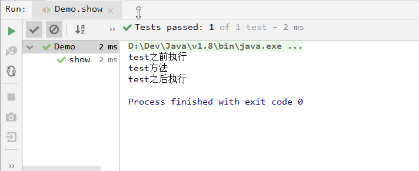
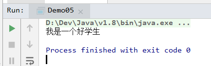
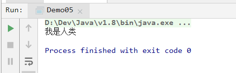

# `day025` 反射

> 作者: 张大鹏

## 001.`Junit`单元测试：

```java
import org.junit.After;
import org.junit.Before;
import org.junit.Test;

public class Demo {

    @Before
    public void befor() {
        System.out.println("test之前执行");
    }

    @Test
    public void show() {
        System.out.println("test方法");
    }

    @After
    public void after() {
        System.out.println("test之后执行");
    }
}
```

- 打印结果



- 注意事项

  - 1.`Test`加载`Junit`的时候必须下载的`Lib`包
  - 2.测试方法不能是静态方法
  - 3.测试方法必须是`public`权限


## 002.获取`Class`对象的三种方法

```java
package com.lxgzhw.demo01.Reflect;

import com.lxgzhw.domain.Person;

/*
获取class对象的方式:
    1.Class.forName("全类名")
    2.类名.class
    3.对象.getClass()
 */
public class Demo01 {
    public static void main(String[] args) throws ClassNotFoundException {

        //方法1:通过全类名获取
        Class<?> aClass = Class.forName("com.lxgzhw.domain.Person");
        System.out.println(aClass);
        System.out.println("-------------------------------");

        //方法2:通过类名获取
        Class<Person> personClass = Person.class;
        System.out.println(personClass);
        System.out.println("-------------------------------");

        //方法3:通过实例获取
        Class<? extends Person> aClass1 = new Person().getClass();
        System.out.println(aClass1);
    }
}
```


## 003.反射获取成员变量

- `Person`类

```java
package com.lxgzhw.domain;

public class Person {
    private String name;
    private int age;

    //公开属性
    public String a = "aaa";

    public Person() {
    }

    public Person(String name, int age) {
        this.name = name;
        this.age = age;
    }

    @Override
    public String toString() {
        return "Person{" +
                "name='" + name + '\'' +
                ", age=" + age +
                '}';
    }

    public String getName() {
        return name;
    }

    public void setName(String name) {
        this.name = name;
    }

    public int getAge() {
        return age;
    }

    public void setAge(int age) {
        this.age = age;
    }
}
```

- 反射测试类

```java
package com.lxgzhw.demo01.Reflect;

import com.lxgzhw.domain.Person;

import java.lang.reflect.Field;
import java.util.Arrays;
import java.util.stream.Stream;

/*
通过Class对象获取成员变量:
    1.getFields()获取public
    2.getField(成员变量名)
        1.返回成员变量
        2.可以通过成员变量.get(对象名)获取值
        3.可以通过成员变量.set(对象名,值)设置值
    3.getDeclaredFields()获取所有
 */
public class Demo02 {
    public static void main(String[] args) throws NoSuchFieldException, IllegalAccessException {
        //1.获取public成员变量
        Class<Person> personClass = Person.class;
        Field[] fields = personClass.getFields();
        Stream<Field> stream = Arrays.stream(fields);
        stream.forEach(System.out::println);
        System.out.println("-------------------------------");

        //2.获取所有成员变量
        Field[] declaredFields = personClass.getDeclaredFields();
        Stream<Field> stream1 = Arrays.stream(declaredFields);
        stream1.forEach(System.out::println);
        System.out.println("-------------------------------");

        //3.设置反射设置成员变量的值
        Person cuFeng = new Person("楚枫", 22);
        System.out.println(cuFeng);
        //3.1获取楚枫的a成员变量
        Field a = personClass.getDeclaredField("a");
        //3.2设置楚枫的年龄
        a.set(cuFeng, "哈哈哈");
        System.out.println(cuFeng.a);
    }
}
```


## 004.反射获取构造方法

```java
package com.lxgzhw.demo01.Reflect;

import com.lxgzhw.domain.Person;

import java.lang.reflect.Constructor;
import java.lang.reflect.InvocationTargetException;

/*
反射获取构造方法:
    1.getConstructors 获取公开的
    2.getDeclaredConstructors 获取所有的
 */
public class Demo03 {
    public static void main(String[] args) throws NoSuchMethodException, IllegalAccessException, InvocationTargetException, InstantiationException {
        //获取构造方法1:公开的
        Class<Person> personClass = Person.class;
        Constructor<?>[] constructors = personClass.getConstructors();
        for (Constructor<?> constructor : constructors) {
            System.out.println(constructor);
        }
        System.out.println("-------------------------------");

        //获取构造方法2:所有的
        Constructor<?>[] declaredConstructors = personClass.getDeclaredConstructors();
        for (Constructor<?> declaredConstructor : declaredConstructors) {
            System.out.println(declaredConstructor);
        }
        System.out.println("-------------------------------");

        //通过反射创建对象1:有参构造
        Constructor<Person> constructor = personClass.getConstructor(String.class, int.class);
        Person cuFeng = constructor.newInstance("楚枫", 22);
        System.out.println(cuFeng);
        System.out.println("-------------------------------");

        //通过反射创建对象2:无参构造
        Constructor<Person> constructor1 = personClass.getConstructor();
        Person cuiCui = constructor1.newInstance();
        cuiCui.setName("萃萃");
        cuiCui.setAge(21);
        System.out.println(cuiCui);
    }
}
```


## 005.通过反射获取成员方法

```java
package com.lxgzhw.demo01.Reflect;

import com.lxgzhw.domain.Student;

import java.lang.reflect.InvocationTargetException;
import java.lang.reflect.Method;

/*
通过反射获取成员方法:
    1.getMethod
    2.getDeclaredMethod
 */
public class Demo04 {
    public static void main(String[] args) throws NoSuchMethodException, InvocationTargetException, IllegalAccessException, InstantiationException {
        Class<Student> studentClass = Student.class;
        //1.获取Student类的公开方法
        Method show = studentClass.getMethod("show");
        //2.调用方法
        /*
        注意:
            1.调用方法不能直接调用,需要依赖invoke方法
            2.参数是一个类的实例对象
         */
        //show.invoke(new Student());
        show.invoke(studentClass.newInstance());
    }
}
```


## 006.框架类

> 定义一个类,可以创建任意类的对象，可以执行任意方法

- 1.在`src`目录下创建`prop.properties`配置文件

```properties
className=com.lxgzhw.domain.Student
methodName=show
```

- 2.写类文件代码

```java
package com.lxgzhw.demo01.Reflect;

import java.io.IOException;
import java.io.InputStream;
import java.lang.reflect.InvocationTargetException;
import java.lang.reflect.Method;
import java.util.Properties;

public class Demo05 {
    public static void main(String[] args) throws IOException, ClassNotFoundException, IllegalAccessException, InstantiationException, NoSuchMethodException, InvocationTargetException {
        //1.创建Properties对象
        Properties properties = new Properties();
        //2.加载配置文件,转换为集合
        ClassLoader classLoader = Demo05.class.getClassLoader();
        InputStream resourceAsStream = classLoader.getResourceAsStream("prop.properties");
        properties.load(resourceAsStream);
        //3.获取配置文件数据
        String className = properties.getProperty("className");
        String methodName = properties.getProperty("methodName");
        //4.加载该类
        Class<?> aClass = Class.forName(className);
        //5.创建对象
        Object o = aClass.newInstance();
        //6.获取方法对象
        Method method = aClass.getMethod(methodName);
        //7.执行方法
        method.invoke(o);
    }
}
```

- 打印结果



- 4.将配置文件修改为`Person`类

```properties
className=com.lxgzhw.domain.Person
methodName=show
```

- 5. 在`Person`中添加`show`方法

```java
public void show(){
    System.out.println("我是人类");
}
```

- 再次执行结果




