# `day026` `Mysql`数据库的安装

> 作者: 张大鹏


## 001.安装`Mysql`

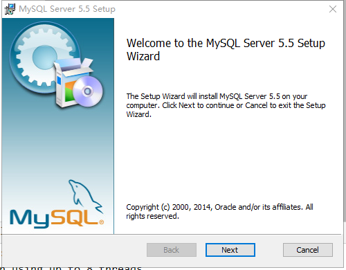


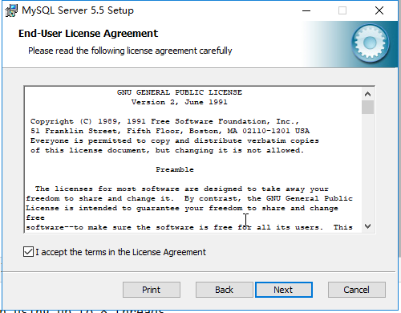

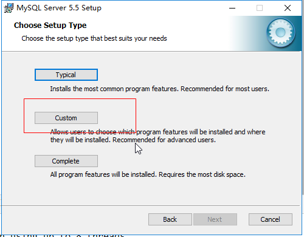

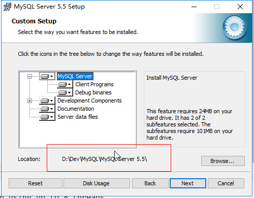

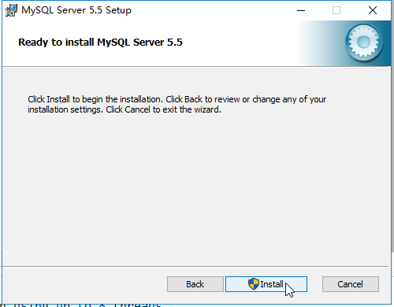

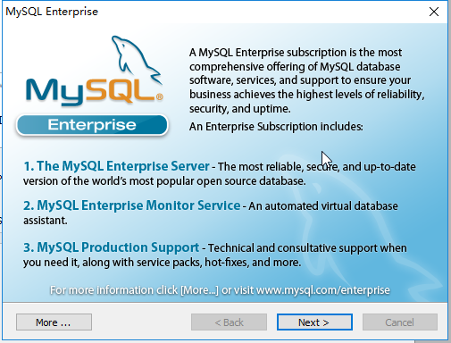


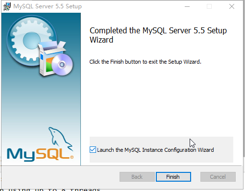

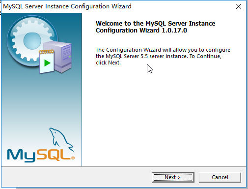

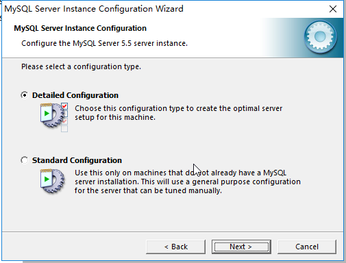

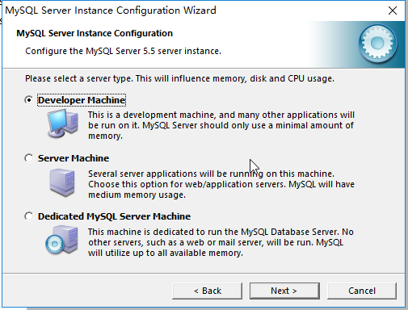

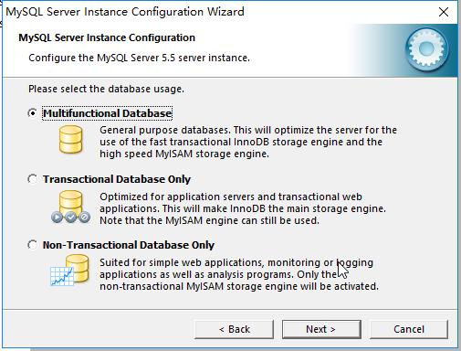

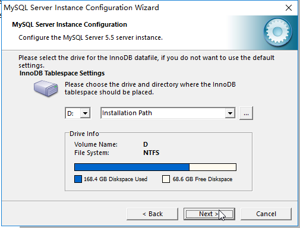

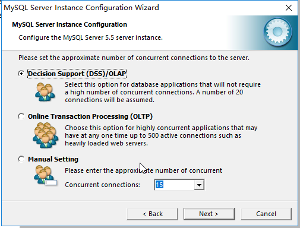

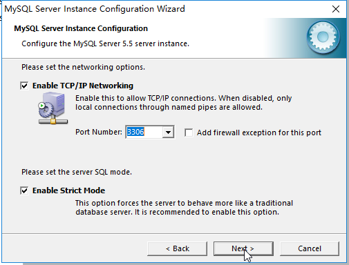

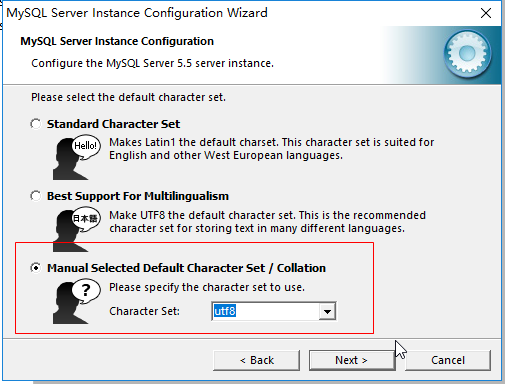

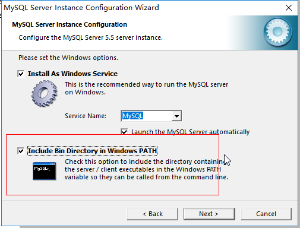

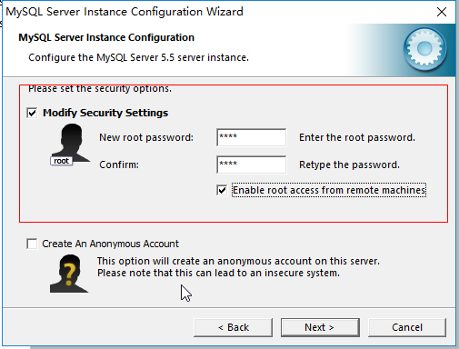

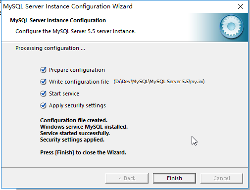


## 002.卸载

- 1.卸载`Mysql`软件
- 2.删除C盘下的`Mysql`目录

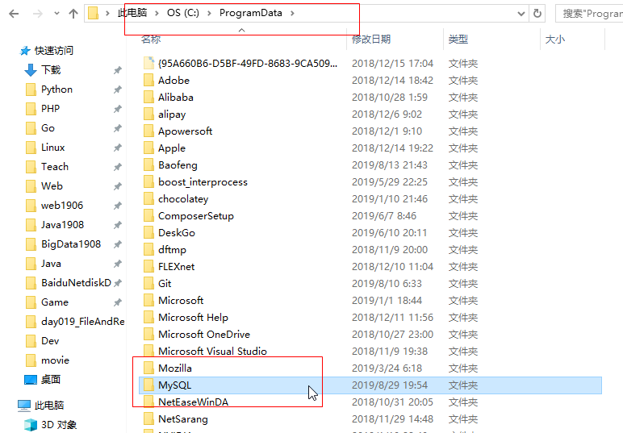


## 003.登录

- 1.在项目根目录创建`db`文件夹

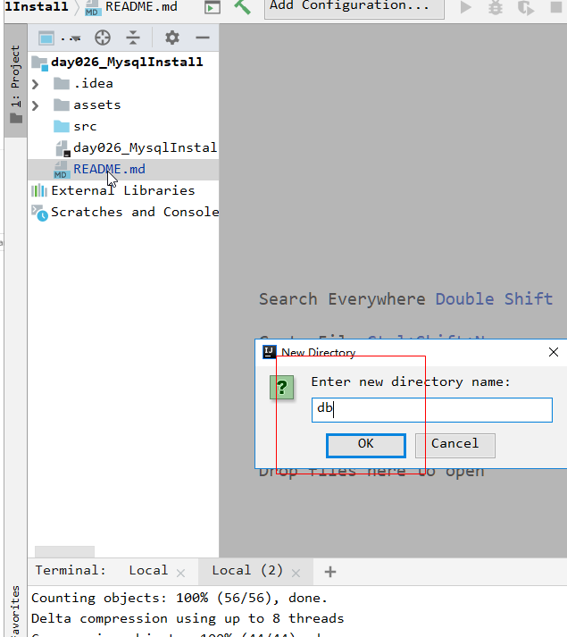

- 2.在`db`文件夹中创建`test.sql`文件

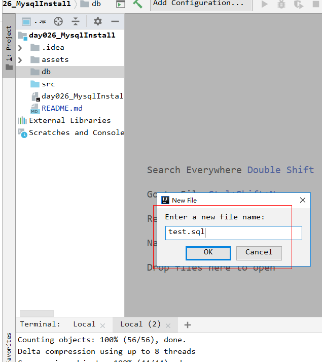

- 3.创建好后点右上角`Configure...`

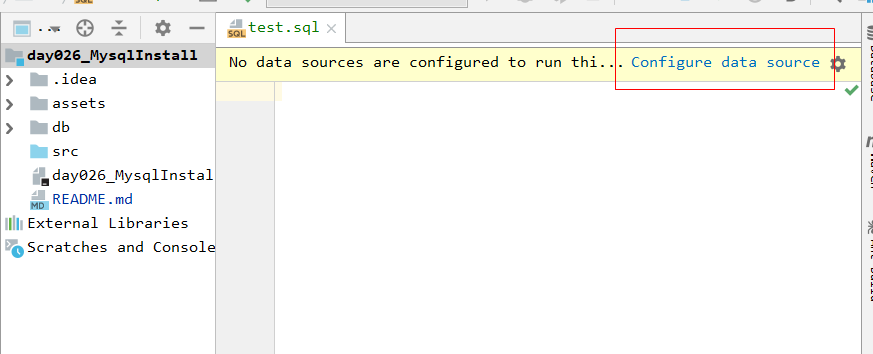

- 4.弹出窗口中添加`Mysql`

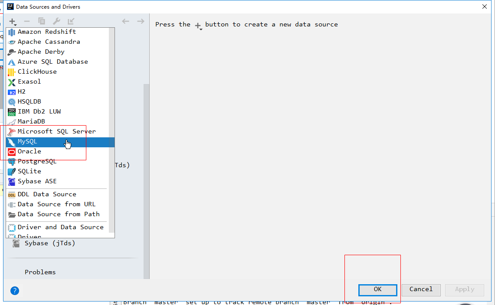

- 4.填写数据库`test`和账号密码,然后测试

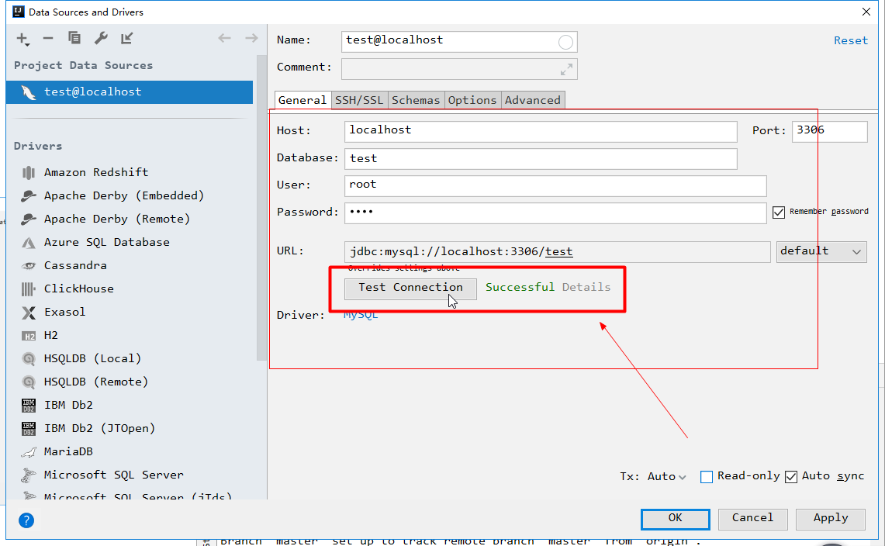

> 出现绿色的`Successful`则表示成功

- 5.在`test.sql`中写一句查询语句,然后按`ctrl+enter`运行

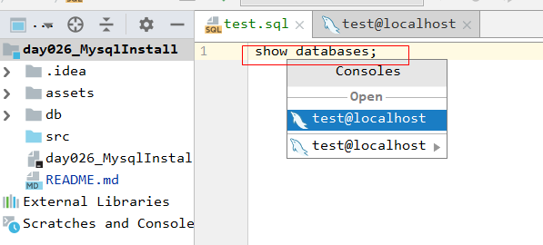

- 6.出现查询结果表示成功

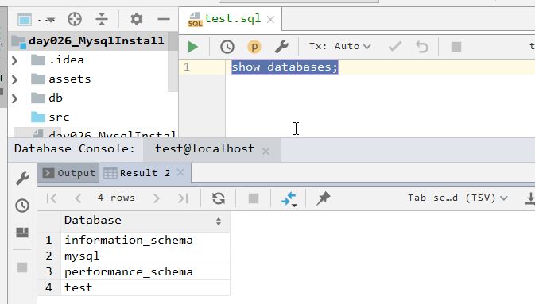


## 004.关闭和启动服务

```
管理员身份运行cmd
开启服务:net start mysql
关闭服务:net stop mysql
```


## 005.命令方式登录和退出

```
cmd打开窗口
登录: mysql -uroot -p你的密码
退出: exit
```


## 006.`SQL`

- `Structured Query Language`结构化查询语言
- 定义了操作所有关系型数据库的规则


## 007.分类

- `DDL`:操作数据库和表
- `DML`增删改表中的数据
- `DQL`查询表中的数据
- `DCL`授权


## 008.查询数据库

```
查看数据库名称
show databases;
查看创建数据库的语句
show create database mysql;
```


## 009.创建数据库

```
创建数据库
create database if not exists db1 character set utf8;
```


## 010.修改数据库

```
修改数据库的字符串
alter database db1 character set utf8;
```


## 011.删除数据库

```
删除数据库
drop database db1;
```


## 012.使用数据库

```
查看正在使用的数据库
select database();

切换到对应的数据
use db1;
```


## 013.创建表

```
语法
create table 表名(
	列名1 数据类型1,
	列名2 数据类型2,
	...
);
```

- 数据库常用数据类型
  - `int`:整数类型
  - `double`:小数类型
  - `date`:日期类型,只包含年月日
  - `datetime`:日期类型,包含年月日时分秒
  - `timestamp`:时间戳类型,包含年月日时分秒
    - 如果不赋值或者赋值为null,则默认使用当前系统时间
  - `varchar`:字符串
- 创建一张学生表

```sql
-- 创建数据库
create database if not exists db1 character set utf8;

-- 使用数据库
use db1;

-- 查看当前正使用的数据库
select database();

-- 创建学生表
create table students(
  id int primary key auto_increment,
  name varchar (32),
  age int,
  math double (4,1),
  english double (4,1),
  chinese double (4,1),
  birthday date,
  insert_time timestamp
);

-- 删除学生表
drop table students;
```


## 014.查询表

```
查询所有的表
show tables;

查询表结构
desc 表名;
```


## 015.更新表

```
修改表名
alter table 表名 rename to 新的表名;

修改表的字符集
alter table 表名 character set 字符集名称;

添加一列
alter table 表名 add 列名 数据类型;

修改列名称类型
alter table 表名 change 列名 行列名 新数据类型;
alter table 表名 modify 列名 新数据类型;

删除列
alter table 表名 drop 列名;
```


## 016.删除表

```
格式: drop table 表名;

删除学生表
drop table students;
```


## 017.复制表

```
格式: create table 表名 like 被复制的表名;
```


## 018.`SQLYog`的安装和使用

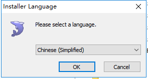

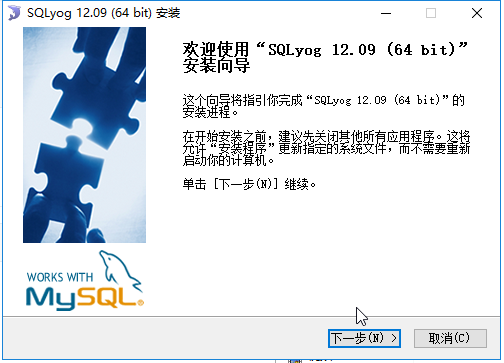

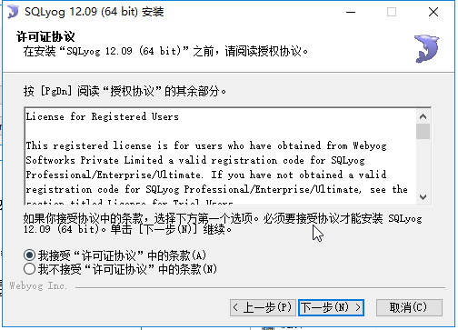

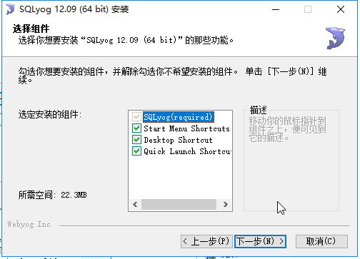

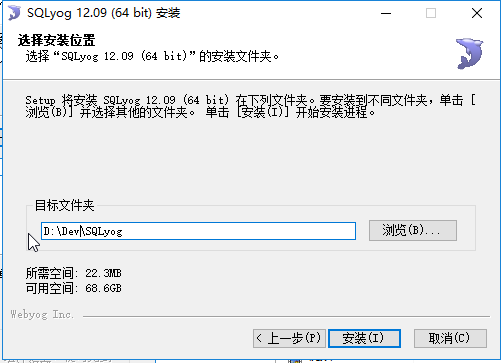

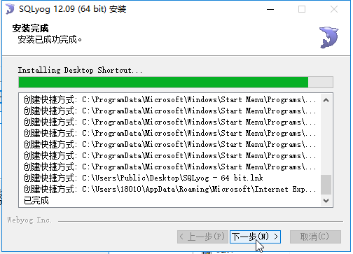

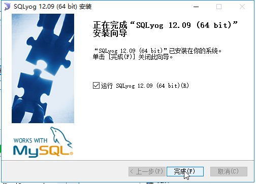

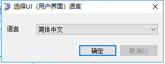

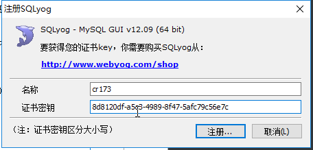

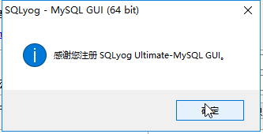

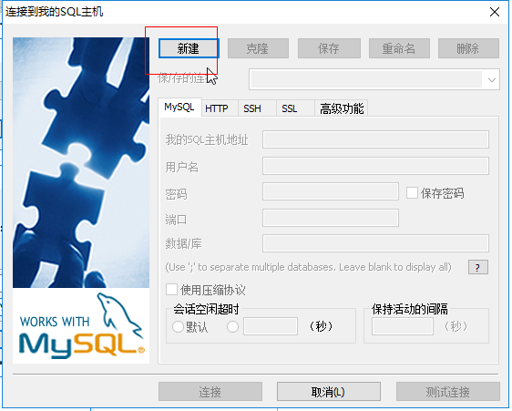


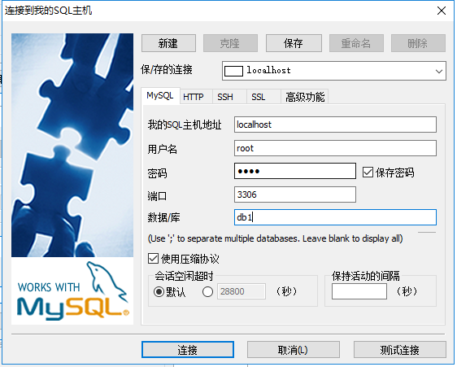

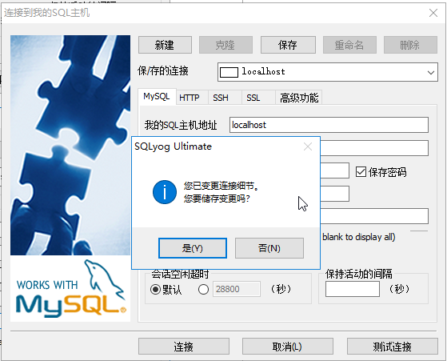

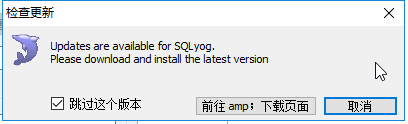

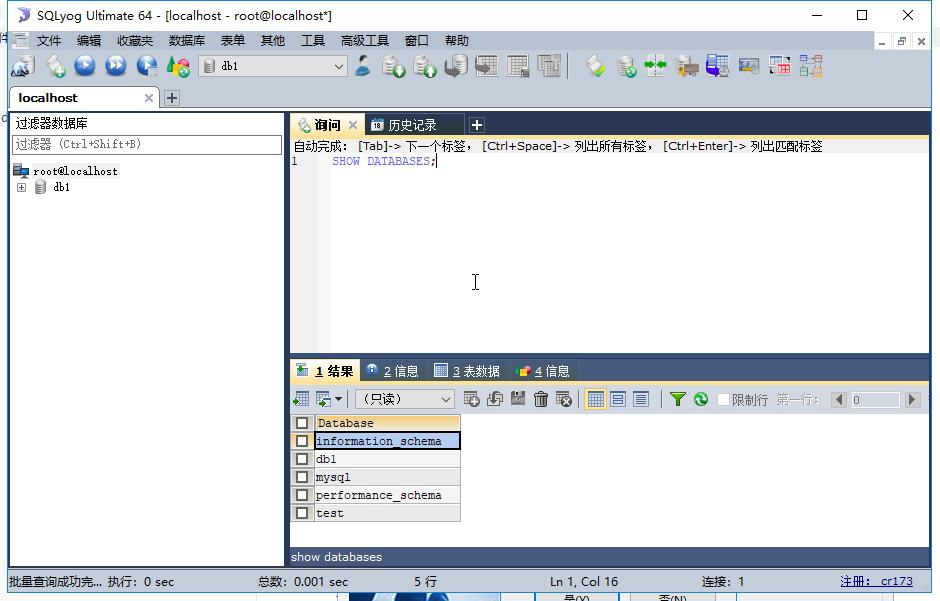


## 019.`DML`之添加数据

```
格式:insert into 表名(字段) values(对应数据);
```

- 注意:
  - 1.列表和值要依次对应
  - 2.如果不给值,可以写`null`
  - 3.除了数字类型,其他类型都需用单引号或双引号引起来

- 同时向`students`表添加多条数据

```sql
-- 向学生表插入数据
use db1;
desc students;

-- 同时插入多条数据
insert into students (name ,age,math,english,chinese,birthday)
values
("张大鹏",22,99,33,88,"1993-8-29")
;

select *from students;


insert into students (name ,age,math,english,chinese,birthday)
values 
("刘国兵",22,69,63,78,"1993-8-29"),
("刘国梁",21,79,73,78,"1993-8-29"),
("刘国栋",21,99,73,78,"1993-8-29");
```


## 020.`DQL`之查询所有记录

```
格式:select *from 表名;
```


## 021.`DML`之删除数据

```
格式:delete from 表名 条件;

格式2:truncate table 表名;
注意:truncate 会先删除表,再创建一张一模一样的表,推荐使用,效率更高

删除id为1的
delete from students where id=1;
```

- 注意:
  - 1.如果不给条件,会删除所有数据


## 022.`DML`之修改数据

```
格式: update 表名 set 列名=新值 条件;
多个数据可以用逗号隔开
```

- 注意:
  - 1.不加任何条件会修改所有数据
  - 2.修改多个数据可以用逗号隔开


## 023.基础查询

```
去重查询
select distinct 字段 from 表名 条件

计算
select name math,english,math+english from students;
注意,只要有null,计算结果都是null
解决方法:ifnull(可能为null的字段,默认值)
select name math,english,math+ifnull(english,0) from students;

多字段查询
select 字段名1,字段名2... from 表名;

起别名:as关键字,as也可以省略
```

- 查询所有学生的成绩

```sql
-- 查询所有学生的成绩
use db1;
show tables;
select *from students;
select name,math,english,chinese,math+english+chinese as 总分 from students;
```


## 024.条件查询

```
where子句后面跟条件

运算符
>  <  = ...
in (可能的条件列表)
between 小值 and 大值
and or not
is null
is not null
```

- 查询数学分数大于80分的学生

```sql
-- 查询数学分数大于80分的学生
select name,math from students where math>80;
```


## 025.模糊查询

```
like关键字
_ 表示任意单个字符
% 表示任意多个字符

查询姓马的
like "马%"

查询第二个字是化的
like "_化%"

查询姓名中包含马的人
lik "%马%"
```

- 查询姓刘的学生

```sql
-- 查询姓刘的学生
select *from students where name like "刘%";
```

- 查询姓名中有"兵"字的学生

```sql
-- 查询姓名中有兵字的学生
select *from students where name like "%兵%";
```


