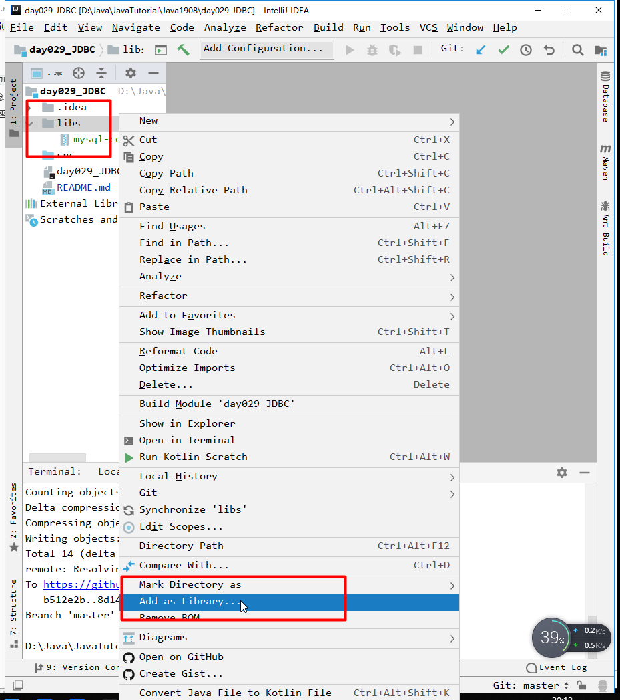
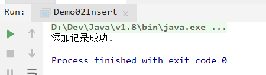
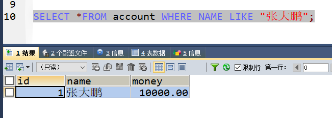
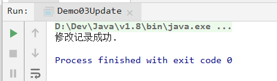
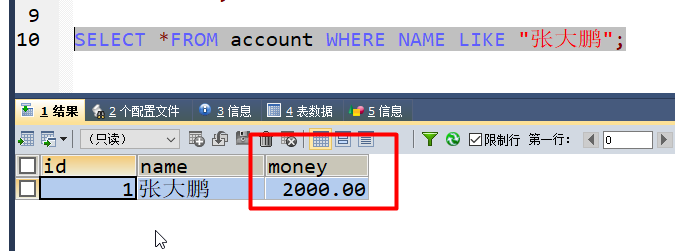
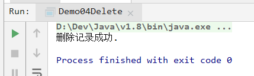
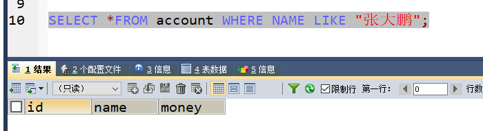
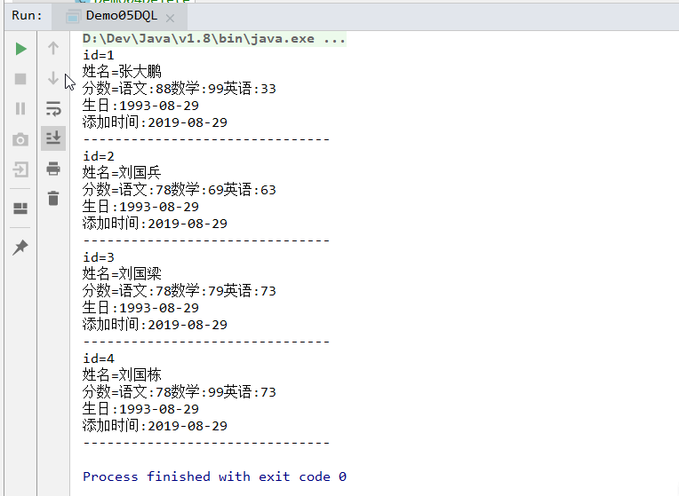
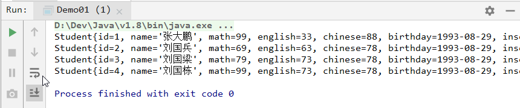
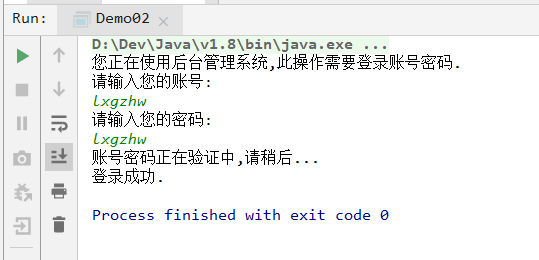

# `day029` `JDBC`

> 作者: 张大鹏


## 001.概念

> 其实是官方（sun公司）定义的一套操作所有关系型数据库的规则，即接口。各个数据库厂商去实现这套接口，提供数据库驱动jar包。我们可以使用这套接口（`JDBC`）编程，真正执行的代码是驱动jar包中的实现类。


## 002.快速入门

- 1.导入驱动`jar`包



> 1.创建libs目录
>
> 2.将mysql驱动包复制到该目录
>
> 3.将该目录添加为Library目录

- 2.写测试代码

```java
package com.lxgzhw.demo01.JDBC;

import java.sql.*;

public class Demo01 {
    public static void main(String[] args) throws SQLException, ClassNotFoundException {
        //1.注册驱动
        Class.forName("com.mysql.jdbc.Driver");
        //2.获取数据库连接对象DriverManager
        Connection connection = DriverManager.getConnection(
                "jdbc:mysql://localhost:3306/db1",
                "root",
                "root");
        //3.定义sql语句
        String sql = "select *from students";
        //4.获取执行sql的对象 Statement
        Statement statement = connection.createStatement();
        //5.执行sql
        ResultSet resultSet = statement.executeQuery(sql);
        //6.处理结果
        System.out.println(resultSet);
        //7.释放资源
        statement.close();
        connection.close();
    }
}
```


## 003.添加记录

1.先创建一张表

```sql
CREATE TABLE account(
  id INT PRIMARY KEY AUTO_INCREMENT,
  NAME VARCHAR(24),-- 姓名
  money DOUBLE(7,2)-- 金额
);

SHOW TABLES;
DESC account;
```

2.写`java`代码

```java
package com.lxgzhw.demo01.JDBC;

import java.sql.Connection;
import java.sql.DriverManager;
import java.sql.SQLException;
import java.sql.Statement;

/*
添加记录:insert语句
 */
public class Demo02Insert {
    public static void main(String[] args) {
        Connection connection = null;
        Statement statement = null;
        try {
            //1.注册驱动
            Class.forName("com.mysql.jdbc.Driver");
            //2.定义sql
            String sql = "insert into account values(null,'张大鹏',10000)";
            //3.获取Connection对象 DriverManager
            connection = DriverManager.getConnection(
                    "jdbc:mysql://localhost:3306/db1",
                    "root",
                    "root"
            );
            //4.通过Connection对象创建Statement对象
            statement = connection.createStatement();
            //5.执行sql
            int i = statement.executeUpdate(sql);
            //6.处理结果
            if (i > 0) {
                System.out.println("添加记录成功.");
            } else {
                System.out.println("添加记录失败.");
            }
        } catch (ClassNotFoundException e) {
            e.printStackTrace();
        } catch (SQLException e) {
            e.printStackTrace();
        } finally {
            //7.释放资源
            //不为null才关闭,防止空指针异常
            if (statement != null) {
                try {
                    statement.close();
                } catch (SQLException e) {
                    e.printStackTrace();
                }
            }
            if (connection != null) {
                try {
                    connection.close();
                } catch (SQLException e) {
                    e.printStackTrace();
                }
            }
        }
    }
}
```

打印结果



数据库查询结果




## 004.修改记录

1.写`java`代码

```java
package com.lxgzhw.demo01.JDBC;

import java.sql.Connection;
import java.sql.DriverManager;
import java.sql.SQLException;
import java.sql.Statement;

/*
修改数据库表记录:update
 */
public class Demo03Update {
    public static void main(String[] args) {
        Connection connection=null;
        Statement statement=null;
        try {
            //1.注册驱动
            Class.forName("com.mysql.jdbc.Driver");
            //2.获取连接对象 DriverManager
            connection = DriverManager.getConnection(
                    "jdbc:mysql://localhost:3306/db1",
                    "root",
                    "root"
            );
            //3.获取Statement对象
            statement = connection.createStatement();
            //4.定义sql
            String sql="update account set money=2000 where id=1";
            //5.执行sql
            int i = statement.executeUpdate(sql);
            //6.结果
            if (i>0){
                System.out.println("修改记录成功.");
            }else {
                System.out.println("修改记录失败.");
            }
        } catch (ClassNotFoundException e) {
            e.printStackTrace();
        } catch (SQLException e) {
            e.printStackTrace();
        }finally {
            //7.释放资源
            if (connection!=null){
                try {
                    connection.close();
                } catch (SQLException e) {
                    e.printStackTrace();
                }
            }
            if (statement!=null){
                try {
                    statement.close();
                } catch (SQLException e) {
                    e.printStackTrace();
                }
            }
        }
    }
}
```



2.查询数据库




## 005.删除记录

1.写`java`代码

```java
package com.lxgzhw.demo01.JDBC;

import java.sql.Connection;
import java.sql.DriverManager;
import java.sql.SQLException;
import java.sql.Statement;

/*
jdbc删除数据库表记录:delete
 */
public class Demo04Delete {
    public static void main(String[] args) {
        //1.定义Connection对象和Statement对象
        Connection connection=null;
        Statement statement=null;
        try {
            //2.注册驱动
            Class.forName("com.mysql.jdbc.Driver");
            //3.创建Connection和Statement对象
            connection= DriverManager.getConnection(
                    ///表示默认本地和默认3306端口
                    "jdbc:mysql:///db1",
                    "root",
                    "root"
            );
            statement=connection.createStatement();
            //4.创建sql语句并执行
            String sql="delete from account where id=1";
            int i = statement.executeUpdate(sql);
            //5.处理结果
            if (i>0){
                System.out.println("删除记录成功.");
            }else {
                System.out.println("删除记录失败.");
            }
        } catch (ClassNotFoundException e) {
            e.printStackTrace();
        } catch (SQLException e) {
            e.printStackTrace();
        }finally {
            //6.释放资源
            if (statement!=null){
                try {
                    statement.close();
                } catch (SQLException e) {
                    e.printStackTrace();
                }
            }
            if (connection!=null){
                try {
                    connection.close();
                } catch (SQLException e) {
                    e.printStackTrace();
                }
            }
        }
    }
}
```

执行结果



2.查询数据库



数据库中id为1的记录已经不在了,说明删除成功.


## 006.查询记录

```java
package com.lxgzhw.demo01.JDBC;

import java.sql.*;

/*
jdbc操作数据库表:查询记录
 */
public class Demo05DQL {
    public static void main(String[] args) {
        //1.创建Connection,Statement,ResultSet对象
        Connection connection=null;
        Statement statement=null;
        ResultSet resultSet=null;
        try{
            //2.注册驱动
            Class.forName("com.mysql.jdbc.Driver");
            //3.实现Connection对象和Statement对象
            connection= DriverManager.getConnection(
                    "jdbc:mysql:///db1",
                    "root",
                    "root"
            );
            statement=connection.createStatement();
            //4.定义sql语句
            String sql="select *from students";
            //5.执行SQL语句,把结果装在ResultSet对象中
            resultSet=statement.executeQuery(sql);
            /*
            注意:
                增伤改也就是DDL用executeUpdate方法
                查询也就是DQL用executeQuery方法
             */
            //6.处理结果
            while (resultSet.next()){
                //根据字段获取数据
                //id name age math english chinese birthday insert_time
                int id=resultSet.getInt("id");
                String name=resultSet.getString("name");
                int english=resultSet.getInt("english");
                int math=resultSet.getInt("math");
                int chinese=resultSet.getInt("chinese");
                Date birthday=resultSet.getDate("birthday");
                Date insert_time=resultSet.getDate("insert_time");
                System.out.println("id="+id);
                System.out.println("姓名="+name);
                System.out.println("分数="+"语文:"+chinese+"数学:"+math+"英语:"+english);
                System.out.println("生日:"+birthday);
                System.out.println("添加时间:"+insert_time);
                System.out.println("-------------------------------");
            }
        } catch (ClassNotFoundException e) {
            e.printStackTrace();
        } catch (SQLException e) {
            e.printStackTrace();
        }finally {
            if (statement!=null){
                try {
                    statement.close();
                } catch (SQLException e) {
                    e.printStackTrace();
                }
            }
            if (resultSet!=null){
                try {
                    resultSet.close();
                } catch (SQLException e) {
                    e.printStackTrace();
                }
            }
            if (connection!=null){
                try {
                    connection.close();
                } catch (SQLException e) {
                    e.printStackTrace();
                }
            }
        }
    }
}
```

打印结果




## 007.封装`JDBCUtils`

1.在`src`目录下创建`jdbc.properties`文件

```properties
url=jdbc:mysql:///db1
user=root
password=root
driver=com.mysql.jdbc.Driver
```

2.创建`JDBCUtils.java`文件

```java
package com.lxgzhw.demo02.uitil;

import java.io.FileNotFoundException;
import java.io.FileReader;
import java.io.IOException;
import java.net.URL;
import java.sql.*;
import java.util.Properties;

/*
封装JDBC工具类
 */
public class JDBCUtils {
    //定义四个私有静态变量
    /*
    1.静态代码块只能用静态变量
    2.这些变量不想被外部访问,只在内部使用
     */
    private static String url;
    private static String user;
    private static String password;
    private static String driver;

    /**
     * 文件的读取.只需要读取一次,使用静态代码块
     * 静态代码块的特点是只会执行一次
     */
    static {
        //读取资源文件,获取值
        try {
            //1.创建Properties集合类
            Properties properties = new Properties();
            //2.加载配置文件
            ClassLoader classLoader = JDBCUtils.class.getClassLoader();
            URL resource = classLoader.getResource("jdbc.properties");
            String path = resource.getPath();
            properties.load(new FileReader(path));
            //3.获取数据并赋值
            url = properties.getProperty("url");
            user = properties.getProperty("user");
            password = properties.getProperty("password");
            driver = properties.getProperty("driver");
            //4.注册驱动
            Class.forName(driver);
        } catch (FileNotFoundException e) {
            e.printStackTrace();
        } catch (IOException e) {
            e.printStackTrace();
        } catch (ClassNotFoundException e) {
            e.printStackTrace();
        }
    }

    /**
     * 获取Connection连接
     *
     * @return 连接对象
     */
    public static Connection getConnection() throws SQLException {
        return DriverManager.getConnection(url, user, password);
    }

    /**
     * DDL操作后释放资源
     *
     * @param statement  执行sql语句的对象
     * @param connection 连接数据库的对象
     */
    public static void close(Statement statement, Connection connection) {
        if (statement != null) {
            try {
                statement.close();
            } catch (SQLException e) {
                e.printStackTrace();
            }
        }
        if (connection != null) {
            try {
                connection.close();
            } catch (SQLException e) {
                e.printStackTrace();
            }
        }
    }

    /**
     * DQL操作后释放资源
     *
     * @param resultSet  结果集对象
     * @param statement  执行sql的对象
     * @param connection 连接数据库的对象
     */
    public static void close(ResultSet resultSet, Statement statement, Connection connection) {
        if (resultSet != null) {
            try {
                resultSet.close();
            } catch (SQLException e) {
                e.printStackTrace();
            }
        }
        if (statement != null) {
            try {
                statement.close();
            } catch (SQLException e) {
                e.printStackTrace();
            }
        }
        if (connection != null) {
            try {
                connection.close();
            } catch (SQLException e) {
                e.printStackTrace();
            }
        }
    }
}
```


## 008.封装数据库结果集

> ```
> 练习1:定义一个方法，查询students表的数据将其封装为对象，然后装载集合，返回。
> ```

```java
package com.lxgzhw.demo03.Practice;

import com.lxgzhw.demo02.uitil.JDBCUtils;

import java.sql.*;
import java.util.ArrayList;

/*
练习1:定义一个方法，查询students表的数据将其封装为对象，然后装载集合，返回。
 */
public class Demo01 {
    public static void main(String[] args) {
        //1.获取集合
        ArrayList<Student> allStudents = getAllStudents();
        //2.遍历集合
        allStudents.stream().forEach(System.out::println);
    }

    /*
    分析:
        1.Students表字段
          id name age math english chinese birthday insert_time
        2.需要根据字段创建对应的Student类对象
        3.查询数据库中的students表,将结果封装为对象
        4.将所有的对象装到一个集合中
        5.将集合返回
            这里选ArrayList集合
     */
    static ArrayList<Student> getAllStudents() {
        //0.定义一个空集合
        ArrayList<Student> students = null;
        PreparedStatement preparedStatement = null;
        Connection connection = null;
        ResultSet resultSet = null;
        try {
            students = new ArrayList<>();
            //1.获取连接
            connection = JDBCUtils.getConnection();
            //2.定义sql语句
            String sql = "select *from students";
            //3.执行sql语句
            preparedStatement = connection.prepareStatement(sql);
            resultSet = preparedStatement.executeQuery();
            //4.封装对象,装到集合
            while (resultSet.next()) {
                int id = resultSet.getInt("id");
                String name = resultSet.getString("name");
                int english = resultSet.getInt("english");
                int math = resultSet.getInt("math");
                int chinese = resultSet.getInt("chinese");
                Date birthday = resultSet.getDate("birthday");
                Date insert_time = resultSet.getDate("insert_time");
                //4.1创建对象
                Student student = new Student();
                student.setId(id);
                student.setName(name);
                student.setEnglish(english);
                student.setChinese(chinese);
                student.setMath(math);
                student.setBirthday(birthday);
                student.setInsert_time(insert_time);
                //4.2将对象装到集合中
                students.add(student);
            }
        } catch (SQLException e) {
            e.printStackTrace();
        } finally {
            JDBCUtils.close(resultSet, preparedStatement, connection);
        }
        //5.返回集合
        return students;
    }
}
```

打印结果




## 009.用户登录

1.创建数据库表

```sql
-- 创建数据库表并添加一条数据
CREATE TABLE users(
  id INT PRIMARY KEY AUTO_INCREMENT,
  `username` VARCHAR(24),
  `password` VARCHAR(72)
);

INSERT INTO users VALUES
(NULL,"lxgzhw","lxgzhw"),
(NULL,"zhangdapeng","zhangdapeng");

SELECT * FROM users;
```

2.写`java`代码

```java
package com.lxgzhw.demo03.Practice;
/*
练习:用户输入账号密码,连接数据库查询,判断账号密码是否正确
 */

import com.lxgzhw.demo02.uitil.JDBCUtils;

import java.sql.*;
import java.util.Scanner;

/*
分析:
    1.用户录入用Scanner
    2.没有数据库表需要创建
    3.使用JDBCUtils工具类获取连接
    4.使用PrepareStatement.executeQuery()查询
    5.判断是否有next(),没有则表示没有数据,账号密码不存在或错误
    6.使用JDBCUtils释放资源
 */
public class Demo02 {
    public static void main(String[] args) {
        //1.创建要用到的Connection,ResultSet,Statement对象
        Connection connection = null;
        ResultSet resultSet = null;
        PreparedStatement statement = null;
        try {
            //2.获取Connection和Statement对象
            connection = JDBCUtils.getConnection();
            //3.获取用户输入的账号密码
            System.out.println("您正在使用后台管理系统,此操作需要登录账号密码.");
            System.out.println("请输入您的账号:");
            Scanner sc = new Scanner(System.in);
            String username = sc.next();
            System.out.println("请输入您的密码:");
            String password = sc.next();
            System.out.println("账号密码正在验证中,请稍后...");
            //4.定义sql语句
            String sql = "select id from users where username=? and password=?";
            statement = connection.prepareStatement(sql);
            statement.setString(1, username);
            statement.setString(2, password);
            //5.执行sql语句
            resultSet = statement.executeQuery();
            //6.根据结果判断登录是否成功
            if (resultSet.next()) {
                System.out.println("登录成功.");
            } else {
                System.out.println("用户名或密码错误.");
            }
        } catch (SQLException e) {
            e.printStackTrace();
        } finally {
            JDBCUtils.close(resultSet, statement, connection);
        }
    }
}
```

运行结果



