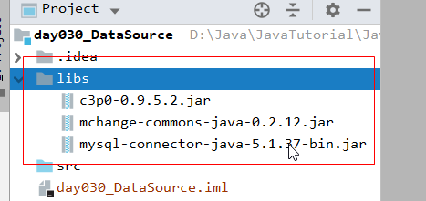
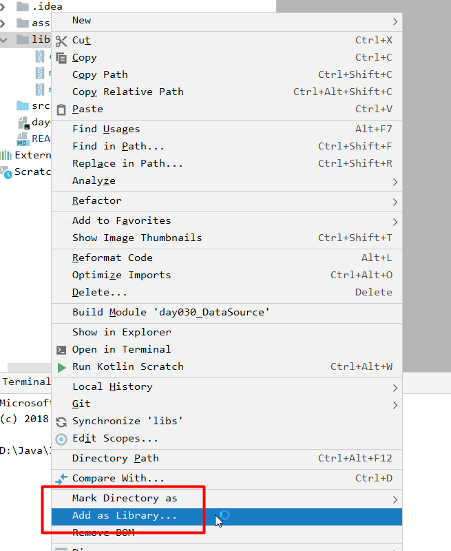
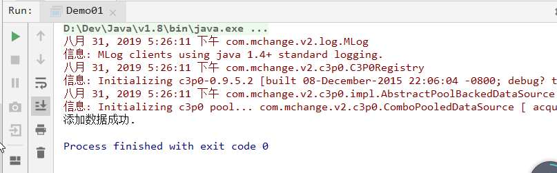
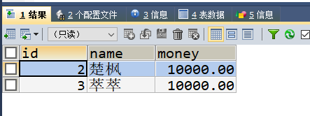
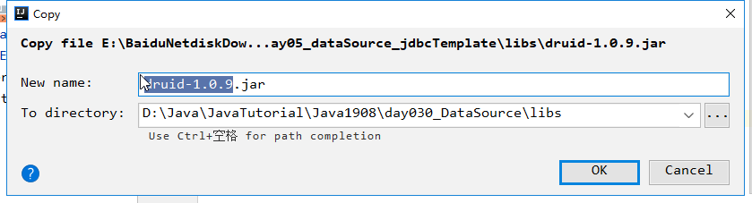
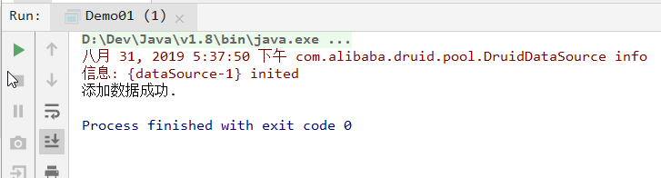
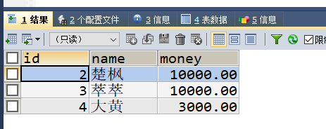
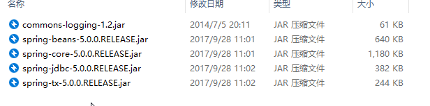
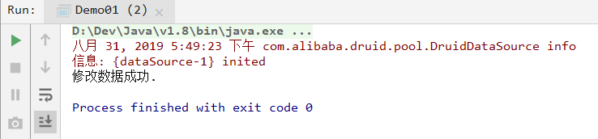
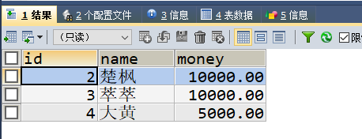

# `day030` `DataSource`

> 作者: 张大鹏


## 001.`C3P0`数据库连接池技术

1.导入`jar`包



2.将`libs`目录添加为`Library`



3.创建配置文件`src/c3p0-config.xml`

```xml
<c3p0-config>
    <!-- 使用默认的配置读取连接池对象 -->
    <default-config>
        <!--  连接参数 -->
        <property name="driverClass">com.mysql.jdbc.Driver</property>
        <property name="jdbcUrl">jdbc:mysql://localhost:3306/db1</property>
        <property name="user">root</property>
        <property name="password">root</property>

        <!-- 连接池参数 -->
        <!--初始化申请的连接数量-->
        <property name="initialPoolSize">5</property>
        <!--最大的连接数量-->
        <property name="maxPoolSize">10</property>
        <!--超时时间-->
        <property name="checkoutTimeout">3000</property>
    </default-config>
</c3p0-config>
```

4.写`java`代码

```java
package com.lxgzhw.demo01.C3P0;

import com.mchange.v2.c3p0.ComboPooledDataSource;

import java.sql.Connection;
import java.sql.PreparedStatement;
import java.sql.SQLException;

/*
获取C3P0的数据库连接池
 */
public class Demo01 {
    public static void main(String[] args) throws SQLException {
        //1.创建数据库连接池对象
        ComboPooledDataSource comboPooledDataSource = new ComboPooledDataSource();
        //2.获取连接对象
        Connection connection = comboPooledDataSource.getConnection();
        //3.使用
        //3.1 定义sql语句
        String sql = "insert into account values(null,?,?)";
        //3.2 预编译sql语句
        PreparedStatement preparedStatement = connection.prepareStatement(sql);
        //3.3 执行sql语句
        preparedStatement.setString(1, "萃萃");
        preparedStatement.setDouble(2, 10000);
        int i = preparedStatement.executeUpdate();
        //3.4 处理结果
        if (i > 0) {
            System.out.println("添加数据成功.");
        } else {
            System.out.println("添加数据失败.");
        }
    }
}
```

> 打印结果



> 数据库查询结果




## 002.`Druid`数据库连接池技术

1.导入`jar包`



2.定义配置文件

`src/druid.properties`

```properties
driverClassName=com.mysql.jdbc.Driver
url=jdbc:mysql:///db1
username=root
password=root
# 初始化连接数量
initialSize=5
# 最大连接数
maxActive=10
# 最大等待时间
maxWait=3000
```

3.写`java`代码

```java
package com.lxgzhw.demo02.Druid;

import com.alibaba.druid.pool.DruidDataSourceFactory;

import javax.sql.DataSource;
import java.io.IOException;
import java.io.InputStream;
import java.sql.Connection;
import java.sql.PreparedStatement;
import java.util.Properties;

public class Demo01 {
    public static void main(String[] args) throws Exception {
        //1.加载配置文件
        Properties properties = new Properties();
        InputStream resourceAsStream = Demo01.class.getClassLoader()
                .getResourceAsStream("druid.properties");
        properties.load(resourceAsStream);
        //2.获取连接池对象
        DataSource dataSource = DruidDataSourceFactory.createDataSource(properties);
        //3.获取连接
        Connection connection = dataSource.getConnection();
        //4.使用
        //4.1 定义sql语句
        String sql = "insert into account values(null,?,?)";
        //4.2 预编译sql语句
        PreparedStatement preparedStatement = connection.prepareStatement(sql);
        preparedStatement.setString(1, "大黄");
        preparedStatement.setDouble(2, 3000);
        //4.3 执行sql语句
        int i = preparedStatement.executeUpdate();
        //4.4 处理结果
        if (i > 0) {
            System.out.println("添加数据成功.");
        } else {
            System.out.println("添加数据失败.");
        }
    }
}
```

> 运行结果



> 数据库查询结果




## 003.`Spring JDBC`

1.导入`jar`包



2.写`java`代码

```java
package com.lxgzhw.demo03.Spring;

import com.alibaba.druid.pool.DruidDataSourceFactory;
import org.springframework.jdbc.core.JdbcTemplate;

import javax.sql.DataSource;
import java.util.Properties;

public class Demo01 {
    public static void main(String[] args) throws Exception {
        //1.加载配置文件
        Properties properties = new Properties();
        properties.load(Demo01.class.getClassLoader()
                .getResourceAsStream("druid.properties"));

        //2.创建连接池对象
        DataSource dataSource = DruidDataSourceFactory.createDataSource(properties);

        //3.创建JDBCTemplate对象
        JdbcTemplate jdbcTemplate = new JdbcTemplate(dataSource);

        //4.写sql语句
        String sql = "update account set money=5000 where name=?";
        //5.执行sql语句
        int update = jdbcTemplate.update(sql, "大黄");
        //6.处理结果
        if (update > 0) {
            System.out.println("修改数据成功.");
        } else {
            System.out.println("修改数据失败.");
        }
    }
}
```

> 运行结果



> 数据库查询结果




## 004.插入数据

```java
package com.lxgzhw.demo03.Spring;

import com.alibaba.druid.pool.DruidDataSourceFactory;
import org.springframework.jdbc.core.JdbcTemplate;

import javax.sql.DataSource;
import java.util.Properties;

public class Demo02Insert {
    public static void main(String[] args) throws Exception {
        //1.加载配置文件
        Properties properties = new Properties();
        properties.load(Demo02Insert.class.getClassLoader()
                .getResourceAsStream("druid.properties"));

        //2.创建连接池对象 DruidDataSourceFactory
        DataSource dataSource = DruidDataSourceFactory.createDataSource(properties);

        //3.获取JDBCTemplate对象
        JdbcTemplate jdbcTemplate = new JdbcTemplate(dataSource);

        //4.定义sql语句
        String sql = "insert into account values(null,?,?)";

        //5.编译sql语句并执行
        int count = jdbcTemplate.update(sql, "刘国兵", 4888);

        //6.处理结果
        if (count > 0) {
            System.out.println("添加数据成功.");
        }
    }
}
```


## 005.封装`JDBCUtils`

```java
package com.lxgzhw.demo03.Spring;

import com.alibaba.druid.pool.DruidDataSourceFactory;
import org.springframework.jdbc.core.JdbcTemplate;

import javax.sql.DataSource;
import java.io.IOException;
import java.util.Properties;

public class JDBCUtils {
    public static JdbcTemplate getExe() throws Exception {

        //1.加载配置文件
        Properties properties = new Properties();
        properties.load(Demo03Practice.class.getClassLoader()
                .getResourceAsStream("druid.properties"));

        //2.创建Datasource
        DataSource dataSource = DruidDataSourceFactory
                .createDataSource(properties);

        //3.创建JDBCTemplate
        JdbcTemplate jdbcTemplate = new JdbcTemplate(dataSource);

        //4.返回JDBCTemplate
        return jdbcTemplate;
    }
}
```


## 006.练习

```sql
package com.lxgzhw.demo03.Spring;

import com.alibaba.druid.pool.DruidDataSourceFactory;
import org.junit.Test;
import org.springframework.jdbc.core.BeanPropertyRowMapper;
import org.springframework.jdbc.core.JdbcTemplate;

import javax.sql.DataSource;
import java.io.IOException;
import java.util.List;
import java.util.Map;
import java.util.Properties;

public class Demo03Practice {

    //修改楚枫的money为20000
    @Test
    public void test01() throws Exception {
        JdbcTemplate exe = JDBCUtils.getExe();
        //1.写sql语句
        String sql = "update account set money=? where name=?";

        //2.执行sql语句
        int count = exe.update(sql, 20000, "楚枫");

        //3.结果
        if (count > 0) {
            System.out.println("修改数据成功.");
        } else {
            System.out.println("修改数据失败.");
        }
    }

    //添加一条记录
    @Test
    public void test02() throws Exception {
        JdbcTemplate exe = JDBCUtils.getExe();
        String sql = "insert into account values (null,?,?)";
        int count = exe.update(sql, "刘国栋", 3999);
        if (count > 0) {
            System.out.println("添加数据成功.");
        }
    }

    //查询一条记录封装为map集合
    @Test
    public void test03() throws Exception {
        JdbcTemplate exe = JDBCUtils.getExe();
        String sql = "select id,name,money from account where name=?";
        Map<String, Object> map = exe.queryForMap(sql, "楚枫");
        System.out.println(map);
    }

    //查询所有记录,封装为List
    @Test
    public void test04() throws Exception {
        JdbcTemplate exe = JDBCUtils.getExe();
        String sql = "select id,name,money from account";
        List<Map<String, Object>> maps = exe.queryForList(sql);
        maps.stream().forEach(System.out::println);
    }

    //查询所有记录,想封装为Account对象,再封装为List集合
    @Test
    public void test05() throws Exception {
        JdbcTemplate exe = JDBCUtils.getExe();
        String sql = "select id,name,money from account";
        List<Account> query = exe.query(sql, new BeanPropertyRowMapper<>(Account.class));
        query.stream().forEach(System.out::println);
    }

    //查询总记录数
    @Test
    public void test06() throws Exception {
        JdbcTemplate exe = JDBCUtils.getExe();
        String sql = "select count(id) from account";
        Long count = exe.queryForObject(sql, Long.class);
        System.out.println("总记录数:" + count);
    } 
}
```

