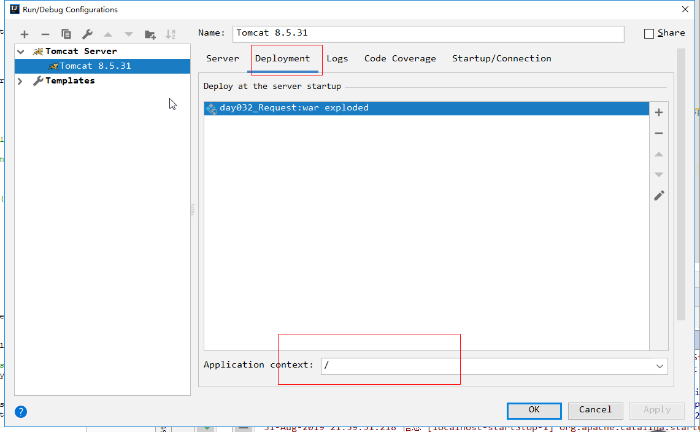
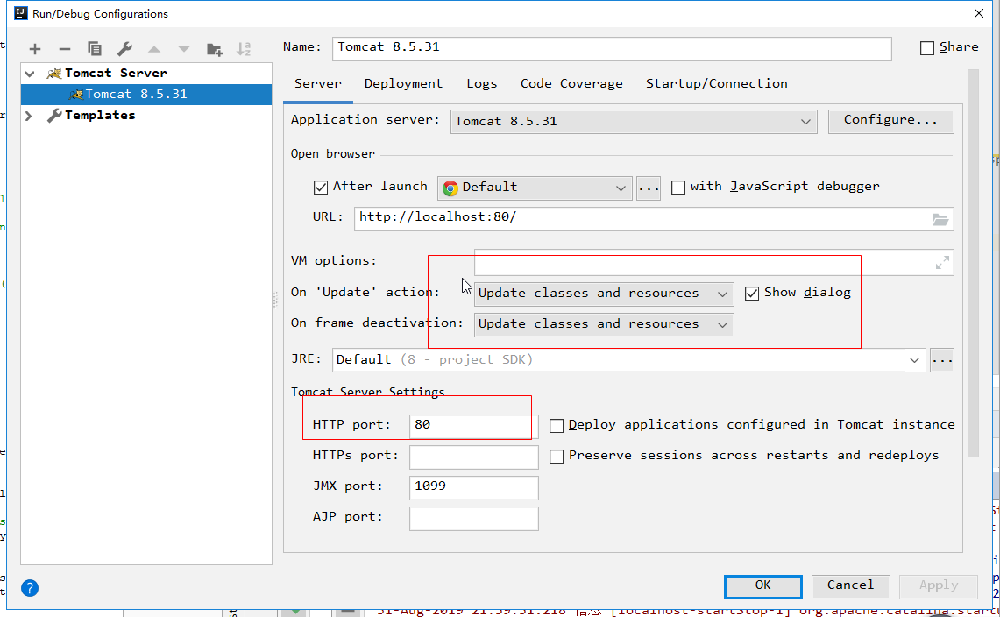
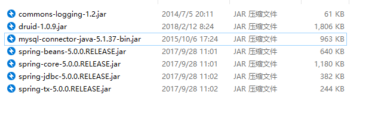

# `day032` `Request`

> 作者: 张大鹏

## 001.`Servlet`体系结构

```
Servlet -- 接口
--->>>
GenericServlet -- 抽象类
--->>>
HttpServlet  -- 抽象类
```

>  `GenericServlet`：将`Servlet`接口中其他的方法做了默认空实现，只将service()方法作为抽象
>
> 将来定义`Servlet`类时，可以继承`GenericServlet`，实现service()方法即可

> `HttpServlet`：对`http`协议的一种封装，简化操作

- 1.定义类继承`HttpServlet`
- 2.复写`doGet/doPost`方法


## 002.`Servlet`相关配置

1.一个`Servlet`可以定义多个访问路径

- `@WebServlet({"/d4","/dd4","/ddd4"})`

2.路径定义规则

- 1.`/xxx`：路径匹配
- 2.`/xxx/xxx`:多层路径，目录结构
- 3.`*.do`：扩展名匹配


## 003.`HTTP`

> 概念：Hyper Text Transfer Protocol 超文本传输协议

1.传输协议：定义了，客户端和服务器端通信时，发送数据的格式

2.特点：

1. 基于TCP/IP的高级协议
2. 默认端口号:80
3. 基于请求/响应模型的:一次请求对应一次响应
4. 无状态的：每次请求之间相互独立，不能交互数据

3.历史版本

  1.0：每一次请求响应都会建立新的连接

  1.1：复用连接


## 004.请求消息数据格式

1.请求行

2.请求头

3.请求空行

4.请求体


## 005.请求方式

HTTP协议有7中请求方式，常用的有2种

- 1.GET
  - 1.请求参数在请求行中，在`url`后。
  - 2.请求的`url`长度有限制的
  - 3.不太安全
- 2.POST
  - 1.请求参数在请求体中
  - 2.请求的`url`长度没有限制的
  - 3.相对安全


## 006.常用请求头

请求头：客户端浏览器告诉服务器一些信息

- 1.`User-Agent`：浏览器告诉服务器，我访问你使用的浏览器版本信息
  - 可以在服务器端获取该头的信息，解决浏览器的兼容性问题
- 2.`Referer：http://localhost/login.html`
  - 告诉服务器，我(当前请求)从哪里来？
  - 防盗链
  - 数据统计


## 007.Request

request和response对象是由服务器创建的。我们来使用它们

request对象是来获取请求消息，response对象是来设置响应消息


## 008.获取请求行数据

1.获取请求方式 ：GET  `String getMethod() `

2.获取虚拟目录：`String getContextPath()`

3.获取`Servlet`路径: `String getServletPath()`

4.获取get方式请求参数: `String getQueryString()`

5.获取请求URI: `String getRequestURI()` `StringBuffer getRequestURL() `

- `URL`:统一资源定位符,绝对路径
- `URI`:统一资源标识符,相对路径

6.获取协议及版本: `String getProtocol()`

7.获取客户机的`IP`地址: `String getRemoteAddr()`

```java
package com.lxgzhw.request;

import javax.servlet.ServletException;
import javax.servlet.annotation.WebServlet;
import javax.servlet.http.HttpServlet;
import javax.servlet.http.HttpServletRequest;
import javax.servlet.http.HttpServletResponse;
import java.io.IOException;

/*
获取请求行数据
 */
@WebServlet("/demo01")
public class Demo01 extends HttpServlet {
    @Override
    protected void doGet(HttpServletRequest req, HttpServletResponse resp) throws ServletException, IOException {
        //获取请求方法 getMethod()
        String method = req.getMethod();
        System.out.println("请求方式:" + method);
        System.out.println("-------------------------------");

        //获取虚拟根目录
        String contextPath = req.getContextPath();
        System.out.println("虚拟根目录:" + contextPath);
        System.out.println("-------------------------------");

        //获取Servlet路径
        String servletPath = req.getServletPath();
        System.out.println("Servlet路径:" + servletPath);
        System.out.println("-------------------------------");

        //获取get请求参数
        String queryString = req.getQueryString();
        System.out.println("请求参数:" + queryString);
        System.out.println("-------------------------------");

        //获取URI
        String requestURI = req.getRequestURI();
        System.out.println("统一资源标识符:" + requestURI);
        System.out.println("-------------------------------");

        //获取协议及版本
        String protocol = req.getProtocol();
        System.out.println("协议及版本:" + protocol);
        System.out.println("-------------------------------");

        //获取客户机的ip地址
        String remoteAddr = req.getRemoteAddr();
        System.out.println("用户ip地址:" + remoteAddr);
        System.out.println("-------------------------------");
    }
}
```


## 009.获取请求头数据

`String getHeader(String name)`:通过请求头的名称获取请求头的值

`Enumeration<String> getHeaderNames()`:获取所有的请求头名称

```java
package com.lxgzhw.request;

import javax.servlet.ServletException;
import javax.servlet.annotation.WebServlet;
import javax.servlet.http.HttpServlet;
import javax.servlet.http.HttpServletRequest;
import javax.servlet.http.HttpServletResponse;
import java.io.IOException;
import java.util.Enumeration;

/*
获取请求头数据
 */
@WebServlet("/demo02")
public class Demo02 extends HttpServlet {
    @Override
    protected void doGet(HttpServletRequest req, HttpServletResponse resp) throws ServletException, IOException {
        //获取所有的请求头名称
        Enumeration<String> headerNames = req.getHeaderNames();
        //根据名称获取值
        while (headerNames.hasMoreElements()) {
            String s = headerNames.nextElement();
            String header = req.getHeader(s);
            System.out.println(s + ":" + header);
        }
    }
}
```


## 010.获取请求体数据

请求体：只有POST请求方式，才有请求体，在请求体中封装了POST请求的请求参数

步骤:

- 1.获取流对象
  - `BufferedReader getReader()：获取字符输入流，只能操作字符数据`
  - `ServletInputStream getInputStream()：获取字节输入流，可以操作所有类型数据`
- 2.再从流对象中拿数据

```html
<!DOCTYPE html>
<html lang="en">
<head>
    <meta charset="UTF-8">
    <title>Title</title>
</head>
<body>
<h1>演示post方式提交</h1>
<form action="/demo05" method="post">
    <input type="text" name="username">
    <input type="submit" value="确认">
</form>
</body>
</html>
```

```java
package com.lxgzhw.request;

import javax.servlet.ServletException;
import javax.servlet.annotation.WebServlet;
import javax.servlet.http.HttpServlet;
import javax.servlet.http.HttpServletRequest;
import javax.servlet.http.HttpServletResponse;
import java.io.BufferedReader;
import java.io.IOException;

@WebServlet("/demo05")
public class Demo05 extends HttpServlet {
    @Override
    protected void doPost(HttpServletRequest req, HttpServletResponse resp) throws ServletException, IOException {
        //1.获取字符流
        BufferedReader reader = req.getReader();
        //2.读取数据
        String line = null;
        while ((line = reader.readLine()) != null) {
            System.out.println(line);
        }
    }
}
```


## 011.通用获取方式

1.` String getParameter(String name)`:根据参数名称获取参数值,可以获取get参数

2.` String[] getParameterValues(String name)`:根据参数名称获取参数值的数组

3.`Enumeration<String> getParameterNames()`:获取所有请求的参数名称

4.`Map<String,String[]> getParameterMap()`:获取所有参数的map集合

```java
package com.lxgzhw.request;

import javax.servlet.ServletException;
import javax.servlet.annotation.WebServlet;
import javax.servlet.http.HttpServlet;
import javax.servlet.http.HttpServletRequest;
import javax.servlet.http.HttpServletResponse;
import java.io.IOException;
import java.util.Map;

@WebServlet("/demo06")
public class Demo06 extends HttpServlet {
    @Override
    protected void doPost(HttpServletRequest req, HttpServletResponse resp) throws ServletException, IOException {

        //获取参数的通用方法1
        String username = req.getParameter("username");
        System.out.println("用户名:" + username);
        System.out.println("-------------------------------");

        //获取参数的通用方法2
        Map<String, String[]> parameterMap = req.getParameterMap();
        parameterMap.keySet().stream().forEach(k -> {
            String v = req.getParameter(k);
            System.out.println(k + "---->>>>" + v);

        });
    }
}
```


## 012.乱码问题

get方式：tomcat 8 已经将get方式乱码问题解决了

post方式：会乱码

- 解决：在获取参数前，设置request的编码
- `request.setCharacterEncoding("utf-8");`

```java
package com.lxgzhw.request;

import javax.servlet.ServletException;
import javax.servlet.annotation.WebServlet;
import javax.servlet.http.HttpServlet;
import javax.servlet.http.HttpServletRequest;
import javax.servlet.http.HttpServletResponse;
import java.io.IOException;

@WebServlet("/demo07")
public class Demo07 extends HttpServlet {
    @Override
    protected void doPost(HttpServletRequest req, HttpServletResponse resp) throws ServletException, IOException {
        //解决中文乱码问题
        req.setCharacterEncoding("utf8");
        String username = req.getParameter("username");
        System.out.println("中文名字:" + username);
    }
}
```


## 013.请求转发

请求转发：一种在服务器内部的资源跳转方式

1.通过request对象获取请求转发器对象

- `RequestDispatcher getRequestDispatcher(String path)`

2.使用`RequestDispatcher`对象来进行转发

- `forward(ServletRequest request, ServletResponse response) `

3.特点

```
1. 浏览器地址栏路径不发生变化
2. 只能转发到当前服务器内部资源中。
3. 转发是一次请求
```

```java
package com.lxgzhw.request;

import javax.servlet.ServletException;
import javax.servlet.annotation.WebServlet;
import javax.servlet.http.HttpServlet;
import javax.servlet.http.HttpServletRequest;
import javax.servlet.http.HttpServletResponse;
import java.io.IOException;

@WebServlet("/demo08")
public class Demo08 extends HttpServlet {
    @Override
    protected void doGet(HttpServletRequest req, HttpServletResponse resp) throws ServletException, IOException {
        //转发并携带数据到 demo09
        System.out.println("这里是demo08");
        req.setAttribute("msg","可以携带数据转发");
        req.getRequestDispatcher("/demo09").forward(req,resp);
    }
}
```

```java
package com.lxgzhw.request;

import javax.servlet.ServletException;
import javax.servlet.annotation.WebServlet;
import javax.servlet.http.HttpServlet;
import javax.servlet.http.HttpServletRequest;
import javax.servlet.http.HttpServletResponse;
import java.io.IOException;

@WebServlet("/demo09")
public class Demo09 extends HttpServlet {
    @Override
    protected void doGet(HttpServletRequest req, HttpServletResponse resp) throws ServletException, IOException {
        System.out.println("这里是demo09");
        Object msg = req.getAttribute("msg");
        System.out.println("获取到的数据:" + msg);
    }
}
```


## 014.共享数据

域对象：一个有作用范围的对象，可以在范围内共享数据

request域：代表一次请求的范围，一般用于请求转发的多个资源中共享数据

方法:

```
1. void setAttribute(String name,Object obj):存储数据
2. Object getAttitude(String name):通过键获取值
3. void removeAttribute(String name):通过键移除键值对
```


## 015.配置`Tomcat`

1.设置根目录



2.设置热更新和端口




## 016.用户登录

需求:

```
1.编写login.html登录页面,username & password 两个输入框
2.使用Druid数据库连接池技术,操作mysql，day14数据库中user表
3.使用JdbcTemplate技术封装JDBC
4.登录成功跳转到SuccessServlet展示：登录成功！用户名,欢迎您
5.登录失败跳转到FailServlet展示：登录失败，用户名或密码错误
```

1.导入`jar`包



2.写`login.html`

```html
<!DOCTYPE html>
<html lang="en">
<head>
    <meta charset="UTF-8">
    <title>登录</title>
</head>
<body>
<form action="/login" method="post">
    <table width="80%" align="center" border="1">
        <tr>
            <td>请输入用户名</td>
            <td>
                <input type="text" name="username">
            </td>
        </tr>
        <tr>
            <td>请输入密码</td>
            <td>
                <input type="password" name="password">
            </td>
        </tr>
        <tr>
            <td colspan="2">
                <input type="submit" value="确认">
            </td>
        </tr>
    </table>
</form>
</body>
</html>
```


3.写`domain/User.java`

```java
package com.lxgzhw.login.domain;

public class User {
    private Integer id;
    private String username;
    private String password;

    public User() {
    }

    public User(Integer id, String username, String password) {
        this.id = id;
        this.username = username;
        this.password = password;
    }

    @Override
    public String toString() {
        return "User{" +
                "id=" + id +
                ", username='" + username + '\'' +
                ", password='" + password + '\'' +
                '}';
    }

    public Integer getId() {
        return id;
    }

    public void setId(Integer id) {
        this.id = id;
    }

    public String getUsername() {
        return username;
    }

    public void setUsername(String username) {
        this.username = username;
    }

    public String getPassword() {
        return password;
    }

    public void setPassword(String password) {
        this.password = password;
    }
}
```

4. 写`util/JDBCUtils.java`

```java
package com.lxgzhw.util;

import com.alibaba.druid.pool.DruidDataSourceFactory;
import com.lxgzhw.login.LoginServlet;
import org.springframework.jdbc.core.JdbcTemplate;

import javax.sql.DataSource;
import java.io.IOException;
import java.io.InputStream;
import java.sql.Connection;
import java.sql.SQLException;
import java.util.Properties;

public class JDBCUtils {

    private static DataSource ds;

    static {
        try {
            //1.加载配置文件
            Properties properties = new Properties();
            InputStream resourceAsStream = JDBCUtils.class.getClassLoader()
                    .getResourceAsStream("druid.properties");
            properties.load(resourceAsStream);
            //2.初始化连接池对象
            ds = DruidDataSourceFactory.createDataSource(properties)
        } catch (IOException e) {
            e.printStackTrace();
        } catch (Exception e) {
            e.printStackTrace();
        }
    }

    /**
     * 获取连接池对象
     *
     * @return 连接池
     */
    public static DataSource getDataSource() {
        return ds;
    }

    public static Connection getConnection() throws SQLException {
        return ds.getConnection();
    }
}
```

3.写`dao/UserDao.java`

```java
package com.lxgzhw.dao;

import com.lxgzhw.login.domain.User;
import com.lxgzhw.util.JDBCUtils;
import org.springframework.dao.DataAccessException;
import org.springframework.jdbc.core.BeanPropertyRowMapper;
import org.springframework.jdbc.core.JdbcTemplate;

/*
操作数据库中的users表
 */
public class UserDao {
    //1.声明JDBCTemplate对象共用
    private JdbcTemplate template =
            new JdbcTemplate(JDBCUtils.getDataSource());

    //2.登录方法
    /**
     * 用户登录
     *
     * @param loginUser 登录的用户对象
     * @return 登录的用户对象数据库信息包装
     */
    public User login(User loginUser) {
        try {
            //1.编写sql
            String sql = "select id,username,password from users where username=? and password=?";
            //2.调用query方法
            User user = template.queryForObject(sql,
                    new BeanPropertyRowMapper<User>(User.class),
                    loginUser.getUsername(),
                    loginUser.getPassword());
            return user;
        } catch (DataAccessException e) {
            e.printStackTrace();
            return null;
        }
    }
}
```

3.写一个`test/UserDaoTest.java`测试

```java
package com.lxgzhw.test;

import com.lxgzhw.dao.UserDao;
import com.lxgzhw.login.domain.User;
import org.junit.Test;

/*
测试是否能够访问数据库
 */
public class UserDaoTest {
    @Test
    public void testLogin(){
        //1.创建登录用户
        User loginUser = new User();
        loginUser.setUsername("lxgzhw");
        loginUser.setPassword("lxgzhw");

        //2.调用登录方法
        User user = new UserDao().login(loginUser);
        System.out.println(user);
    }
}
```

4.写`LoginServlet.java`

```java
package com.lxgzhw.login;

import com.lxgzhw.dao.UserDao;
import com.lxgzhw.login.domain.User;
import javax.servlet.ServletException;
import javax.servlet.annotation.WebServlet;
import javax.servlet.http.HttpServlet;
import javax.servlet.http.HttpServletRequest;
import javax.servlet.http.HttpServletResponse;
import java.io.IOException;

@WebServlet("/login")
public class LoginServlet extends HttpServlet {
    @Override
    protected void doPost(HttpServletRequest req, HttpServletResponse resp) throws IOException, ServletException {
        //1.获取用户名密码
        req.setCharacterEncoding("utf8");
        String username = req.getParameter("username");
        String password = req.getParameter("password");
        System.out.println("用户名:" + username);
        System.out.println("密码:" + password);
        System.out.println("-------------------------------");

        //2.封装loginUser对象
        User loginUser = new User();
        loginUser.setUsername(username);
        loginUser.setPassword(password);
        System.out.println(loginUser);
        System.out.println("-------------------------------");

        //3.调用UserDao登录方法
        //User user = new UserDao().login(loginUser);
        UserDao userDao = new UserDao();
        User user = userDao.login(loginUser);
        System.out.println(user);
        System.out.println("-------------------------------");

        //4.处理结果
        if (user != null) {
            //登录成功
            //将数据传过去
            req.setAttribute("user", user);
            req.getRequestDispatcher("loginSuccess").forward(req, resp);
        } else {
            req.getRequestDispatcher("loginFail").forward(req, resp);
        }

    }
}
```

5.写`SuccessServlet.java`

```java
package com.lxgzhw.login;

import com.lxgzhw.login.domain.User;

import javax.servlet.ServletException;
import javax.servlet.annotation.WebServlet;
import javax.servlet.http.HttpServlet;
import javax.servlet.http.HttpServletRequest;
import javax.servlet.http.HttpServletResponse;
import java.io.IOException;

@WebServlet("/loginSuccess")
public class SuccessServlet extends HttpServlet {
    @Override
    protected void doGet(HttpServletRequest req, HttpServletResponse resp) throws ServletException, IOException {
        //获取用户名
        User user = (User) req.getAttribute("user");
        System.out.println("登录成功," + user.getUsername() + ",欢迎您!");
    }

    @Override
    protected void doPost(HttpServletRequest req, HttpServletResponse resp) throws ServletException, IOException {
        this.doGet(req, resp);
    }
}
```

6.写`FailServlet.java`

```java
package com.lxgzhw.login;

import javax.servlet.ServletException;
import javax.servlet.annotation.WebServlet;
import javax.servlet.http.HttpServlet;
import javax.servlet.http.HttpServletRequest;
import javax.servlet.http.HttpServletResponse;
import java.io.IOException;

@WebServlet("/loginFail")
public class FailServlet extends HttpServlet {
    @Override
    protected void doGet(HttpServletRequest req, HttpServletResponse resp) throws ServletException, IOException {
        System.out.println("登录失败");
    }

    @Override
    protected void doPost(HttpServletRequest req, HttpServletResponse resp) throws ServletException, IOException {
        this.doGet(req, resp);
    }
}
```


## 017.解决浏览器兼容

```java
package com.lxgzhw.request;

import javax.servlet.ServletException;
import javax.servlet.annotation.WebServlet;
import javax.servlet.http.HttpServlet;
import javax.servlet.http.HttpServletRequest;
import javax.servlet.http.HttpServletResponse;
import java.io.IOException;

@WebServlet("/demo03")
public class Demo03 extends HttpServlet {
    @Override
    protected void doGet(HttpServletRequest req, HttpServletResponse resp) throws ServletException, IOException {
        String header = req.getHeader("user-agent");
        if (header.contains("Chrome")) {
            System.out.println("兼容谷歌浏览器...");
        } else if (header.contains("Firefox")) {
            System.out.println("兼容火狐浏览器....");
        } else {
            System.out.println("兼容其他浏览器...");
        }
    }
}
```


## 018.设置防盗链

```java
package com.lxgzhw.request;

import javax.servlet.ServletException;
import javax.servlet.annotation.WebServlet;
import javax.servlet.http.HttpServlet;
import javax.servlet.http.HttpServletRequest;
import javax.servlet.http.HttpServletResponse;
import java.io.IOException;

@WebServlet("/demo04")
public class Demo04 extends HttpServlet {
    @Override
    protected void doGet(HttpServletRequest req, HttpServletResponse resp) throws ServletException, IOException {
        String referer = req.getHeader("referer");
        System.out.println(referer);//http://localhost/day14/login.html

        //防盗链
        if(referer != null ){
            if(referer.contains("/day14")){
                //正常访问
                // System.out.println("播放电影....");
                resp.setContentType("text/html;charset=utf-8");
                resp.getWriter().write("播放电影....");
            }else{
                //盗链
                //System.out.println("想看电影吗？来优酷吧...");
                resp.setContentType("text/html;charset=utf-8");
                resp.getWriter().write("想看电影吗？来优酷吧...");
            }
        }
    }
}
```

