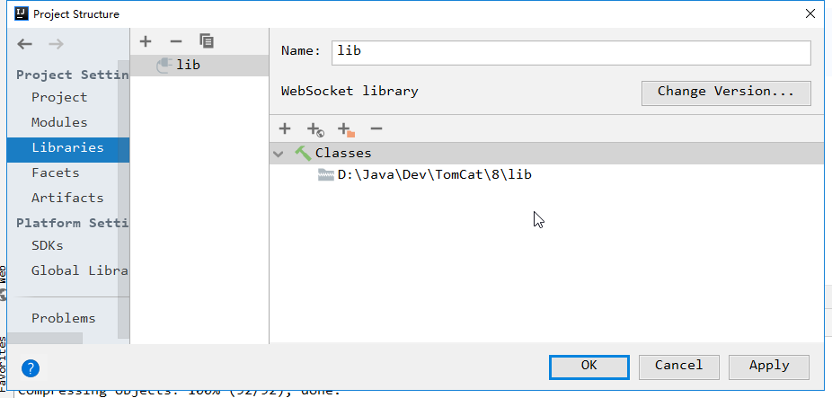
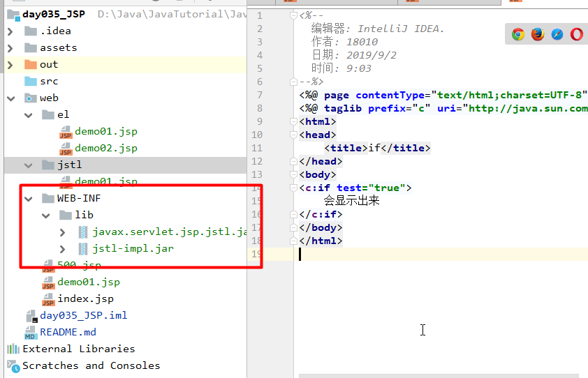
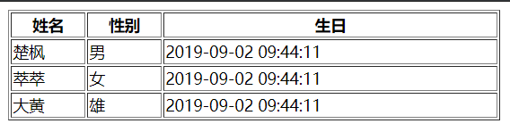

# `day035` `JSP`

> 作者: 张大鹏


## 001.`JSP`指令

```
作用：用于配置JSP页面，导入资源文件
格式：
	<%@ 指令名称 属性名1=属性值1 属性名2=属性值2 ... %>
```

指令分类

```
1. page： 配置JSP页面的
	contentType：等同于response.setContentType()	
		1. 设置响应体的mime类型以及字符集
		2. 设置当前jsp页面的编码（只能是高级的IDE才能生效，如果使用低级工具，则需要设置pageEncoding属性设置当前页面的字符集）
    import：导包
    errorPage：当前页面发生异常后，会自动跳转到指定的错误页面
    isErrorPage：标识当前也是是否是错误页面。
    	true：是，可以使用内置对象exception
    	false：否。默认值。不可以使用内置对象exception
    	
2. include： 页面包含的。导入页面的资源文件
	<%@include file="top.jsp"%>
	
3. taglib： 导入资源
	 <%@ taglib prefix="c" uri="http://java.sun.com/jsp/jstl/core" %>
	 prefix：前缀，自定义的
```


## 002.注释

```
1. html注释：
	<!-- -->:只能注释html代码片段
2. jsp注释：推荐使用
	<%-- --%>：可以注释所有
```


## 003.内置对象

>  在`jsp`页面中不需要创建，直接使用的对象

```
 一共有9个：
			变量名					真实类型						作用
		* pageContext				PageContext					当前页面共享数据，还可以获取其他八个内置对象
		* request					HttpServletRequest			一次请求访问的多个资源(转发)
		* session					HttpSession					一次会话的多个请求间
		* application				ServletContext				所有用户间共享数据
		* response					HttpServletResponse			响应对象
		* page						Object						当前页面(Servlet)的对象  this
		* out						JspWriter					输出对象，数据输出到页面上
		* config					ServletConfig				Servlet的配置对象
		* exception					Throwable					异常对象
```


## 004.`MVC`开发模式

1.`jsp`演变历史

```
1. 早期只有servlet，只能使用response输出标签数据，非常麻烦
2. 后来有了jsp，简化了Servlet的开发，如果过度使用jsp，在jsp中即写大量的java代码，又写html，造成难于维护，难于分工协作
3. 再后来，java的web开发，借鉴mvc开发模式，使得程序的设计更加合理性
```

2.`MVC`

```
1. M：Model，模型。JavaBean
	* 完成具体的业务操作，如：查询数据库，封装对象
2. V：View，视图。JSP
	* 展示数据
3. C：Controller，控制器。Servlet
	* 获取用户的输入
	* 调用模型
	* 将数据交给视图进行展示
```

3.优缺点

```
1. 优点：
	1. 耦合性低，方便维护，可以利于分工协作
	2. 重用性高

2. 缺点：
	1. 使得项目架构变得复杂，对开发人员要求高
```


## 005.`EL`表达式

```
1. 概念：Expression Language 表达式语言
2. 作用：替换和简化jsp页面中java代码的编写
3. 语法：${表达式}
4. 注意：
	* jsp默认支持el表达式的。如果要忽略el表达式
		1. 设置jsp中page指令中：isELIgnored="true" 忽略当前jsp页面中所有的el表达式
		2. \${表达式} ：忽略当前这个el表达式
```


## 006.运算

```
运算符：
     1. 算数运算符： + - * /(div) %(mod)
     2. 比较运算符： > < >= <= == !=
     3. 逻辑运算符： &&(and) ||(or) !(not)
     4. 空运算符： empty
         * 功能：用于判断字符串、集合、数组对象是否为null或者长度是否为0
         * ${empty list}:判断字符串、集合、数组对象是否为null或者长度为0
         * ${not empty str}:表示判断字符串、集合、数组对象是否不为null 并且 长度>0
```

```jsp
<%--
  编辑器: IntelliJ IDEA.
  作者: 18010
  日期: 2019/9/2
  时间: 8:50
--%>
<%@ page contentType="text/html;charset=UTF-8" language="java" %>
<html>
<head>
    <title>Title</title>
</head>
<body>
<h3>算术运算符</h3>
<p>${3+33}</p>
<p>${3-33}</p>
<p>${3*33}</p>
<p>${3/33}</p>
<p>${3%33}</p>

<h3>比较运算符</h3>
<p>${4>44}</p>
<p>${4<44}</p>
<p>${4==44}</p>


<h3>empty运算符</h3>
<p>${empty ""}</p>
<p>${empty 0}</p>
<p>${empty []}</p>
</body>
</html>
```


## 007.获取值

```
1. el表达式只能从域对象中获取值
2. 语法：
	1. ${域名称.键名}：从指定域中获取指定键的值
        * 域名称：
            1. pageScope		--> pageContext
            2. requestScope 	--> request
            3. sessionScope 	--> session
            4. applicationScope --> application（ServletContext）
        * 举例：在request域中存储了name=张三
        * 获取：${requestScope.name}

	2. ${键名}：表示依次从最小的域中查找是否有该键对应的值，直到找到为止。
    3. 获取对象、List集合、Map集合的值
        1. 对象：${域名称.键名.属性名}
        	* 本质上会去调用对象的getter方法

        2. List集合：${域名称.键名[索引]}

        3. Map集合：
            * ${域名称.键名.key名称}
            * ${域名称.键名["key名称"]}
```

```jsp
<%--
  编辑器: IntelliJ IDEA.
  作者: 18010
  日期: 2019/9/2
  时间: 8:54
--%>
<%@ page contentType="text/html;charset=UTF-8" language="java" %>
<html>
<head>
    <title>Title</title>
</head>
<body>
<%
    //1.存储数据
    session.setAttribute("name", "张大鹏");
    request.setAttribute("name", "萃萃");
%>
<h3>获取值</h3>
<p>${requestScope.name}</p>
<p>${sessionScope.name}</p>
</body>
</html>
```


## 008.隐式对象

```
* el表达式中有11个隐式对象
    * pageContext：
    * 获取jsp其他八个内置对象
    * ${pageContext.request.contextPath}：动态获取虚拟目录
```


## 009.`JSTL`

> `概念：JavaServer Pages Tag Library  JSP标准标签库`
>
> `是由Apache组织提供的开源的免费的jsp标签		<标签>`
>
> `作用：用于简化和替换jsp页面上的java代码`

使用步骤

```
1. 导入jstl相关jar包
2. 引入标签库：taglib指令：  <%@ taglib %>
3. 使用标签
```


## 010.常用`JSTL`标签

```
1. if:相当于java代码的if语句
	1. 属性：
        * test 必须属性，接受boolean表达式
        * 如果表达式为true，则显示if标签体内容，如果为false，则不显示标签体内容
        * 一般情况下，test属性值会结合el表达式一起使用
	2. 注意：
		* c:if标签没有else情况，想要else情况，则可以在定义一个c:if标签
2. choose:相当于java代码的switch语句
    1. 使用choose标签声明         			相当于switch声明
    2. 使用when标签做判断         			相当于case
    3. 使用otherwise标签做其他情况的声明    	相当于default

3. foreach:相当于java代码的for语句
```


## 011.定义服务器500错误页面

1.出错页面

```jsp
<%--
  编辑器: IntelliJ IDEA.
  作者: 18010
  日期: 2019/9/2
  时间: 8:39
--%>
<%@ page contentType="text/html;charset=UTF-8" language="java"
         errorPage="500.jsp"
%>
<html>
<head>
    <title>定义服务器500错误页面</title>
</head>
<body>
<%
    //制造服务器错误
    int num = 4 / 0;
%>
</body>
</html>
```

2.处理500错误页面

```jsp
<%--
  编辑器: IntelliJ IDEA.
  作者: 18010
  日期: 2019/9/2
  时间: 8:40
--%>
<%@ page contentType="text/html;charset=UTF-8" language="java"
         isErrorPage="true"
%>
<html>
<head>
    <title>理想国真恵玩</title>
</head>
<body>
<h1>服务器正忙,请稍后.....</h1>
<%
    //错误页面可以使用exception内置对象
    String message = exception.getMessage();
    out.print(message);
%>
</body>
</html>
```


## 012.`IDEA`不提示内置域对象解决方案

1.打开`project structrue->Libraries`

2.点加号,找到`tomcat`文件夹下的`lib`目录,添加进来即可




## 013.`if`标签的使用

1.导入`jstl`包



2.导入`taglib`

```jsp
<%@ taglib prefix="c" uri="http://java.sun.com/jsp/jstl/core" %>
```

3.写代码

```jsp
<c:if test="true">
    会显示出来
</c:if>
```

完整源码

```jsp
<%--
  编辑器: IntelliJ IDEA.
  作者: 18010
  日期: 2019/9/2
  时间: 9:03
--%>
<%@ page contentType="text/html;charset=UTF-8" language="java" %>
<%@ taglib prefix="c" uri="http://java.sun.com/jsp/jstl/core" %>
<html>
<head>
    <title>if</title>
</head>
<body>
<c:if test="true">
    会显示出来
</c:if>
</body>
</html>
```


## 014.`choose`标签的使用

```jsp
<%--
  编辑器: IntelliJ IDEA.
  作者: 18010
  日期: 2019/9/2
  时间: 9:15
--%>
<%@ page contentType="text/html;charset=UTF-8" language="java" %>
<%@ taglib prefix="c" uri="http://java.sun.com/jsp/jstl/core" %>
<html>
<head>
    <title>choose</title>
</head>
<body>
<%
    //判断今天是星期几
    request.setAttribute("n", 3);
%>
<c:choose>
    <c:when test="${n==1}">星期一</c:when>
    <c:when test="${n==2}">星期二</c:when>
    <c:when test="${n==3}">星期三</c:when>
    <c:when test="${n==4}">星期四</c:when>
    <c:when test="${n==5}">星期五</c:when>
    <c:when test="${n==6}">星期六</c:when>
    <c:when test="${n==7}">星期天</c:when>

    <c:otherwise>数字输入有误</c:otherwise>
</c:choose>
</body>
</html>
```


## 015.`foreach`的使用

```jsp
<%@ page import="java.util.ArrayList" %><%--
  编辑器: IntelliJ IDEA.
  作者: 18010
  日期: 2019/9/2
  时间: 9:20
--%>
<%@ page contentType="text/html;charset=UTF-8" language="java" %>
<%@ taglib prefix="c" uri="http://java.sun.com/jsp/jstl/core" %>
<html>
<head>
    <title>for</title>
</head>
<body>
<%--
foreach:相当于java代码的for语句
    1. 完成重复的操作
        * 属性：
            begin：开始值
            end：结束值
            var：临时变量
            step：步长
            varStatus:循环状态对象
                index:容器中元素的索引，从0开始
                count:循环次数，从1开始
    2.注意:foreach包左又包右
--%>
<%--打印10次HelloWorld--%>
<c:forEach begin="1" end="10" step="1" varStatus="s">
    <h3>HelloWorld---${s.count}</h3>
</c:forEach>


<%--
 2. 遍历容器
    * 属性：
        items:容器对象
        var:容器中元素的临时变量
        varStatus:循环状态对象
            index:容器中元素的索引，从0开始
            count:循环次数，从1开始
 --%>
<%--1.创建列表--%>
<%
    ArrayList<String> strings = new ArrayList<>();
    strings.add("楚枫");
    strings.add("萃萃");
    strings.add("大黄");
    request.setAttribute("names",strings);
%>
<%--2.遍历列表--%>
<c:forEach items="${names}" var="i" varStatus="name">
    <h3>${name.index} ${name.count} ${i}</h3>
</c:forEach>
</body>
</html>
```


## 016.练习

```
1.创建User类型,包含name,gender,birthday三个属性
2.包含getBirStr方法,返回格式化的生日
3.包含全参,空参,getter和setter方法
4.创建一个jsp文件,在里面创建一个包含3个User对象的ArrayList集合
5.遍历该集合,打印到table表格中,要求生日格式化输出
```

1.创建`User`类

```java
package com.lxgzhw.web.domain;

import java.text.SimpleDateFormat;
import java.util.Date;

public class User {
    private String name;
    private char gender;
    private Date birthday;

    /**
     * 格式化生日
     * @return 格式化后的生日字符串
     */
    public String getBirthStr(){
        SimpleDateFormat simpleDateFormat = new SimpleDateFormat("yyyy-MM-dd HH:mm:ss");
        String format = simpleDateFormat.format(birthday);
        return format.toString();
    }

    public User() {
    }

    public User(String name, char gender, Date birthday) {
        this.name = name;
        this.gender = gender;
        this.birthday = birthday;
    }

    @Override
    public String toString() {
        return "User{" +
                "name='" + name + '\'' +
                ", gender=" + gender +
                ", birthday=" + birthday +
                '}';
    }

    public String getName() {
        return name;
    }

    public void setName(String name) {
        this.name = name;
    }

    public char getGender() {
        return gender;
    }

    public void setGender(char gender) {
        this.gender = gender;
    }

    public Date getBirthday() {
        return birthday;
    }

    public void setBirthday(Date birthday) {
        this.birthday = birthday;
    }
}
```

2.创建`jsp`文件

```jsp
<%@ page import="java.util.ArrayList" %>
<%@ page import="com.lxgzhw.web.domain.User" %>
<%@ page import="java.util.Date" %><%--
  编辑器: IntelliJ IDEA.
  作者: 18010
  日期: 2019/9/2
  时间: 9:39
--%>
<%@ page contentType="text/html;charset=UTF-8" language="java" %>
<%@ taglib prefix="c" uri="http://java.sun.com/jsp/jstl/core" %>
<html>
<head>
    <title>遍历数据填充表格</title>
</head>
<body>
<%
    //1.创建集合
    ArrayList<User> users = new ArrayList<>();
    //2.填充集合
    users.add(new User("楚枫", '男', new Date()));
    users.add(new User("萃萃", '女', new Date()));
    users.add(new User("大黄", '雄', new Date()));
    //3.传到request域
    request.setAttribute("users", users);
%>

<%--遍历集合,填充表格--%>
<table border="1" width="60%" align="center">
    <tr>
        <th>姓名</th>
        <th>性别</th>
        <th>生日</th>
    </tr>
    <c:forEach items="${users}" var="user" varStatus="s">
        <tr>
            <td>${user.name}</td>
            <td>${user.gender}</td>
            <td>${user.birthStr}</td>
        </tr>
    </c:forEach>
</table>
</body>
</html>
```

3.重启服务器,打开浏览器测试



