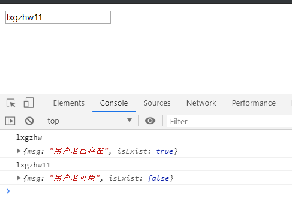

# `day038` `Ajax`和`Json`

> 作者: 张大鹏

## 001.`Ajax`技术

> 概念： `ASynchronous JavaScript And XML`	异步的JavaScript 和 XML

1. 异步和同步

```
客户端和服务器端相互通信的基础上
	同步:客户端必须等待服务器端的响应。在等待的期间客户端不能做其他操作。
	异步:客户端不需要等待服务器端的响应。在服务器处理请求的过程中，客户端可以进行其他的操作。
```

Ajax 是一种在无需重新加载整个网页的情况下，能够更新部分网页的技术。

通过在后台与服务器进行少量数据交换，Ajax 可以使网页实现异步更新。这意味着可以在不重新加载整个网页的情况下，对网页的某部分进行更新。
传统的网页（不使用 Ajax）如果需要更新内容，必须重载整个网页页面。


## 002.`Ajax`入门

1.写一个`Servlet`

```java
package com.lxgzhw.web.servlet;

import javax.servlet.ServletException;
import javax.servlet.annotation.WebServlet;
import javax.servlet.http.HttpServlet;
import javax.servlet.http.HttpServletRequest;
import javax.servlet.http.HttpServletResponse;
import java.io.IOException;

/*

 */
@WebServlet("/ajax")
public class AjaxServlet extends HttpServlet {
    @Override
    protected void doGet(HttpServletRequest req, HttpServletResponse resp) throws ServletException, IOException {
        resp.setContentType("text/html;charset=utf8");
        String username = req.getParameter("username");
        resp.getWriter().write("你好:" + username);
    }

    @Override
    protected void doPost(HttpServletRequest req, HttpServletResponse resp) throws ServletException, IOException {
        this.doGet(req, resp);
    }
}
```

2.`get`方式的`ajax`

```html
<!DOCTYPE html>
<html lang="en">
<head>
    <meta charset="UTF-8">
    <title>get</title>
</head>
<body>

<script src="https://cdn.bootcss.com/jquery/3.4.1/jquery.js"></script>
<script>
    $(function () {
        //参数:url,data,success回调函数,文本类型
        $.get("/ajax", {username: "张大鹏"}, function (data) {
            alert(data)
        })
    })
</script>
</body>
</html>
```

3.`post`方式的`ajax`

```html
<!DOCTYPE html>
<html lang="en">
<head>
    <meta charset="UTF-8">
    <title>post</title>
</head>
<body>
<script src="https://cdn.bootcss.com/jquery/3.4.1/jquery.js"></script>
<script>
    $(function () {
        $.post("/ajax", {username: "张大鹏"}, function (data) {
            alert(data)
        }, "text")
    })
</script>
</body>
</html>
```


## 003.`json`

```
json现在多用于存储和交换文本信息的语法
进行数据的传输
JSON 比 XML 更小、更快，更易解析。
```

基本规则

```
键用引号双引号引起来，也可以不使用引号
值得取值类型：
	1. 数字（整数或浮点数）
    2. 字符串（在双引号中）
    3. 逻辑值（true 或 false）
    4. 数组（在方括号中）	{"persons":[{},{}]}
    5. 对象（在花括号中） {"address":{"province"："陕西"....}}
    6. null
数据由逗号分隔：多个键值对由逗号分隔
花括号保存对象：使用{}定义json 格式
方括号保存数组：[]
```


## 004.`jackson`

1. 导入jackson的相关jar包
2. 创建Jackson核心对象 `ObjectMapper`
3. 调用`ObjectMapper`的相关方法进行转换

常用方法

```
1. 转换方法：
    * writeValue(参数1，obj):
        参数1：
        File：将obj对象转换为JSON字符串，并保存到指定的文件中
        Writer：将obj对象转换为JSON字符串，并将json数据填充到字符输出流中
        OutputStream：将obj对象转换为JSON字符串，并将json数据填充到字节输出流中
    * writeValueAsString(obj):将对象转为json字符串

2. 注解：
    1. @JsonIgnore：排除属性。
    2. @JsonFormat：属性值得格式化
    * @JsonFormat(pattern = "yyyy-MM-dd")

3. 复杂java对象转换
    1. List：数组
    2. Map：对象格式一致
```


## 005.使用`jackson`

1.创建`Person`类

```java
package com.lxgzhw.domain;

import com.fasterxml.jackson.annotation.JsonFormat;

import java.util.Date;

public class Person {
    private String name;
    private int age;
    private String gender;
    @JsonFormat(pattern = "yyyy-MM-dd")
    private Date birthday;

    public Person() {
    }

    public Person(String name, int age, String gender, Date birthday) {
        this.name = name;
        this.age = age;
        this.gender = gender;
        this.birthday = birthday;
    }

    public String getName() {
        return name;
    }

    public void setName(String name) {
        this.name = name;
    }

    public int getAge() {
        return age;
    }

    public void setAge(int age) {
        this.age = age;
    }

    public String getGender() {
        return gender;
    }

    public void setGender(String gender) {
        this.gender = gender;
    }

    public Date getBirthday() {
        return birthday;
    }

    public void setBirthday(Date birthday) {
        this.birthday = birthday;
    }

    @Override
    public String toString() {
        return "Person{" +
                "name='" + name + '\'' +
                ", age=" + age +
                ", gender='" + gender + '\'' +
                ", birthday=" + birthday +
                '}';
    }
}
```

2.创建测试类测试`jackson`

```java
package com.lxgzhw.test;

import com.fasterxml.jackson.core.JsonProcessingException;
import com.fasterxml.jackson.databind.ObjectMapper;
import com.lxgzhw.domain.Person;
import org.junit.Test;

import java.io.File;
import java.io.FileWriter;
import java.io.IOException;
import java.util.ArrayList;
import java.util.Date;

public class JacksonTest {
    @Test
    public void test01() throws JsonProcessingException {
        //Java对象转json字符串
        //1.创建Person对象
        Person person = new Person("张大鹏", 22, "男", new Date());
        //2.创建ObjectMapper
        ObjectMapper objectMapper = new ObjectMapper();
        //3.转换为String字符串
        String s = objectMapper.writeValueAsString(person);
        System.out.println(s);
    }

    @Test
    public void test02() throws IOException {
        //转换为json并保存
        new ObjectMapper().writeValue(new FileWriter("person.json"),
                new Person("张大鹏", 22, "男", new Date()));
    }

    @Test
    public void test03() throws JsonProcessingException {
        //列表转json
        ArrayList<Person> people = new ArrayList<>();
        people.add(new Person("张大鹏", 22, "男", new Date()));
        people.add(new Person("张大鹏", 22, "男", new Date()));
        people.add(new Person("张大鹏", 22, "男", new Date()));
        people.add(new Person("张大鹏", 22, "男", new Date()));
        String s = new ObjectMapper().writeValueAsString(people);
        System.out.println(s);
    }

    @Test
    public void test04() throws IOException {
        //json转Person
        String person = "{\"name\":\"张大鹏\",\"age\":22,\"gender\":\"男\",\"birthday\":\"2019-09-03\"}";
        Person person1 = new ObjectMapper().readValue(person, Person.class);
        System.out.println(person1);
    }
}
```


## 006.案例:验证用户名

1.创建注册页面

```html
<!DOCTYPE html>
<html lang="en">
<head>
    <meta charset="UTF-8">
    <title>注册</title>
</head>
<body>
<form action="">
    <input type="text" name="username" placeholder="请输入用户名">
</form>
<script src="https://cdn.bootcss.com/jquery/3.4.1/jquery.js"></script>
<script>
    $(function () {
        $("input[name=username]").blur(function () {
            let username = $(this).val()
            console.log(username)
            $.get("/checkUser", {username: username}, function (data) {
                console.log(data)
            })
        })
    })
</script>
</body>
</html>
```

2.创建`Servlet`

```java
package com.lxgzhw.web.servlet;

import com.fasterxml.jackson.databind.ObjectMapper;

import javax.servlet.ServletException;
import javax.servlet.annotation.WebServlet;
import javax.servlet.http.HttpServlet;
import javax.servlet.http.HttpServletRequest;
import javax.servlet.http.HttpServletResponse;
import java.io.IOException;
import java.util.HashMap;

/*

 */
@WebServlet("/checkUser")
public class CheckUserServlet extends HttpServlet {
    @Override
    protected void doGet(HttpServletRequest req, HttpServletResponse resp) throws ServletException, IOException {
        //1.获取用户名
        String username = req.getParameter("username");
        resp.setContentType("application/json;charset=utf8");
        //2.判断用户名是否存在
        //3.返回给前端
        HashMap<String, Object> json = new HashMap<>();
        if (username.equals("lxgzhw")) {
            json.put("isExist", true);
            json.put("msg", "用户名已存在");
        } else {
            json.put("isExist", false);
            json.put("msg", "用户名可用");
        }
        new ObjectMapper().writeValue(resp.getWriter(), json);
    }

    @Override
    protected void doPost(HttpServletRequest req, HttpServletResponse resp) throws ServletException, IOException {
        this.doGet(req, resp);
    }
}
```

3.测试结果



