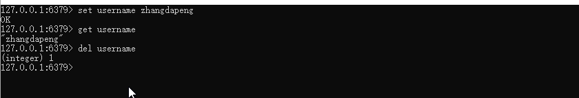
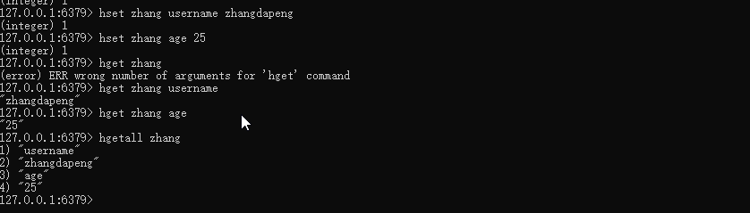
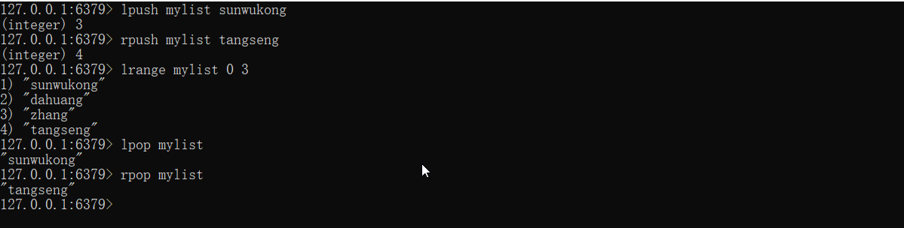
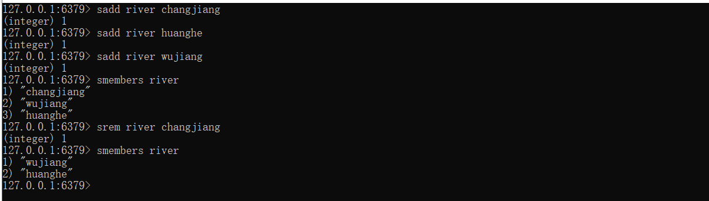
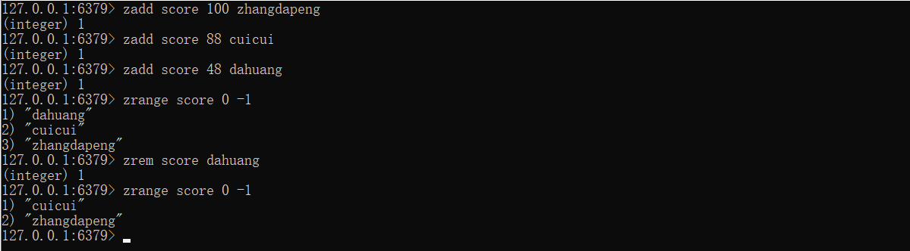
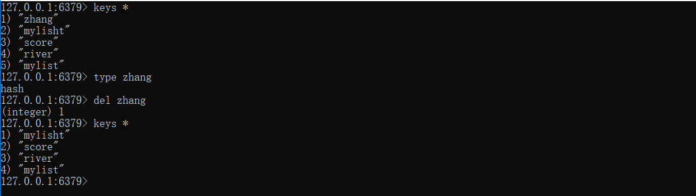
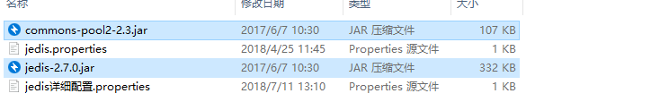
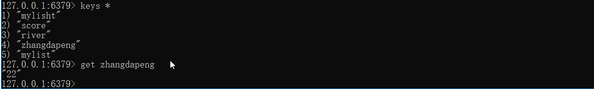

# `day039` `Redis`

> 作者: 张大鹏


## 001.`Redis`

```
概念： redis是一款高性能的NOSQL系列的非关系型数据库
```

```
Redis是用C语言开发的一个开源的高性能键值对（key-value）数据库，官方提供测试数据，50个并发执行100000个请求,读的速度是110000次/s,写的速度是81000次/s ，且Redis通过提供多种键值数据类型来适应不同场景下的存储需求，目前为止Redis支持的键值数据类型如下：
1) 字符串类型 string
2) 哈希类型 hash
3) 列表类型 list
4) 集合类型 set
5) 有序集合类型 sortedset
```


## 002.`NoSQL`

```
NoSQL(NoSQL = Not Only SQL)，意即“不仅仅是SQL”，是一项全新的数据库理念，泛指非关系型的数据库。
随着互联网web2.0网站的兴起，传统的关系数据库在应付web2.0网站，特别是超大规模和高并发的SNS类型的web2.0纯动态网站已经显得力不从心，暴露了很多难以克服的问题，而非关系型的数据库则由于其本身的特点得到了非常迅速的发展。NoSQL数据库的产生就是为了解决大规模数据集合多重数据种类带来的挑战，尤其是大数据应用难题。
```


## 003.`NoSQL`优点

```
1）成本：nosql数据库简单易部署，基本都是开源软件，不需要像使用oracle那样花费大量成本购买使用，相比关系型数据库价格便宜。
2）查询速度：nosql数据库将数据存储于缓存之中，关系型数据库将数据存储在硬盘中，自然查询速度远不及nosql数据库。
3）存储数据的格式：nosql的存储格式是key,value形式、文档形式、图片形式等等，所以可以存储基础类型以及对象或者是集合等各种格式，而数据库则只支持基础类型。
4）扩展性：关系型数据库有类似join这样的多表查询机制的限制导致扩展很艰难。
```


## 004.操作字符串类型

```
1. 存储： set key value
2. 获取： get key
3. 删除： del key
```




## 005.操作哈希类型

```
1. 存储： hset key field value
2. 获取： 
* hget key field: 获取指定的field对应的值
* hgetall key：获取所有的field和value
3. 删除： hdel key field
```




## 006.操作列表类型

```
1. 添加：
    1. lpush key value: 将元素加入列表左表
    2. rpush key value：将元素加入列表右边

2. 获取：
	* lrange key start end ：范围获取
3. 删除：
    * lpop key： 删除列表最左边的元素，并将元素返回
    * rpop key： 删除列表最右边的元素，并将元素返回
```




## 007.操作无序集合

```
1. 存储：sadd key value
2. 获取：smembers key:获取set集合中所有元素
3. 删除：srem key value:删除set集合中的某个元素	
```




## 008.操作有序集合

```
有序集合类型 sortedset：不允许重复元素，且元素有顺序.每个元素都会关联一个double类型的分数。redis正是通过分数来为集合中的成员进行从小到大的排序。
```

```
1. 存储：zadd key 一个数字(根据数字排序) value
2. 获取：zrange key start end 
3. 删除：zrem key value
```




## 009.通用命令

```
1. keys * : 查询所有的键
2. type key ： 获取键对应的value的类型
3. del key：删除指定的key value
```




## 010.`Redis`持久化机制

```
redis是一个内存数据库，当redis服务器重启，获取电脑重启，数据会丢失，我们可以将redis内存中的数据持久化保存到硬盘的文件中。
```

```
1. RDB：默认方式，不需要进行配置，默认就使用这种机制
	* 在一定的间隔时间中，检测key的变化情况，然后持久化数据
    1. 编辑redis.windwos.conf文件
    #   after 900 sec (15 min) if at least 1 key changed
    save 900 1
    #   after 300 sec (5 min) if at least 10 keys changed
    save 300 10
    #   after 60 sec if at least 10000 keys changed
    save 60 10000

    2. 重新启动redis服务器，并指定配置文件名称
        redis-server.exe redis.windows.conf	
```

```
2. AOF：日志记录的方式，可以记录每一条命令的操作。可以每一次命令操作后，持久化数据
    1. 编辑redis.windwos.conf文件
        appendonly no（关闭aof） --> appendonly yes （开启aof）

        # appendfsync always ： 每一次操作都进行持久化
        appendfsync everysec ： 每隔一秒进行一次持久化
        # appendfsync no	 ： 不进行持久化
    2. 重新启动redis服务器，并指定配置文件名称
        redis-server.exe redis.windows.conf	
```


## 011.`JRedis`快速入门

1.导入依赖包



2.写`java`代码

```java
package com.lxgzhw.jredis;

import redis.clients.jedis.Jedis;

public class Demo01 {
    public static void main(String[] args) {
        //1.获取连接
        Jedis localhost = new Jedis("localhost", 6379);
        //2.操作
        localhost.set("zhangdapeng", "22");
        //3.关闭连接
        localhost.close();
    }
}
```

3.`redis`数据库查看




## 012.指定字符串过期时间

```java
package com.lxgzhw.jredis;

import redis.clients.jedis.Jedis;

public class Demo02 {
    public static void main(String[] args) {
        //1.获取连接
        Jedis localhost = new Jedis("localhost", 6379);
        //2.使用 setex
        //2.1 设置字符串和获取字符串
        localhost.set("code", "aabb");
        String code = localhost.get("code");
        System.out.println(code);

        //2.2 指定过期时间的的字符串
        localhost.setex("code", 20, "okok");
        String code1 = localhost.get("code");
        System.out.println(code1);
        //3.关闭
        localhost.close();
    }
}
```


## 013.`Jedis`操作`hash`类型

```java
package com.lxgzhw.jredis;

import redis.clients.jedis.Jedis;

import java.util.Map;
import java.util.Set;

public class Demo03 {
    public static void main(String[] args) {
        //Jedis操作hash类型
        //1.获取连接
        Jedis localhost = new Jedis("localhost", 6379);

        //2.操作
        localhost.hset("zhangdapeng1", "name", "张大鹏");
        localhost.hset("zhangdapeng1", "age", "22");
        localhost.hset("zhangdapeng1", "gender", "男");
        //2.1 获取
        String age = localhost.hget("zhangdapeng1", "age");
        System.out.println(age);
        //2.2 获取所有
        Map<String, String> zhangdapeng1 = localhost.hgetAll("zhangdapeng1");
        Set<String> keys = zhangdapeng1.keySet();
        for (String key : keys) {
            System.out.println(key + ":" + zhangdapeng1.get(key));
        }

        //3.关闭
        localhost.close();
    }
}
```


## 014.`Jedis`操作`list`

```java
package com.lxgzhw.jredis;

import redis.clients.jedis.Jedis;

import java.util.List;

public class Demo04 {
    public static void main(String[] args) {
        //Jedis操作list
        Jedis localhost = new Jedis("localhost", 6379);
        //1.两种存储方式,lpush rpush
        localhost.lpush("mylist", "楚枫", "萃萃");
        localhost.rpush("mylist", "孙悟空", "唐僧");

        //2.取出方式 lrange
        List<String> mylist = localhost.lrange("mylist", 0, -1);

        //3.打印
        System.out.println(mylist);
        
        //4.两种删除方式lpop rpop
        localhost.lpop("mylist");
        localhost.rpop("mylist");

        localhost.close();
    }
}
```


## 015.`Jedis`操作无序集合

```java
package com.lxgzhw.jredis;

import redis.clients.jedis.Jedis;

import java.util.Set;

public class Demo05 {
    public static void main(String[] args) {
        //Jedis操作无序集合 sadd srem  smembers
        Jedis localhost = new Jedis("localhost", 6379);
        //1.添加
        localhost.sadd("myset", "孙悟空", "唐僧", "猪八戒", "沙僧");

        //2.获取,打印
        Set<String> myset = localhost.smembers("myset");
        System.out.println(myset);

        //3.删除,打印
        localhost.srem("myset", "孙悟空", "唐僧");
        Set<String> myset1 = localhost.smembers("myset");
        System.out.println(myset1);
        
        localhost.close();
    }
}
```


## 016.`Jedis`操作有序集合

```java
package com.lxgzhw.jredis;

import redis.clients.jedis.Jedis;

import java.util.Set;

public class Demo06 {
    public static void main(String[] args) {
        //Jedis操作有序集合 zadd zrange zrem
        Jedis localhost = new Jedis("localhost", 6379);
        //1.添加有序集合
        localhost.zadd("mySortedSet", 1, "红眼");
        localhost.zadd("mySortedSet", 2, "魔道");
        localhost.zadd("mySortedSet", 3, "战法");
        localhost.zadd("mySortedSet", 4, "暗帝");
        localhost.zadd("mySortedSet", 5, "机械");
        localhost.zadd("mySortedSet", 6, "混沌");

        //2.获取,打印
        Set<String> mySortedSet = localhost.zrange("mySortedSet", 0, -1);
        System.out.println(mySortedSet);

        //3.删除,获取,打印
        localhost.zrem("mySortedSet", "红眼", "魔道");
        Set<String> mySortedSet1 = localhost.zrange("mySortedSet", 0, -1);
        System.out.println(mySortedSet1);

        localhost.close();
    }
}
```


## 017.`jedis`连接池

1.创建配置文件

```properties
host=127.0.0.1
port=6379
maxTotal=50
maxIdle=10
```

2.创建工具类文件

```java
package com.lxgzhw.jredis.util;

import redis.clients.jedis.Jedis;
import redis.clients.jedis.JedisPool;
import redis.clients.jedis.JedisPoolConfig;

import java.io.IOException;
import java.io.InputStream;
import java.util.Properties;

public class JedisUtils {
    //1.创建连接池对象
    private static JedisPool jedisPool;

    //2.加载连接池
    static {
        //2.1读取配置文件
        InputStream resourceAsStream = JedisPool.class.getClassLoader()
                .getResourceAsStream("jedis.properties");
        //2.2创建Properties对象
        Properties properties = new Properties();
        //2.3加载文件
        try {
            properties.load(resourceAsStream);
        } catch (IOException e) {
            e.printStackTrace();
        }
        //2.4获取配置数据,设置JedisPollConfig
        JedisPoolConfig jedisPoolConfig = new JedisPoolConfig();
        jedisPoolConfig.setMaxTotal(Integer.parseInt(properties.getProperty("maxTotal")));
        jedisPoolConfig.setMaxIdle(Integer.parseInt(properties.getProperty("maxIdle")));
        //2.5初始化JedisPool
        jedisPool = new JedisPool(jedisPoolConfig,
                properties.getProperty("host"),
                Integer.parseInt(properties.getProperty("port")));
    }

    //3.写获取连接方法
    public static Jedis getJedis() {
        return jedisPool.getResource();
    }
}
```

3.写测试类

```java
package com.lxgzhw.jredis;

import com.lxgzhw.jredis.util.JedisUtils;
import redis.clients.jedis.Jedis;

public class Demo07 {
    public static void main(String[] args) {
        //1.获取jedis连接
        Jedis jedis = JedisUtils.getJedis();

        //2.设置String类型数据,获取,打印
        jedis.set("testPool", "连接池测试");
        String testPool = jedis.get("testPool");
        System.out.println(testPool);
    }
}
```


## 018.省份下拉框小案例

1.定义`druid.properties`配置文件

```properties
driverClassName=com.mysql.jdbc.Driver
url=jdbc:mysql:///day039
username=root
password=root
initialSize=5
maxActive=10
maxWait=3000
```

2.定义`JDBCUtils.java`工具类文件

```java
package com.lxgzhw.util;

import com.alibaba.druid.pool.DruidDataSourceFactory;

import javax.sql.DataSource;
import java.io.IOException;
import java.io.InputStream;
import java.sql.Connection;
import java.sql.SQLException;
import java.util.Properties;

public class JDBCUtils {
    private static DataSource dataSource;

    static {
        try {
            //1.加载配置文件
            Properties properties = new Properties();
            InputStream resourceAsStream = JDBCUtils.class.getClassLoader()
                    .getResourceAsStream("druid.properties");
            properties.load(resourceAsStream);
            //2.初始化连接池对象
            dataSource = DruidDataSourceFactory.createDataSource(properties);
        } catch (IOException e) {
            e.printStackTrace();
        } catch (Exception e) {
            e.printStackTrace();
        }
    }
    //获取连接池的方法
    public static DataSource getDataSource(){
        return dataSource;
    }

    //获取连接对象的方法
    public static Connection getConnection() throws SQLException {
        return dataSource.getConnection();
    }
}

```

3.写一个`Province.java`对象类

```
package com.lxgzhw.domain;

public class Province {
    private int id;
    private String name;


    public Province() {
    }

    public Province(int id, String name) {
        this.id = id;
        this.name = name;
    }

    public int getId() {
        return id;
    }

    public void setId(int id) {
        this.id = id;
    }

    public String getName() {
        return name;
    }

    public void setName(String name) {
        this.name = name;
    }

    @Override
    public String toString() {
        return "Province{" +
                "id=" + id +
                ", name='" + name + '\'' +
                '}';
    }
}

```

4.写一个`ProvinceDao.java`接口类

```java
package com.lxgzhw.dao;

import com.lxgzhw.domain.Province;

import java.util.List;

public interface ProvinceDao {
    //查询所有的省份
    List<Province> findAll();
}

```


5.写一个`ProvinceDaoImpl.java`接口实现类

```java
package com.lxgzhw.dao.impl;

import com.lxgzhw.dao.ProvinceDao;
import com.lxgzhw.domain.Province;
import com.lxgzhw.util.JDBCUtils;
import org.springframework.jdbc.core.BeanPropertyRowMapper;
import org.springframework.jdbc.core.JdbcTemplate;

import java.util.List;

public class ProvinceDaoImpl implements ProvinceDao {
    private JdbcTemplate template =
            new JdbcTemplate(JDBCUtils.getDataSource());

    @Override
    public List<Province> findAll() {
        //1.定义sql
        String sql = "select *from province";
        //2.执行sql
        List<Province> list = template.query(sql, new BeanPropertyRowMapper<>(Province.class));
        //3.返回数据
        return list;
    }
}

```


6.创建数据库,创建表,插入数据

```sql
CREATE DATABASE day039 CHARSET=utf8;
USE day039;

CREATE TABLE province(
id INT PRIMARY KEY AUTO_INCREMENT,
NAME VARCHAR(32)
)CHARSET=utf8;

SHOW TABLES;

INSERT INTO province VALUES
(NULL,"贵州"),
(NULL,"重庆"),
(NULL,"四川"),
(NULL,"云南"),
(NULL,"广西");

```


7.写一个`ProvinceService.java`接口

```java
package com.lxgzhw.service;

import com.lxgzhw.domain.Province;

import java.util.List;

public interface ProvinceService {
    List<Province> findAll();//查询所有省份

    String findAllJson();//查询所有省份的json格式
}

```


8.写一个`ProvinceServiceImpl.java`实现类

```java
package com.lxgzhw.service.impl;

import com.fasterxml.jackson.core.JsonProcessingException;
import com.fasterxml.jackson.databind.ObjectMapper;
import com.lxgzhw.dao.ProvinceDao;
import com.lxgzhw.dao.impl.ProvinceDaoImpl;
import com.lxgzhw.domain.Province;
import com.lxgzhw.jredis.util.JedisUtils;
import com.lxgzhw.service.ProvinceService;
import redis.clients.jedis.Jedis;

import java.util.List;

public class ProvinceServiceImpl implements ProvinceService {
    //声明dao
    private ProvinceDao dao =
            new ProvinceDaoImpl();

    @Override
    public List<Province> findAll() {
        return dao.findAll();
    }

    /**
     * 使用redis缓存
     *
     * @return json格式数据
     */
    @Override
    public String findAllJson() {
        //1.先从redis中查询数据
        Jedis jedis = JedisUtils.getJedis();
        String province = jedis.get("province");

        //2如果没有,则从数据库中查
        if (province == null || province.length() == 2) {
            //2.1 从数据库查询数据
            List<Province> all = dao.findAll();

            //2.2 转换为json格式
            ObjectMapper objectMapper = new ObjectMapper();
            try {
                //2.3 将数据存入redis
                province = objectMapper.writeValueAsString(all);
            } catch (JsonProcessingException e) {
                e.printStackTrace();
            }
            jedis.set("province", province);
            jedis.close();
        }
        return province;
    }
}

```


9.写一个`province.html`

```html
<!DOCTYPE html>
<html lang="en">
<head>
    <meta charset="UTF-8">
    <title>省份</title>
</head>
<body>
<form action="">
    <select name="province" id="province">
        <option value="">--请选择省份--</option>
    </select>
</form>
<script src="js/jquery-3.3.1.min.js"></script>
<script>
    $(function () {
        //1.发送ajax请求,加载所有的省份数据
        $.get("/provinceServlet", {}, function (data) {
            //1.获取select
            let province = $("#province")
            //2.遍历json数组
            $(data).each(function () {
                //3.创建option
                let option = "<option name='" + this.id + "'>" + this.name + "</option>";
                //4.追加option
                province.append(option)
            })
        })

    })
</script>
</body>
</html>
```


10.写一个`ProvinceServlet.java`类

```java
package com.lxgzhw.web.servlet;

import com.lxgzhw.service.impl.ProvinceServiceImpl;

import javax.servlet.ServletException;
import javax.servlet.annotation.WebServlet;
import javax.servlet.http.HttpServlet;
import javax.servlet.http.HttpServletRequest;
import javax.servlet.http.HttpServletResponse;
import java.io.IOException;

/*
返回所有的省份数据
 */
@WebServlet("/provinceServlet")
public class ProvinceServlet extends HttpServlet {
    @Override
    protected void doGet(HttpServletRequest req, HttpServletResponse resp) throws ServletException, IOException {
        //1.调用service查询
        String allJson = new ProvinceServiceImpl().findAllJson();
        System.out.println(allJson);
        //2.响应
        resp.setContentType("application/json;charset=utf8");
        resp.getWriter().write(allJson);
    }

    @Override
    protected void doPost(HttpServletRequest req, HttpServletResponse resp) throws ServletException, IOException {
        this.doGet(req, resp);
    }
}

```

