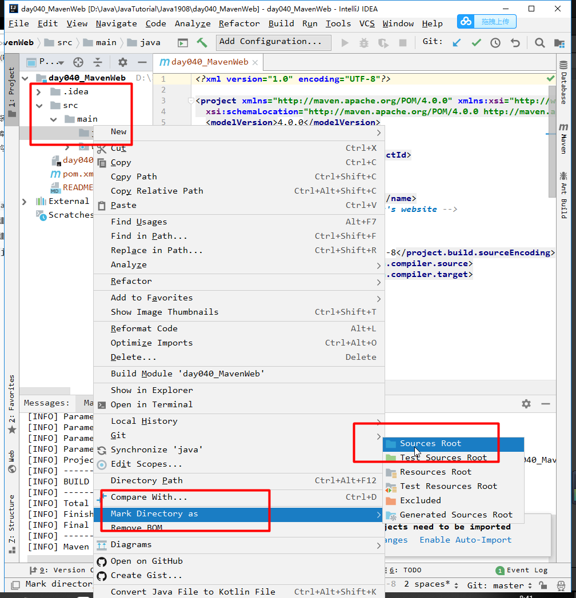
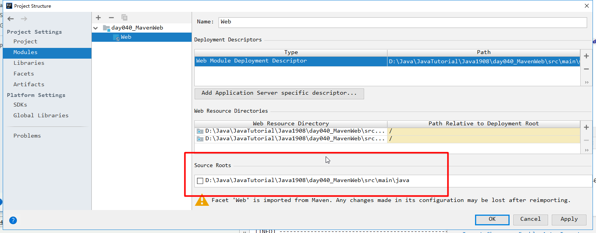
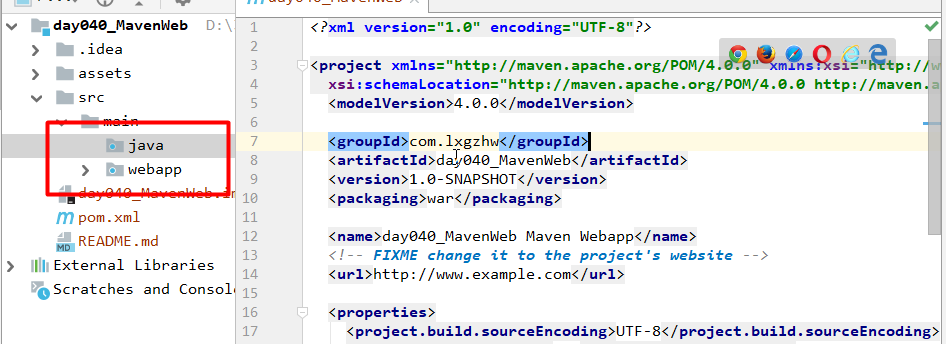
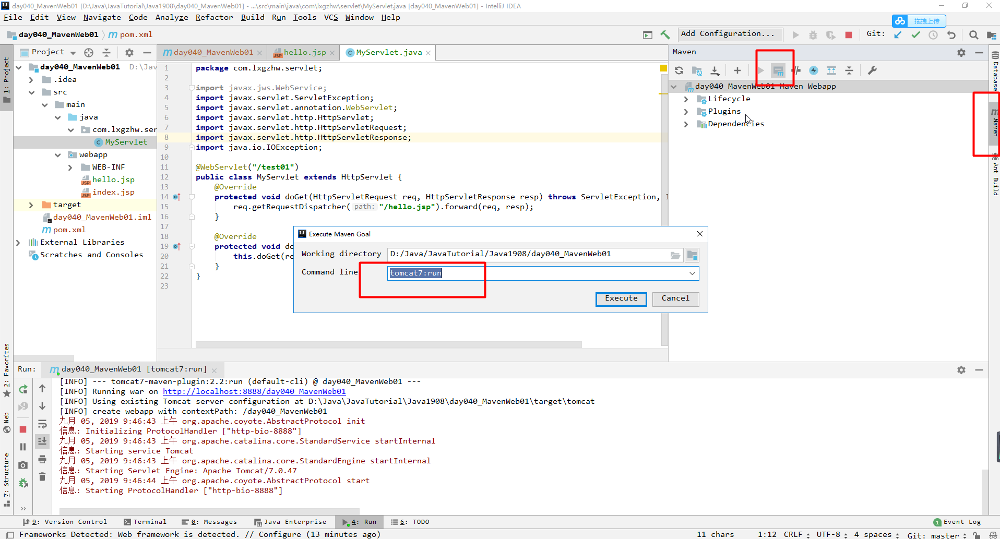
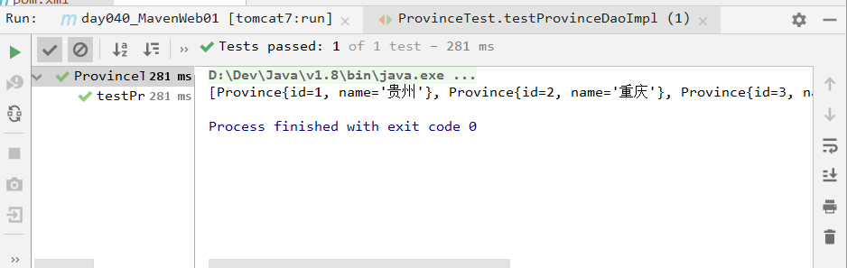

# `day040` `Maven`

> 作者: 张大鹏

## 001.`Maven`的安装

1.解压`Maven`


2.添加`Maven`环境变量


3.添加`path`路径


4.打开`cmd`窗口,输入`mvn -v`命令,没报错则成功


## 002.构建本地仓库

1.打开`conf/setting.xml`配置文件


2.在大概54行的位置添加一行代码


3.解压本地仓库


4.将配置里面的目录修改为本地的仓库目录


## 003.标准目录结构


## 004.常用命令

```
mvn clean    删除编译相关
mvn compile  开始编译
mvn test     运行测试
mvn package  打包
mvn install  安装到本地仓库
```


## 005.声明周期

```
清除生命周期
清除 clear      

默认生命周期
编译 compile
测试 test
打包 package
安装 install
发布 deploy
```


## 006.概念模型图


## 007.`IDEA`集成`Maven`


## 008.使用骨架创建`Maven`的`Java`工程

1.选择`Maven`,需要联网


2.填写公司域名,项目名称和版本号


3.确认`Maven`的信息


4.选择项目存放的目录


5.手动将`java`目录设置为根目录,创建`resources`文件夹设置为资源目录


6.运行`App.java`进行测试


## 009.使用骨架创建`Maven`的`Web`工程

1.选择创建的为`webapp`工程


2.填写域名和项目名


3.确认`Maven`信息


4.选择项目目录


5.项目创建完成


## 010.创建并添加`java`目录

1.创建`java`目录并设置为根目录




2.添加`java`目录




3.`java`目录图标发生变化则表示成功




## 011.运行`Servlet`测试

1.在`pom.xml`填写依赖包的配置

```xml
<?xml version="1.0" encoding="UTF-8"?>

<project xmlns="http://maven.apache.org/POM/4.0.0" xmlns:xsi="http://www.w3.org/2001/XMLSchema-instance"
  xsi:schemaLocation="http://maven.apache.org/POM/4.0.0 http://maven.apache.org/xsd/maven-4.0.0.xsd">
  <modelVersion>4.0.0</modelVersion>

  <groupId>com.lxgzhw</groupId>
  <artifactId>day040_MavenWeb01</artifactId>
  <version>1.0-SNAPSHOT</version>
  <packaging>war</packaging>

  <name>day040_MavenWeb01 Maven Webapp</name>
  <!-- FIXME change it to the project's website -->
  <url>http://www.example.com</url>

  <properties>
    <project.build.sourceEncoding>UTF-8</project.build.sourceEncoding>
    <maven.compiler.source>1.7</maven.compiler.source>
    <maven.compiler.target>1.7</maven.compiler.target>
  </properties>

  <dependencies>
    <dependency>
      <groupId>javax.servlet.jsp</groupId>
      <artifactId>jsp-api</artifactId>
      <version>2.0</version>
      <scope>provided</scope>
    </dependency>
    <dependency>
      <groupId>junit</groupId>
      <artifactId>junit</artifactId>
      <version>4.11</version>
      <scope>test</scope>
    </dependency>
    <dependency>
      <groupId>javax.servlet</groupId>
      <artifactId>javax.servlet-api</artifactId>
      <version>3.1.0</version>
      <scope>provided</scope>
    </dependency>
  </dependencies>

  <build>
    <plugins>
      <plugin>
        <groupId>org.apache.tomcat.maven</groupId>
        <artifactId>tomcat7-maven-plugin</artifactId>
        <version>2.2</version>
        <configuration>
          <port>8888</port>
        </configuration>
      </plugin>
      <plugin>
        <groupId>org.apache.maven.plugins</groupId>
        <artifactId>maven-compiler-plugin</artifactId>
        <configuration>
          <target>1.8</target>
          <source>1.8</source>
          <encoding>UTF-8</encoding>
        </configuration>
      </plugin>
    </plugins>
  </build>
</project>

```

2.写一个`Servlet`

```java
package com.lxgzhw.servlet;

import javax.jws.WebService;
import javax.servlet.ServletException;
import javax.servlet.annotation.WebServlet;
import javax.servlet.http.HttpServlet;
import javax.servlet.http.HttpServletRequest;
import javax.servlet.http.HttpServletResponse;
import java.io.IOException;

@WebServlet("/test01")
public class MyServlet extends HttpServlet {
    @Override
    protected void doGet(HttpServletRequest req, HttpServletResponse resp) throws ServletException, IOException {
        req.getRequestDispatcher("/hello.jsp").forward(req, resp);
    }

    @Override
    protected void doPost(HttpServletRequest req, HttpServletResponse resp) throws ServletException, IOException {
        this.doGet(req, resp);
    }
}

```


3.右侧打开`Maven`,输入`tomcat7:run`运行




## 012.解决jar包冲突

只需要加一行`scope`即可

```xml
<dependency>
    <groupId>javax.servlet.jsp</groupId>
    <artifactId>jsp-api</artifactId>
    <version>2.0</version>
    <scope>provided</scope>
</dependency>
<dependency>
    <groupId>junit</groupId>
    <artifactId>junit</artifactId>
    <version>4.11</version>
    <scope>test</scope>
</dependency>
<dependency>
    <groupId>javax.servlet</groupId>
    <artifactId>javax.servlet-api</artifactId>
    <version>3.1.0</version>
    <scope>provided</scope>
</dependency>
```


## 013.解决`Tomcat`和`jdk`插件问题

`Maven`默认使用`Tomcat6`,要改为7

`jdk`也要改为8

```xml
<plugin>
    <groupId>org.apache.tomcat.maven</groupId>
    <artifactId>tomcat7-maven-plugin</artifactId>
    <version>2.2</version>
    <configuration>
        <port>8888</port>
    </configuration>
</plugin>
<plugin>
    <groupId>org.apache.maven.plugins</groupId>
    <artifactId>maven-compiler-plugin</artifactId>
    <configuration>
        <target>1.8</target>
        <source>1.8</source>
        <encoding>UTF-8</encoding>
    </configuration>
</plugin>
```


## 014.连接数据库

1.配置数据库

```xml
<dependency>
    <groupId>mysql</groupId>
    <artifactId>mysql-connector-java</artifactId>
    <version>5.1.6</version>
    <scope>runtime</scope>
</dependency>
```

2.写一个`Province`对象

```java
package com.lxgzhw.domain;

public class Province {
    private Integer id;
    private String name;

    public Province() {
    }

    public Province(Integer id, String name) {
        this.id = id;
        this.name = name;
    }

    public Integer getId() {
        return id;
    }

    public void setId(Integer id) {
        this.id = id;
    }

    public String getName() {
        return name;
    }

    public void setName(String name) {
        this.name = name;
    }

    @Override
    public String toString() {
        return "Province{" +
                "id=" + id +
                ", name='" + name + '\'' +
                '}';
    }
}

```


3.写一个`ProvinceDao`接口

```java
package com.lxgzhw.dao;

import com.lxgzhw.domain.Province;

import java.util.List;

public interface ProvinceDao {
    //查询所有的省份
    List<Province> findAll() throws Exception;
}

```


4.写一个`ProvinceDaoImpl`实现类

```java
package com.lxgzhw.dao.impl;

import com.lxgzhw.dao.ProvinceDao;
import com.lxgzhw.domain.Province;

import java.sql.Connection;
import java.sql.DriverManager;
import java.sql.PreparedStatement;
import java.sql.ResultSet;
import java.util.ArrayList;
import java.util.List;

public class ProvinceDaoImpl implements ProvinceDao {

    @Override
    public List<Province> findAll() throws Exception {
        //1.创建集合
        ArrayList<Province> provinces = new ArrayList<>();

        //2.创建连接对象,操作数据库的对象,结果集对象
        Connection connection = null;
        PreparedStatement preparedStatement = null;
        ResultSet resultSet = null;

        //3.捕获异常
        try {
            //3.1加载驱动类
            Class.forName("com.mysql.jdbc.Driver");

            //3.2实例化连接对象,操作对象,结果集对象
            connection = DriverManager.getConnection("jdbc:mysql:///day039",
                    "root","root");
            preparedStatement = connection.prepareCall("select *from province");
            resultSet = preparedStatement.executeQuery();

            //3.3把查询结果封装到集合
            while (resultSet.next()) {
                provinces.add(new Province(
                        resultSet.getInt("id"),
                        resultSet.getString("name")));
            }
        } catch (Exception e) {
            e.printStackTrace();
        }

        //4.返回集合
        return provinces;
    }
}

```


3.写一个测试类

```java
package com.lxgzhw.test;

import com.lxgzhw.dao.impl.ProvinceDaoImpl;
import com.lxgzhw.domain.Province;
import org.junit.Test;

import java.util.List;

public class ProvinceTest {
    @Test
    public void test01() {
        System.out.println("hhh");
    }

    @Test
    public void testProvinceDaoImpl() throws Exception {
        List<Province> all = new ProvinceDaoImpl().findAll();
        System.out.println(all);
    }
}

```


4.测试结果



